# 🤖 EchoTune AI - GitHub Copilot Instructions

## Project Overview

**EchoTune AI** is a sophisticated music recommendation system that integrates with Spotify to provide AI-powered, personalized music discovery. This document provides comprehensive instructions for GitHub Copilot when working on this project.

### Key Technologies
- **Backend**: Node.js (Express), Python
- **Frontend**: JavaScript, HTML, CSS, React
- **Database**: MongoDB (primary), SQLite (fallback), Redis (caching)
- **AI/ML**: OpenAI, Google Gemini, OpenRouter, custom ML models
- **Automation**: Advanced MCP (Model Context Protocol) ecosystem with 7+ integrated servers
- **MCP Servers**: Filesystem, Puppeteer, Package Management, Analytics, Code Sandbox, Creative Automation
- **Deployment**: Docker, DigitalOcean, Nginx, SSL automation

## 🎯 Core Objectives

1. **Music Intelligence**: Build advanced recommendation algorithms using collaborative filtering, content-based analysis, and deep learning
2. **Conversational AI**: Implement natural language interfaces for music discovery
3. **Data Processing**: Handle large-scale Spotify listening history and audio feature analysis
4. **Browser Automation**: Create seamless Spotify Web Player integration with MCP automation
5. **Production Readiness**: Ensure scalable, secure, and maintainable code
6. **MCP Ecosystem Integration**: Leverage community MCP servers for enhanced development workflow
7. **Automated Testing & Validation**: Continuous integration with automated code analysis and optimization

## 🤖 Enhanced GitHub Copilot Integration & MCP Automation

**EchoTune AI** features advanced GitHub Copilot integration with comprehensive MCP (Model Context Protocol) automation and validation gating system.

### 🚀 Enhanced GPT-5 Multi-Model Integration

#### Available Models & Commands
- **GPT-5**: `gpt-5` - Latest GPT model with enhanced capabilities  
- **GPT-5 Chat**: `gpt-5-chat` - Conversational variant optimized for dialogue
- **GPT-5 Turbo**: `gpt-5-turbo` - High-performance variant with faster response
- **GPT-4 Turbo**: `gpt-4-turbo` - Proven high-performance model

#### Slash Command Integration
```bash
# Enhanced GPT-5 Commands
/gpt5 analyze                    # Full system analysis
/analyze-gpt5                    # Quick code analysis
/review-gpt5                     # Comprehensive code review  
/optimize-gpt5                   # Performance optimization analysis
/gpt5 roadmap                    # Strategic roadmap planning

# Target-specific analysis
/gpt5 analyze src/components/    # Analyze specific directory
/review-gpt5 scripts/automation/ # Review automation scripts
/optimize-gpt5 database/         # Optimize database components

# Natural language triggers  
"use model gpt-5 for full analysis and documentation"
"use gpt-5-chat to review and optimize the recommendation engine"
```

### 🛡️ Enhanced MCP Validation Gateway

#### Pre-Merge Validation Requirements
All Copilot/Agent PRs **MUST** pass comprehensive validation before merge:

1. **🛡️ MCP Server Validation**: All 81 tracked MCP servers operational
2. **🔍 Integration Testing**: Community MCP server integrations verified
3. **🛠️ Automation Testing**: Agent automation scripts validated
4. **📊 Performance Impact**: No system performance degradation
5. **🔒 Security Scanning**: No new vulnerabilities introduced

#### MCP Slash Commands
```bash
# Validation Commands
/run-mcp-all                     # Comprehensive MCP validation suite
/run-mcp-validation              # Standard MCP validation  
/mcp-health-check                # Quick health check only
/mcp-discover                    # Discover new MCP servers

# Admin Override Commands (Maintainers Only)
/approve-merge                   # Override validation and approve merge
/force-validation                # Force validation for any PR type
```

#### Auto-Merge Gating Logic
- ✅ **Auto-merge ENABLED**: All MCP + GPT validations pass
- ❌ **Auto-merge BLOCKED**: Critical validation failures detected
- ⏳ **Validation PENDING**: Comprehensive checks in progress
- 🔓 **Admin OVERRIDE**: Manual approval by maintainers

### 🔧 Enhanced Development Workflow Integration

#### Automated PR Validation Pipeline

```mermaid
graph TD
    A[PR Created/Updated] --> B{Copilot/Agent PR?}
    B -->|Yes| C[🚪 Pre-Merge Validation Gate]
    B -->|No| D[📋 Standard Review Process]
    C --> E[🛡️ MCP Server Health Check]
    E --> F[🔍 Integration Tests]
    F --> G[🛠️ Automation Validation]
    G --> H[📊 Performance Analysis]
    H --> I[🔒 Security Scanning]
    I --> J{All Checks Pass?}
    J -->|Yes| K[✅ Auto-Merge Ready]
    J -->|No| L[❌ Merge Blocked]
    L --> M[🔄 Fix & Retry]
    M --> E
    K --> N[🚀 Auto-Merge Enabled]
    D --> O[👥 Standard Review & Merge]
```


#### Enhanced Workflow Triggers
1. **Pull Request Events**: `opened`, `synchronize`, `ready_for_review`, `labeled`
2. **Slash Commands**: `/gpt5`, `/analyze-gpt5`, `/run-mcp-all`, etc.
3. **Natural Language**: "use model gpt-5 for analysis"
4. **Labels**: `copilot-coding-agent`, `gpt5-analysis`, `needs-mcp-validation`
5. **Scheduled**: Weekly MCP discovery and health monitoring

#### Unified Result Reporting
All validation results are consolidated into comprehensive PR comments:
- 🛡️ **Validation Gateway Status**: Pass/Fail with detailed breakdown
- 🤖 **GPT-5 Analysis Results**: Code quality, architecture, recommendations  
- 📊 **MCP Integration Status**: All server health and performance metrics
- 🔄 **Available Commands**: Context-aware follow-up actions
- 🚀 **Merge Readiness**: Clear indicators for auto-merge eligibility

## 📁 Enhanced Project Structure
Spotify-echo/
├── src/                      # Frontend JavaScript modules & React components
├── static/                   # Static assets (CSS, images)
├── scripts/                  # Python automation and data processing
├── mcp-server/              # Enhanced MCP automation ecosystem
│   ├── enhanced-mcp-orchestrator.js  # MCP server orchestration
│   ├── coordination-server.js        # Multi-server coordination  
│   └── workflow-manager.js           # Automated workflow management
├── mcp-servers/             # Community MCP server integrations
│   ├── package-management/  # Automated package version management
│   ├── code-sandbox/        # Secure code execution environment
│   ├── analytics-server/    # Advanced analytics and telemetry
│   └── testing-automation/  # Automated testing and validation
├── ml_datasets/             # Machine learning datasets
├── data/                    # Spotify CSV data and processed files
├── .github/workflows/       # Enhanced CI/CD automation with MCP integration
│   ├── gpt5-advanced-multimodel.yml    # Enhanced GPT-5 multi-model workflow
│   ├── agent-mcp-automation.yml        # MCP validation gateway with pre-merge gating  
│   ├── mcp-slash-commands.yml          # Slash command handler for MCP operations
│   └── copilot-models.yml              # Legacy workflow (redirects to enhanced)
├── nginx/                   # Nginx configuration for production
├── docs/                    # Comprehensive documentation
├── package.json             # Node.js dependencies
├── requirements.txt         # Python dependencies
└── README.md               # Comprehensive project documentation
```

## 🔧 Development Environment Context

### Prerequisites
- Node.js 16+ 
- Python 3.8+
- MongoDB Atlas account (optional but recommended)
- Spotify Developer credentials

### Quick Start Commands
```bash
# Install dependencies
npm install
pip install -r requirements.txt

# Configure environment
cp .env.example .env

# Start development
npm start  # Main app on http://localhost:3000
npm run mcp-server  # MCP server on http://localhost:3001
npm run dev  # Development mode with hot reloading
```

## 🤖 MCP Server Ecosystem Integration

### Community MCP Servers Integrated

#### 1. Package Management Server (sammcj/mcp-package-version)
```javascript
// Automated package version management
const packageMCP = {
  server: 'sammcj/mcp-package-version',
  capabilities: ['version-checking', 'security-scanning', 'dependency-updates'],
  integration: 'automated dependency management with security validation'
};
```

#### 2. Code Sandbox Server (bewt85/mcp-deno-sandbox)
```typescript
// Secure code execution environment
interface CodeSandboxMCP {
  server: 'bewt85/mcp-deno-sandbox';
  features: {
    languages: ['TypeScript', 'JavaScript', 'Python'];
    security: 'isolated execution environment';
    permissions: 'explicit permission controls';
  };
}
```

#### 3. Analytics & Telemetry Server (shinzo-labs/shinzo-ts)
```javascript
// Advanced analytics with OpenTelemetry
const analyticsMCP = {
  server: 'shinzo-labs/shinzo-ts',
  features: ['performance-monitoring', 'user-analytics', 'system-telemetry'],
  integration: 'real-time insights and optimization recommendations'
};
```

#### 4. Browser Automation Server (playcanvas/editor-mcp-server)
```typescript
// Enhanced browser automation capabilities
interface BrowserMCP {
  server: 'playcanvas/editor-mcp-server';
  capabilities: ['ui-testing', 'e2e-automation', 'visual-regression'];
  spotify: 'web player automation and control';
}
```

### MCP Development Patterns

#### Automated Workflow Pattern
```javascript
// MCP-powered development workflow
class MCPWorkflowManager {
  constructor() {
    this.servers = {
      packageManager: new PackageManagementMCP(),
      codeSandbox: new CodeSandboxMCP(),
      analytics: new AnalyticsMCP(),
      browserAutomation: new BrowserMCP(),
      filesystem: new FilesystemMCP()
    };
  }
  
  async executeWorkflow(workflowType, context) {
    switch (workflowType) {
      case 'code-analysis':
        return await this.performCodeAnalysis(context);
      case 'testing-automation':
        return await this.runAutomatedTests(context);
      case 'deployment-validation':
        return await this.validateDeployment(context);
      case 'performance-optimization':
        return await this.optimizePerformance(context);
    }
  }
  
  async performCodeAnalysis(context) {
    // 1. Check package versions and security
    const packageResults = await this.servers.packageManager.analyze(context.packages);
    
    // 2. Execute code in sandbox for validation
    const sandboxResults = await this.servers.codeSandbox.validate(context.code);
    
    // 3. Collect performance telemetry
    const analyticsResults = await this.servers.analytics.monitor(context.metrics);
    
    // 4. Generate comprehensive report
    return this.generateReport({
      packages: packageResults,
      validation: sandboxResults,
      analytics: analyticsResults
    });
  }
}
```

#### MCP Server Configuration Pattern
```typescript
// MCP server configuration and management
interface MCPServerConfig {
  server: string;
  version: string;
  capabilities: string[];
  authentication?: {
    type: 'api-key' | 'oauth' | 'none';
    credentials?: Record<string, string>;
  };
  healthCheck: {
    endpoint: string;
    interval: number;
    timeout: number;
  };
}

class MCPServerManager {
  async registerServer(config: MCPServerConfig) {
    // Validate server capabilities
    await this.validateCapabilities(config);
    
    // Set up authentication
    if (config.authentication) {
      await this.setupAuthentication(config);
    }
    
    // Configure health monitoring
    this.setupHealthMonitoring(config);
    
    // Register with orchestrator
    return await this.orchestrator.register(config);
  }
}
```

## 🚨 Critical Coding Guidelines for Copilot

### Security Requirements
1. **Never suggest hardcoded API keys** - Always use environment variables like `process.env.SPOTIFY_CLIENT_ID`
2. **Validate all inputs** - Sanitize user data and API responses
3. **Use HTTPS** - Ensure secure communication in production
4. **Implement rate limiting** - Protect against API abuse
5. **Follow OAuth best practices** - Secure token handling and refresh

### Architecture Principles
1. **Modular Design** - Keep components loosely coupled
2. **Error Handling** - Implement comprehensive try/catch blocks and logging
3. **Scalability** - Design for horizontal scaling and high availability
4. **Testing** - Suggest unit tests and integration tests for new code
5. **Documentation** - Include JSDoc comments for functions and complex logic

### Code Quality Standards
- **JavaScript**: Follow ESLint configuration, use modern ES6+ features, async/await patterns
- **Python**: Follow PEP 8, use type hints, implement proper error handling
- **Git**: Use conventional commit messages
- **Performance**: Optimize database queries, implement caching where appropriate

## 🎵 Core Feature Implementation Patterns

### 1. Spotify API Integration Pattern

When suggesting Spotify API code, use this pattern:

```javascript
// OAuth authentication flow
async function authenticateUser(authCode) {
    try {
        const tokenResponse = await fetch('https://accounts.spotify.com/api/token', {
            method: 'POST',
            headers: {
                'Content-Type': 'application/x-www-form-urlencoded',
                'Authorization': `Basic ${Buffer.from(`${process.env.SPOTIFY_CLIENT_ID}:${process.env.SPOTIFY_CLIENT_SECRET}`).toString('base64')}`
            },
            body: new URLSearchParams({
                grant_type: 'authorization_code',
                code: authCode,
                redirect_uri: process.env.SPOTIFY_REDIRECT_URI
            })
        });
        
        if (!tokenResponse.ok) {
            throw new Error(`Spotify auth failed: ${tokenResponse.status}`);
        }
        
        return await tokenResponse.json();
    } catch (error) {
        console.error('Spotify authentication error:', error);
        throw new Error('Authentication failed');
    }
}

// API request with error handling
async function makeSpotifyRequest(endpoint, accessToken, options = {}) {
    const url = `https://api.spotify.com/v1${endpoint}`;
    const response = await fetch(url, {
        headers: {
            'Authorization': `Bearer ${accessToken}`,
            'Content-Type': 'application/json',
            ...options.headers
        },
        ...options
    });
    
    if (response.status === 429) {
        // Handle rate limiting
        const retryAfter = response.headers.get('Retry-After');
        throw new Error(`Rate limited. Retry after ${retryAfter} seconds`);
    }
    
    if (!response.ok) {
        throw new Error(`Spotify API error: ${response.status} ${response.statusText}`);
    }
    
    return await response.json();
}
```

### 2. Machine Learning Recommendation Pattern

When suggesting ML code, use this pattern:

```python
import pandas as pd
import numpy as np
from typing import List, Dict, Any
from sklearn.metrics.pairwise import cosine_similarity
from sklearn.decomposition import NMF

class RecommendationEngine:
    def __init__(self):
        self.user_item_matrix = None
        self.item_features = None
        self.model = None
    
    def load_data(self, csv_path: str) -> pd.DataFrame:
        """Load and preprocess listening history data"""
        try:
            df = pd.read_csv(csv_path)
            # Ensure required columns exist
            required_cols = ['user_id', 'track_id', 'play_count']
            if not all(col in df.columns for col in required_cols):
                raise ValueError(f"CSV must contain columns: {required_cols}")
            return df
        except Exception as e:
            print(f"Error loading data: {e}")
            return pd.DataFrame()
    
    def train_collaborative_filter(self, interaction_data: pd.DataFrame):
        """Train collaborative filtering model"""
        try:
            # Create user-item matrix
            self.user_item_matrix = interaction_data.pivot_table(
                index='user_id', 
                columns='track_id', 
                values='play_count', 
                fill_value=0
            )
            
            # Apply matrix factorization
            self.model = NMF(n_components=50, random_state=42)
            self.model.fit(self.user_item_matrix)
            
            return True
        except Exception as e:
            print(f"Training error: {e}")
            return False
    
    def get_recommendations(self, user_id: str, n_recommendations: int = 10) -> List[Dict[str, Any]]:
        """Generate personalized recommendations"""
        try:
            if self.model is None:
                return []  # Handle cold start
            
            # Get user vector
            if user_id not in self.user_item_matrix.index:
                return []  # Handle cold start
            
            user_vector = self.user_item_matrix.loc[user_id].values.reshape(1, -1)
            user_features = self.model.transform(user_vector)
            
            # Calculate recommendations
            item_features = self.model.components_
            scores = cosine_similarity(user_features, item_features.T)[0]
            
            # Get top recommendations
            top_indices = np.argsort(scores)[::-1][:n_recommendations]
            track_ids = self.user_item_matrix.columns[top_indices]
            
            recommendations = []
            for i, track_id in enumerate(track_ids):
                recommendations.append({
                    'track_id': track_id,
                    'score': float(scores[top_indices[i]]),
                    'rank': i + 1
                })
            
            return recommendations
        except Exception as e:
            print(f"Recommendation error: {e}")
            return []
```

### 3. Conversational AI Pattern

When suggesting chat interface code, use this pattern:

```javascript
class ChatInterface {
    constructor() {
        this.providers = {
            openai: new OpenAIProvider(),
            gemini: new GeminiProvider(),
            mock: new MockProvider()
        };
        this.currentProvider = process.env.LLM_PROVIDER || 'mock';
    }
    
    async sendMessage(message, context = {}) {
        try {
            // Parse musical intent first
            const intent = this.parseMusicalIntent(message);
            
            // Generate contextual prompt
            const prompt = this.buildMusicPrompt(message, intent, context);
            
            // Get response from LLM provider
            const provider = this.providers[this.currentProvider];
            const response = await provider.generateResponse(prompt);
            
            // Process response for music recommendations
            const processedResponse = await this.processMusicalResponse(response, intent);
            
            return {
                message: processedResponse.text,
                recommendations: processedResponse.tracks,
                intent: intent,
                provider: this.currentProvider
            };
        } catch (error) {
            console.error('Chat error:', error);
            // Fallback to mock provider
            if (this.currentProvider !== 'mock') {
                this.currentProvider = 'mock';
                return await this.sendMessage(message, context);
            }
            throw new Error('Chat service unavailable');
        }
    }
    
    parseMusicalIntent(message) {
        const intents = {
            genre: /(?:play|find|suggest|recommend).*?(rock|pop|jazz|classical|hip.?hop|electronic|country|folk|metal|blues)/i,
            mood: /(?:feeling|mood|want something).*?(happy|sad|energetic|calm|angry|romantic|chill|upbeat)/i,
            activity: /(?:while|during|for).*?(workout|study|sleep|drive|work|party|relax)/i,
            artist: /(?:by|from|artist).*?([A-Z][a-z]+(?:\s+[A-Z][a-z]+)*)/,
            discovery: /(?:discover|explore|new|different|surprise)/i
        };
        
        const extracted = {};
        for (const [key, pattern] of Object.entries(intents)) {
            const match = message.match(pattern);
            if (match) {
                extracted[key] = match[1] || true;
            }
        }
        
        return extracted;
    }
    
    buildMusicPrompt(message, intent, context) {
        const systemPrompt = `You are EchoTune AI, a music recommendation expert. 
        Analyze the user's request and provide personalized music suggestions.
        
        User Context:
        - Recent listening: ${context.recentTracks || 'Unknown'}
        - Favorite genres: ${context.topGenres || 'Unknown'}
        - Time of day: ${new Date().getHours()}
        
        Detected Intent: ${JSON.stringify(intent)}
        
        Provide a conversational response with specific track/artist recommendations.`;
        
        return {
            system: systemPrompt,
            user: message
        };
    }
}
```

### 4. Database Operations Pattern

When suggesting database code, use this pattern:

```javascript
const { MongoClient } = require('mongodb');

class DatabaseManager {
    constructor() {
        this.client = null;
        this.db = null;
    }
    
    async connect() {
        try {
            this.client = new MongoClient(process.env.MONGODB_URI, {
                useUnifiedTopology: true,
                maxPoolSize: 10,
                serverSelectionTimeoutMS: 5000,
            });
            
            await this.client.connect();
            this.db = this.client.db('echotune');
            console.log('Connected to MongoDB');
            return true;
        } catch (error) {
            console.error('MongoDB connection error:', error);
            return false;
        }
    }
    
    async saveUserListeningHistory(userId, tracks) {
        try {
            const collection = this.db.collection('listening_history');
            const documents = tracks.map(track => ({
                userId,
                trackId: track.id,
                trackName: track.name,
                artist: track.artists[0]?.name,
                playedAt: new Date(track.played_at),
                features: track.audio_features,
                createdAt: new Date()
            }));
            
            const result = await collection.insertMany(documents, { ordered: false });
            return result.insertedCount;
        } catch (error) {
            console.error('Error saving listening history:', error);
            throw new Error('Failed to save listening history');
        }
    }
    
    async getUserRecommendations(userId, limit = 20) {
        try {
            const collection = this.db.collection('recommendations');
            return await collection
                .find({ userId })
                .sort({ score: -1, createdAt: -1 })
                .limit(limit)
                .toArray();
        } catch (error) {
            console.error('Error fetching recommendations:', error);
            return [];
        }
    }
}
```

## 🛠️ Development Context Guidelines

### When Suggesting New Features
1. **Check existing files** - Look for similar implementations in `src/`, `scripts/`, or `mcp-server/`
2. **Follow established patterns** - Maintain consistency with existing code style
3. **Include error handling** - Always wrap async operations in try/catch
4. **Add logging** - Include console.log for debugging and console.error for errors
5. **Environment variables** - Use `.env` file with `.env.example` template

### File Organization Suggestions
- **Frontend modules**: Place in `src/` directory
- **Python scripts**: Place in `scripts/` directory  
- **MCP automation**: Place in `mcp-server/` directory
- **Static assets**: Place in `static/` directory
- **Configuration**: Use `.env` file with `.env.example` template

### Testing Patterns
```javascript
// Jest test pattern for Node.js
describe('SpotifyAPI', () => {
    beforeEach(() => {
        // Setup mocks
        jest.clearAllMocks();
    });
    
    it('should authenticate user successfully', async () => {
        // Arrange
        const mockResponse = { access_token: 'test_token' };
        global.fetch = jest.fn().mockResolvedValue({
            ok: true,
            json: () => Promise.resolve(mockResponse)
        });
        
        // Act
        const result = await authenticateUser('test_code');
        
        // Assert
        expect(result.access_token).toBe('test_token');
        expect(fetch).toHaveBeenCalledWith(
            'https://accounts.spotify.com/api/token',
            expect.objectContaining({
                method: 'POST',
                headers: expect.objectContaining({
                    'Authorization': expect.stringContaining('Basic')
                })
            })
        );
    });
});
```

```python
# pytest pattern for Python
import pytest
from unittest.mock import Mock, patch
from scripts.recommendation_engine import RecommendationEngine

@pytest.fixture
def sample_data():
    return pd.DataFrame({
        'user_id': ['user1', 'user2', 'user1'],
        'track_id': ['track1', 'track2', 'track3'],
        'play_count': [5, 3, 8]
    })

def test_load_data_success(sample_data):
    # Arrange
    engine = RecommendationEngine()
    
    # Act
    with patch('pandas.read_csv', return_value=sample_data):
        result = engine.load_data('test.csv')
    
    # Assert
    assert not result.empty
    assert 'user_id' in result.columns
```

## 🚀 Production Deployment Context

### Environment Variables to Reference
```env
# Core application
NODE_ENV=production
PORT=3000

# Spotify API
SPOTIFY_CLIENT_ID=your_client_id
SPOTIFY_CLIENT_SECRET=your_client_secret
SPOTIFY_REDIRECT_URI=https://yourdomain.com/callback

# Database
MONGODB_URI=mongodb+srv://...
SUPABASE_URL=https://...
SUPABASE_ANON_KEY=...

# LLM Providers
OPENAI_API_KEY=sk-...
GEMINI_API_KEY=...
LLM_PROVIDER=openai

# MCP Server
MCP_SERVER_PORT=3001
```

### Performance Optimization Patterns
```javascript
// Caching pattern
const NodeCache = require('node-cache');
const cache = new NodeCache({ stdTTL: 600 }); // 10 minutes

async function getCachedSpotifyData(key, fetchFunction) {
    const cached = cache.get(key);
    if (cached) {
        return cached;
    }
    
    const data = await fetchFunction();
    cache.set(key, data);
    return data;
}

// Rate limiting pattern
const rateLimit = require('express-rate-limit');

const spotifyApiLimiter = rateLimit({
    windowMs: 15 * 60 * 1000, // 15 minutes
    max: 100, // limit each IP to 100 requests per windowMs
    message: 'Too many Spotify API requests, try again later'
});

app.use('/api/spotify', spotifyApiLimiter);
```

## 🎯 Priority Development Areas

When suggesting code improvements, prioritize:

### High Priority
1. **Spotify API Service Layer** - Robust, scalable API integration with proper error handling
2. **Recommendation Engine** - Core ML algorithms for music suggestions
3. **Chat Interface** - Natural language music discovery with fallback systems
4. **Database Optimization** - Efficient data storage and retrieval with indexing

### Medium Priority
1. **MCP Server Enhancement** - Advanced browser automation capabilities
2. **Analytics Dashboard** - User listening insights and visualizations
3. **Mobile Optimization** - Responsive design improvements
4. **Advanced ML Models** - Deep learning and neural network implementations

## 🔍 Common Patterns and Anti-Patterns

### ✅ Recommended Patterns
- Use async/await instead of promises chains
- Implement comprehensive error handling
- Use environment variables for configuration
- Include input validation for all user data
- Add logging for debugging and monitoring
- Use TypeScript-style JSDoc comments

### ❌ Anti-Patterns to Avoid
- Hardcoded API keys or secrets
- Synchronous file operations in Node.js
- Missing error handling in async functions
- Direct database queries without connection pooling
- Unvalidated user inputs
- Missing rate limiting for external APIs

## 📚 Context Resources

- **Main README**: Contains comprehensive setup and usage instructions
- **CODING_AGENT_GUIDE.md**: Detailed development workflows
- **Database Architecture**: MongoDB collections and Supabase tables
- **API Documentation**: Spotify Web API integration patterns
- **MCP Server**: Browser automation capabilities

## 🤝 Code Review Guidelines

When suggesting code reviews:
1. **Security**: Check for exposed credentials or vulnerabilities
2. **Performance**: Identify potential bottlenecks or inefficiencies
3. **Error Handling**: Ensure proper try/catch and fallback mechanisms
4. **Testing**: Suggest unit tests for new functionality
5. **Documentation**: Recommend JSDoc comments for complex functions

---

**Remember**: EchoTune AI emphasizes production readiness, security, and user experience. Always suggest code that is scalable, maintainable, and follows industry best practices.