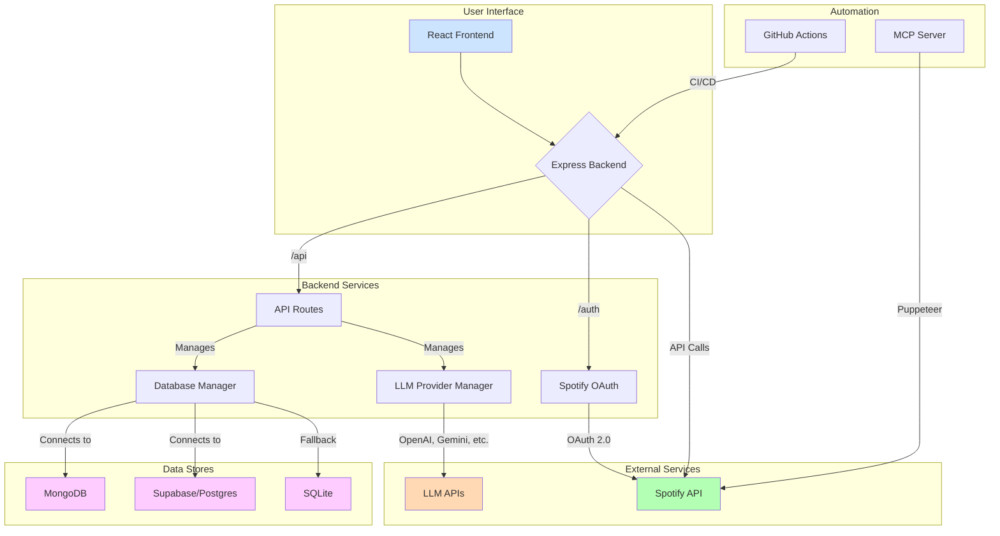
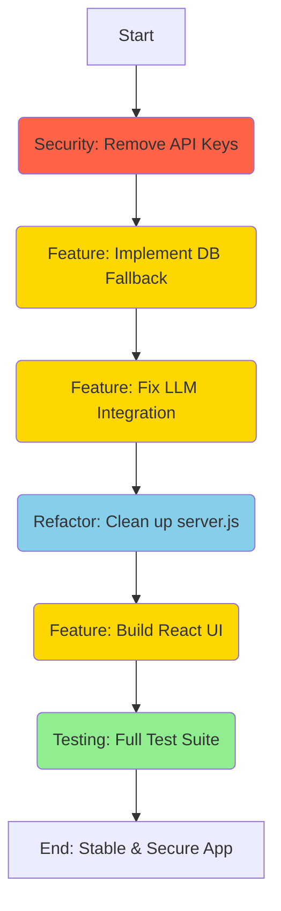

# EchoTune AI: Comprehensive Analysis Report

**Date:** 2025-08-01
**Author:** Jules, AI Software Engineer

## 1. Project Overview

EchoTune AI is a next-generation music recommendation system designed to provide a personalized music discovery experience by leveraging the Spotify API, advanced machine learning, and a conversational AI interface. The system is architected to be highly automated, with comprehensive CI/CD pipelines, multi-database support (MongoDB, Supabase/PostgreSQL), and a containerized deployment model using Docker.

The project is currently in a "Partial Production Ready" state, with many core backend features functional. However, it suffers from several critical issues that prevent a full, secure deployment and a satisfactory user experience.

## 2. Executive Summary

The EchoTune AI codebase has a strong foundation with excellent documentation, a comprehensive set of automation scripts, and a clear architectural vision. However, a detailed analysis has revealed several critical issues that require immediate attention.

The most severe issue is a **critical security vulnerability**: hardcoded API keys are present in the repository. Additionally, core user-facing features, such as the interactive web chat and LLM provider integration, are incomplete or non-functional. The developer experience is also hampered by a complex database setup that lacks a simple fallback for local development.

This report outlines these issues in detail and proposes a clear, prioritized workflow to address them. The goal is to move the project from its current partially functional state to a secure, stable, and feature-complete application.

## 3. System Architecture Diagram

This diagram illustrates the current architecture of the EchoTune AI system, including the frontend, backend, databases, and external services.

## 4. Key Findings & Identified Risks

The following issues have been identified and are categorized by severity.

### 🔴 Critical Security Vulnerabilities

1.  **Hardcoded API Keys:**
    *   **File:** `api keys.txt`
    *   **Description:** This file contains a list of plaintext API keys for OpenRouter and Gemini. Committing secrets to a repository is a major security flaw that can lead to unauthorized access and abuse of these services, resulting in financial costs and security breaches.
    *   **Impact:** Critical. Anyone with access to the repository can steal and use these keys.
    *   **Recommendation:** Immediately remove the `api keys.txt` file from the repository's history and instruct developers to use a `.env` file for local development, loaded via `dotenv`.

### 🟡 High-Priority Bugs & Incomplete Features

1.  **Non-Functional LLM Provider Integration:**
    *   **Files:** `README.md`, `PRIORITIZED_TODO.md`
    *   **Description:** The documentation indicates that the OpenRouter API keys are expired, and the LLM provider integration is not fully functional. The current chat API in `src/server.js` uses a placeholder implementation with hardcoded responses, not a real LLM.
    *   **Impact:** High. The core conversational AI feature is not working as intended.
    *   **Recommendation:** Implement a robust LLM provider manager that can handle multiple keys, rotate them, and gracefully fall back to a working provider or the mock provider if all else fails.

2.  **Basic/Placeholder Web UI:**
    *   **File:** `PRIORITIZED_TODO.md`
    *   **Description:** The project lacks a modern, interactive web chat interface. The current UI is a basic placeholder and does not provide a good user experience.
    *   **Impact:** High. The primary user interface for the application is not functional.
    *   **Recommendation:** Develop the React-based chat interface as described in the TODO list, with real-time updates (via WebSockets), a music player, and a responsive design.

3.  **Missing Database Fallback:**
    *   **File:** `PRIORITIZED_TODO.md`
    *   **Description:** The project requires a connection to MongoDB or Supabase to run, which complicates local development. A simple fallback to a local database like SQLite is needed but not fully implemented.
    *   **Impact:** High. This creates a significant barrier for new developers and complicates testing.
    *   **Recommendation:** Implement the SQLite fallback for the database manager, allowing the application to run without external database dependencies in a development environment.

### 🟠 Medium-Priority Code Quality Issues

1.  **Duplicated Backend Logic:**
    *   **File:** `src/server.js`
    *   **Description:** The main `server.js` file contains significant business logic that should be delegated to other modules. Specifically, it has its own Spotify API and chat implementations, which are duplicated or conflict with the logic in `src/api/routes/`.
    *   **Impact:** Medium. This makes the code harder to maintain, debug, and test.
    *   **Recommendation:** Refactor `src/server.js` to be a pure setup/configuration file. Move all Spotify API logic to `src/spotify/` and `src/api/routes/spotify.js`, and all chat logic to `src/chat/` and `src/api/routes/chat.js`.

### 🟢 Low-Priority Risks & Recommendations

1.  **Dependencies from GitHub:**
    *   **File:** `package.json`
    *   **Description:** The project pulls two dependencies directly from GitHub repositories. This can be a risk if the source repositories are not well-maintained, become unavailable, or are compromised.
    *   **Impact:** Low. The risk is currently low but should be monitored.
    *   **Recommendation:** For long-term stability, consider forking these dependencies or finding alternatives published on the official npm registry.

2.  **Dependency Vulnerability Scan:**
    *   **File:** `package.json`
    *   **Description:** While the dependencies seem current, a formal security audit has not been performed.
    *   **Impact:** Low.
    *   **Recommendation:** Regularly run `npm audit` to identify and fix any known vulnerabilities in the project's dependencies.

## 5. Proposed Remediation Workflow

This diagram illustrates the proposed workflow for addressing the identified issues in a logical, prioritized order.

## 6. Prioritized Recommendations

The following is a prioritized list of tasks to remediate the identified issues:

1.  **Address Critical Security Vulnerability:**
    *   **Task:** Delete the `api keys.txt` file. Use a tool like BFG Repo-Cleaner or `git-filter-repo` to remove it from the entire Git history.
    *   **Task:** Update `CODING_AGENT_GUIDE.md` and `README.md` to instruct developers to create a `.env` file from `.env.example` and store their secrets there.

2.  **Implement Core Features for Stability:**
    *   **Task:** Implement the SQLite database fallback as outlined in `PRIORITIZED_TODO.md`. Ensure the application can start and run in a "demo mode" without any external database connections.
    *   **Task:** Fix the LLM provider integration. Remove the placeholder chat logic from `src/server.js` and ensure the `chatRoutes` correctly use the `LlmProviderManager`. Implement logic to handle failed API keys and fall back to a working provider.

3.  **Refactor for Maintainability:**
    *   **Task:** Refactor `src/server.js` by moving all Spotify-related API logic into the `src/api/routes/spotify.js` and `src/spotify/` modules.
    *   **Task:** Ensure `server.js` is only responsible for middleware, route setup, and starting the server.

4.  **Develop the User Interface:**
    *   **Task:** Begin development of the interactive React chat interface. This should be the final major step, as it depends on the backend APIs being stable and functional.

5.  **Ensure Quality:**
    *   **Task:** Run all existing tests (`npm run test`) to ensure no regressions were introduced.
    *   **Task:** Add new unit and integration tests for the database fallback, the refactored API logic, and the new UI components.
