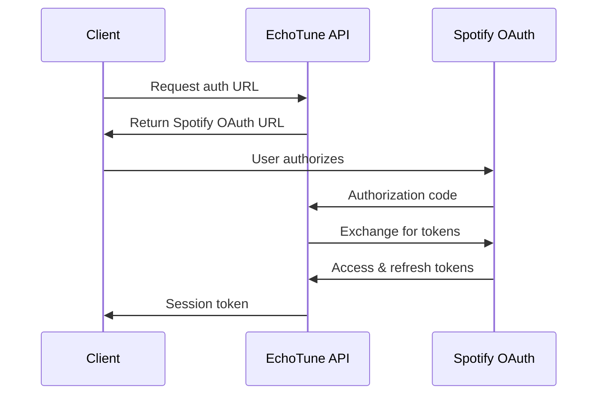

# 🎵 EchoTune AI - Comprehensive API Documentation

> Complete REST API reference for EchoTune AI's next-generation music recommendation system with conversational AI, Spotify integration, and advanced ML algorithms.

## 📋 Table of Contents

- [🔐 Authentication](#-authentication)
- [💬 Chat API](#-chat-api)
- [🎵 Spotify Integration](#-spotify-integration)
- [🤖 Recommendations](#-recommendations)
- [📝 Playlists](#-playlists)
- [💾 Database](#-database)
- [🔍 Providers](#-providers)
- [⚡ Real-time Features](#-real-time-features)
- [🏥 Health & Monitoring](#-health--monitoring)
- [📊 Rate Limiting](#-rate-limiting)
- [🚫 Error Handling](#-error-handling)
- [🔧 SDK Examples](#-sdk-examples)

## 🔐 Authentication

EchoTune AI uses session-based authentication with Spotify OAuth integration.

### Headers Required
```http
Authorization: Bearer <session_token>
Content-Type: application/json
X-User-ID: <user_id> (optional)
```

### Authentication Flow


### Endpoints

#### Get Auth URL
```http
GET /auth/spotify
```

**Response:**
```json
{
  "authUrl": "https://accounts.spotify.com/authorize?...",
  "state": "random_state_string"
}
```

#### Complete Authorization
```http
POST /auth/callback
```

**Request Body:**
```json
{
  "code": "authorization_code",
  "state": "state_string"
}
```

**Response:**
```json
{
  "success": true,
  "user": {
    "id": "user_uuid",
    "spotifyId": "spotify_user_id",
    "displayName": "User Name",
    "email": "user@example.com"
  },
  "sessionToken": "jwt_session_token",
  "expiresAt": "2024-12-31T23:59:59Z"
}
```

## 💬 Chat API

Conversational music discovery powered by multiple LLM providers (OpenAI, Google Gemini, Azure, OpenRouter).

### Start Conversation
```http
POST /api/chat/start
```

**Request Body:**
```json
{
  "sessionId": "string (optional)",
  "provider": "openai|gemini|azure|openrouter|mock",
  "model": "string (optional)",
  "context": {
    "timeOfDay": "morning|afternoon|evening|night",
    "mood": "string",
    "activity": "string"
  }
}
```

**Response:**
```json
{
  "success": true,
  "session": {
    "id": "session_uuid",
    "provider": "gemini",
    "model": "gemini-1.5-flash",
    "userId": "user_uuid",
    "createdAt": "2024-01-01T00:00:00Z",
    "context": {
      "timeOfDay": "evening",
      "mood": "relaxed"
    }
  },
  "message": "Conversation started successfully"
}
```

### Send Message
```http
POST /api/chat/message
```

**Request Body:**
```json
{
  "sessionId": "string (required)",
  "message": "string (required)",
  "provider": "string (optional)",
  "model": "string (optional)",
  "temperature": 0.7,
  "maxTokens": 1000,
  "includeRecommendations": true,
  "context": {
    "currentPlaylist": "playlist_id",
    "recentTracks": ["track_id_1", "track_id_2"]
  }
}
```

**Response:**
```json
{
  "success": true,
  "response": {
    "message": "Based on your mood, I recommend...",
    "provider": "gemini",
    "model": "gemini-1.5-flash",
    "tokens": {
      "prompt": 150,
      "completion": 300,
      "total": 450
    }
  },
  "recommendations": [
    {
      "trackId": "spotify_track_id",
      "trackName": "Song Title",
      "artist": "Artist Name",
      "album": "Album Name",
      "confidence": 0.95,
      "reason": "Matches your current mood and listening history"
    }
  ],
  "sessionId": "session_uuid",
  "timestamp": "2024-01-01T00:00:00Z"
}
```

## 🎵 Spotify Integration

Comprehensive Spotify Web API integration for music data, playlists, and user preferences.

### Audio Features

#### Get Single Track Audio Features
```http
GET /api/spotify/audio-features/:trackId
```

**Query Parameters:**
- `accessToken`: Spotify access token (required)

**Response:**
```json
{
  "success": true,
  "trackId": "spotify_track_id",
  "audioFeatures": {
    "danceability": 0.735,
    "energy": 0.578,
    "key": 5,
    "loudness": -11.84,
    "mode": 0,
    "speechiness": 0.0461,
    "acousticness": 0.514,
    "instrumentalness": 0.0902,
    "liveness": 0.159,
    "valence": 0.636,
    "tempo": 98.002,
    "duration_ms": 207959,
    "time_signature": 4
  }
}
```

#### Batch Audio Features
```http
POST /api/spotify/audio-features/batch
```

**Request Body:**
```json
{
  "trackIds": ["track_id_1", "track_id_2", "..."],
  "accessToken": "spotify_access_token",
  "options": {
    "includeAnalysis": true,
    "includeMetadata": true
  }
}
```

## 🤖 Recommendations

Advanced ML-powered music recommendations using collaborative filtering, content-based analysis, and deep learning.

### Generate Recommendations
```http
POST /api/recommendations/generate
```

**Request Body:**
```json
{
  "limit": 20,
  "algorithm": "hybrid|collaborative|content|deep_learning",
  "context": {
    "mood": "happy|sad|energetic|calm|angry|romantic|focused",
    "activity": "workout|study|sleep|drive|work|party|relax|cooking",
    "timeOfDay": "morning|afternoon|evening|night"
  },
  "preferences": {
    "genres": ["pop", "rock", "jazz"],
    "artists": ["artist_id_1", "artist_id_2"]
  },
  "options": {
    "includeNewMusic": true,
    "excludeRecentlyPlayed": true,
    "diversityFactor": 0.7
  }
}
```

**Response:**
```json
{
  "success": true,
  "recommendations": [
    {
      "trackId": "spotify_track_id",
      "trackName": "Song Title",
      "artist": "Artist Name",
      "album": "Album Name",
      "score": 0.95,
      "confidence": 0.87,
      "reasoning": {
        "primary": "Strong match with your listening history",
        "factors": [
          "Similar audio features to liked tracks",
          "Recommended by users with similar tastes"
        ]
      },
      "metadata": {
        "popularity": 75,
        "releaseDate": "2024-01-01",
        "genres": ["pop", "indie"]
      }
    }
  ],
  "algorithm": "hybrid",
  "metadata": {
    "totalCandidates": 10000,
    "processingTime": 245,
    "generatedAt": "2024-01-01T00:00:00Z"
  }
}
```

## 📝 Playlists

Advanced playlist management with AI-powered creation and automation.

### Create AI Playlist
```http
POST /api/playlists/create-ai
```

**Request Body:**
```json
{
  "name": "Playlist Name",
  "description": "AI-generated playlist for...",
  "prompt": "Create a workout playlist with high energy songs",
  "targetLength": 60,
  "preferences": {
    "genres": ["electronic", "pop"],
    "mood": "energetic"
  }
}
```

## 🏥 Health & Monitoring

System health, monitoring, and diagnostic endpoints.

### Health Check
```http
GET /health
```

**Response:**
```json
{
  "status": "healthy",
  "timestamp": "2024-01-01T00:00:00Z",
  "version": "2.1.0",
  "services": {
    "database": "healthy",
    "spotify_api": "healthy",
    "llm_providers": {
      "openai": "healthy",
      "gemini": "healthy"
    }
  },
  "metrics": {
    "uptime": 86400,
    "requests_per_minute": 45,
    "average_response_time": 125
  }
}
```

## 📊 Rate Limiting

Rate limits vary by endpoint type and user tier.

### Default Limits (per IP address)

| Endpoint Category | Requests per 15 min | Burst Limit |
|------------------|-------------------|-------------|
| Authentication | 10 | 5 |
| Chat API | 50 | 10 |
| Spotify Integration | 200 | 20 |
| Recommendations | 30 | 5 |
| Playlists | 60 | 10 |

### Rate Limit Headers
```http
X-RateLimit-Limit: 50
X-RateLimit-Remaining: 47
X-RateLimit-Reset: 1640995200
```

## 🚫 Error Handling

All API errors follow consistent JSON format with detailed information.

### Error Response Format
```json
{
  "error": "Error Type",
  "message": "Human-readable error description",
  "code": "ERROR_CODE",
  "details": {
    "field": "Specific field that caused the error",
    "constraint": "Validation constraint violated"
  },
  "timestamp": "2024-01-01T00:00:00Z",
  "requestId": "req_uuid_for_tracking"
}
```

### Common Error Codes

#### Authentication Errors
- `AUTH_REQUIRED` - Authentication token required
- `AUTH_INVALID` - Invalid or expired token
- `AUTH_SPOTIFY_FAILED` - Spotify OAuth failed

#### Validation Errors
- `VALIDATION_FAILED` - Request validation failed
- `MISSING_REQUIRED_FIELD` - Required field missing
- `INVALID_FORMAT` - Invalid data format

## 🔧 SDK Examples

### JavaScript/Node.js
```javascript
const EchoTuneAPI = require('@echotune/api-client');

const client = new EchoTuneAPI({
  apiKey: 'your_api_key',
  baseURL: 'https://api.echotune.ai'
});

// Start a conversation
const session = await client.chat.start({
  provider: 'gemini',
  context: { mood: 'energetic', activity: 'workout' }
});

// Send a message
const response = await client.chat.sendMessage({
  sessionId: session.id,
  message: 'Recommend some high-energy workout music',
  includeRecommendations: true
});

// Generate recommendations
const recommendations = await client.recommendations.generate({
  limit: 20,
  context: { mood: 'happy', activity: 'driving' },
  preferences: { genres: ['pop', 'rock'] }
});
```

### Python
```python
from echotune_api import EchoTuneClient

client = EchoTuneClient(
    api_key='your_api_key',
    base_url='https://api.echotune.ai'
)

# Start conversation
session = client.chat.start(
    provider='gemini',
    context={'mood': 'relaxed', 'time_of_day': 'evening'}
)

# Generate recommendations
recommendations = client.recommendations.generate(
    limit=15,
    context={'mood': 'focused', 'activity': 'study'},
    preferences={'genres': ['ambient', 'classical']}
)
```

## 📚 Additional Resources

- **Base URL**: `https://api.echotune.ai`
- **Documentation**: [Complete Documentation](docs/)
- **Architecture**: [System Architecture](docs/architecture/ARCHITECTURE.md)
- **Deployment**: [Deployment Guides](docs/deployment/)

---

**API Version**: 2.1.0  
**Last Updated**: January 2024  
**OpenAPI Specification**: [Download JSON](https://api.echotune.ai/openapi.json)
