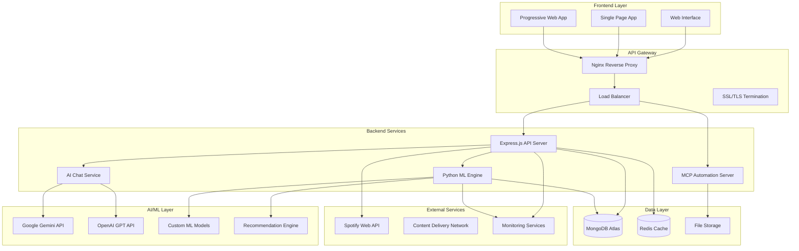
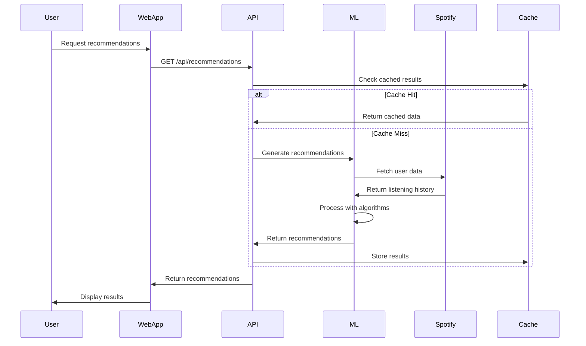
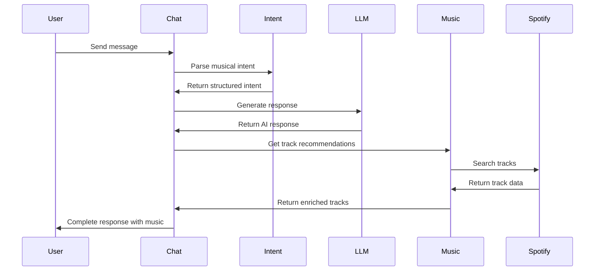
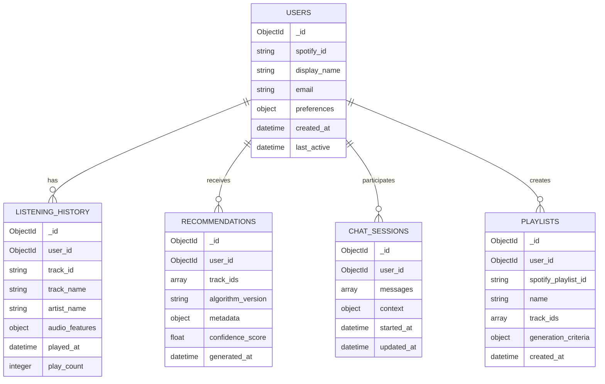
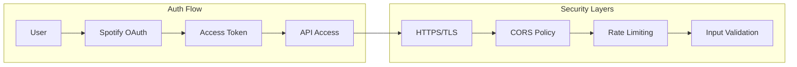
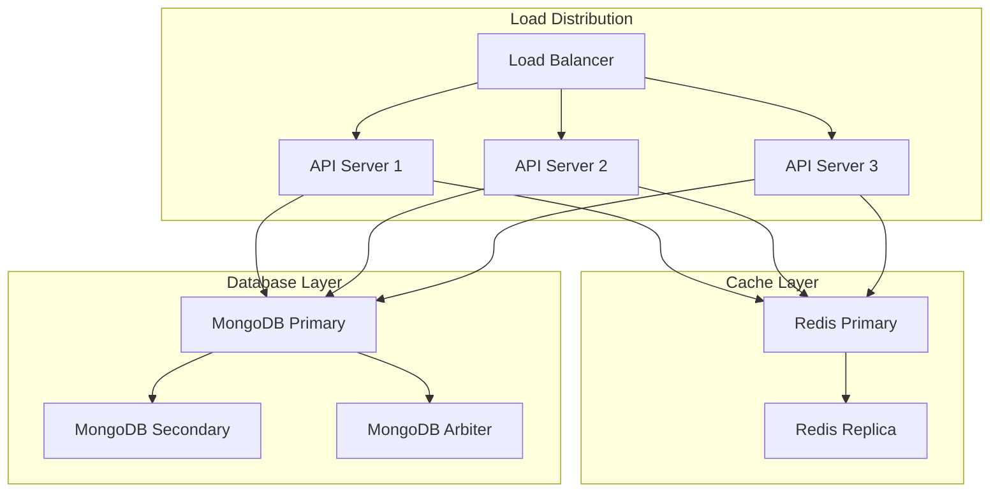
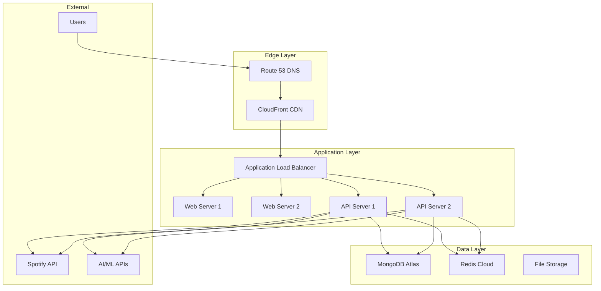
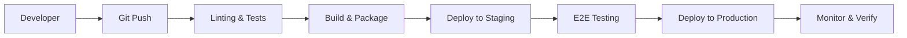

# 🏗️ EchoTune AI - System Architecture

## Overview

EchoTune AI is a microservices-based music recommendation platform that combines Spotify's Web API with advanced AI/ML capabilities to deliver personalized music discovery experiences.

## High-Level Architecture

## Component Architecture

### 🎵 Music Recommendation Flow

### 🤖 AI Chat Interface Flow

## Data Architecture

### 📊 Database Schema (MongoDB)

## Technology Stack

### 🖥️ Backend
- **Runtime**: Node.js 20+
- **Framework**: Express.js
- **Language**: JavaScript (ES2022)
- **ML Engine**: Python 3.8+
- **Process Manager**: PM2

### 🎨 Frontend
- **Framework**: Vanilla JavaScript (Modular)
- **Bundler**: Vite
- **Styling**: CSS3 with CSS Variables
- **PWA**: Service Workers + Web App Manifest

### 🗄️ Data Storage
- **Primary Database**: MongoDB Atlas
- **Caching**: Redis (In-Memory)
- **File Storage**: Local/Cloud Storage
- **Search Engine**: MongoDB Atlas Search

### 🤖 AI/ML Stack
- **LLM APIs**: OpenAI GPT, Google Gemini
- **ML Libraries**: scikit-learn, pandas, numpy
- **Recommendation**: Collaborative Filtering, Content-Based
- **NLP**: Intent recognition, sentiment analysis

### ☁️ Infrastructure
- **Cloud Provider**: DigitalOcean
- **Containerization**: Docker
- **Reverse Proxy**: Nginx
- **SSL**: Let's Encrypt
- **Monitoring**: Custom health checks

## Security Architecture

### 🔐 Authentication & Authorization

### 🛡️ Security Measures
- **Transport Security**: TLS 1.3 encryption
- **API Security**: OAuth 2.0 with PKCE
- **Input Validation**: Comprehensive sanitization
- **Rate Limiting**: Per-user and per-endpoint limits
- **CORS**: Strict origin policies
- **Secrets Management**: Environment variables only

## Scalability & Performance

### 📈 Horizontal Scaling Strategy

### ⚡ Performance Optimizations
- **Caching Strategy**: Multi-layer caching (Redis + In-Memory)
- **Database Indexing**: Optimized MongoDB indexes
- **CDN Integration**: Static asset delivery
- **Lazy Loading**: Progressive data loading
- **Connection Pooling**: Database connection optimization

## Deployment Architecture

### 🚀 Production Environment

## Monitoring & Observability

### 📊 System Monitoring
- **Application Metrics**: Response times, error rates, throughput
- **Infrastructure Metrics**: CPU, memory, disk, network
- **Business Metrics**: Recommendation accuracy, user engagement
- **Log Aggregation**: Structured logging with correlation IDs

### 🚨 Alerting Strategy
- **Critical Alerts**: Service downtime, high error rates
- **Warning Alerts**: Performance degradation, capacity limits
- **Informational**: Deployment notifications, scaling events

## Development Workflow

### 🔄 CI/CD Pipeline

### 🧪 Testing Strategy
- **Unit Tests**: Core business logic
- **Integration Tests**: API endpoints and database
- **E2E Tests**: Critical user journeys
- **Performance Tests**: Load and stress testing
- **Security Tests**: Vulnerability scanning

## Future Architecture Considerations

### 🔮 Planned Enhancements
- **Microservices Migration**: Split monolith into domain services
- **Event-Driven Architecture**: Implement message queues
- **GraphQL API**: Flexible data fetching layer
- **Real-time Features**: WebSocket integration
- **AI Model Hosting**: Self-hosted ML inference

---

**Last Updated**: January 2024
**Architecture Version**: v1.0
