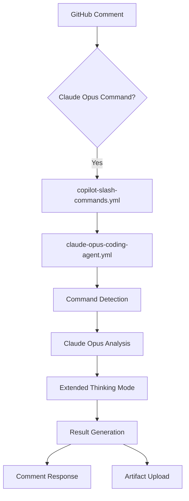

# 🧠 Claude Opus 4.1 GitHub Coding Agent Integration

**Complete guide for integrating Claude Opus 4.1 with GitHub coding agents, featuring extended thinking, deep reasoning, and advanced coding capabilities.**

## 🎯 Overview

Claude Opus 4.1 is Anthropic's most advanced AI model and industry leader for coding and agent capabilities. This integration brings unprecedented AI assistance to the EchoTune AI development workflow with:

- **🧠 Extended Thinking**: Budget-controlled deep reasoning with up to 32K output tokens
- **💻 Advanced Coding**: Industry-leading development assistance with end-to-end task execution
- **🤖 Agent Workflows**: Complex multi-step task automation with intelligent orchestration
- **⏳ Long-horizon Tasks**: Sustained performance on complex objectives requiring thousands of steps
- **🔍 Agentic Search**: Comprehensive insight synthesis across multiple data sources
- **💾 Memory Management**: Context retention across multiple interactions

## 🚀 Quick Start

### Basic Commands

```bash
# Deep reasoning with extended thinking
/claude-opus deep-reasoning

# Advanced coding assistance
/claude-opus advanced-coding

# Architectural analysis
/claude-opus architectural-analysis

# Shortened form
/opus deep-reasoning
```

### Natural Language Triggers

```bash
# Direct requests
"Use Claude Opus 4.1 for analyzing the recommendation engine"
"Analyze with Claude Opus 4.1"
"@claude-opus help me optimize the database queries"
"Claude Opus 4.1 for architectural review"
```

## 📋 Complete Command Reference

### 🧠 Core Command Types

#### 1. Deep Reasoning
**Command**: `/claude-opus deep-reasoning [target] [budget tokens]`
**Purpose**: Deep analytical reasoning with step-by-step problem decomposition

```bash
# Examples
/claude-opus deep-reasoning
/claude-opus deep-reasoning src/ai/
/claude-opus deep-reasoning budget 10000
/claude-opus deep-reasoning src/recommendation/ budget 8000
```

**Features**:
- 🔍 Comprehensive problem analysis
- 🧩 Pattern and relationship identification  
- 💡 Strategic insights and implications
- 📋 Actionable recommendations
- **Default Thinking Budget**: 8,000 tokens

#### 2. Extended Thinking
**Command**: `/claude-opus extended-thinking [target] [budget tokens]`
**Purpose**: Methodical problem-solving with transparent thought processes

```bash
# Examples
/claude-opus extended-thinking
/claude-opus extended-thinking scripts/automation/
/opus extended-thinking budget 12000
```

**Features**:
- 🔄 Iterative problem refinement
- 📊 Multi-faceted analysis approach
- ✅ Well-considered conclusions
- 🧠 Transparent reasoning demonstration
- **Default Thinking Budget**: 10,000 tokens

#### 3. Advanced Coding
**Command**: `/claude-opus advanced-coding [target] [specific request]`
**Purpose**: Industry-leading coding assistance with end-to-end development

```bash
# Examples
/claude-opus advanced-coding
/claude-opus advanced-coding src/api/
/claude-opus advanced-coding "implement caching layer"
/opus advanced-coding src/ml/ "optimize recommendation algorithm"
```

**Features**:
- 💻 Best-in-class development assistance
- 🏗️ Complete development lifecycle management
- 🎯 Production-ready code generation
- 🔄 Adaptive coding patterns
- **Default Thinking Budget**: 6,000 tokens

#### 4. Agent Workflow
**Command**: `/claude-opus agent-workflow [target] [workflow type]`
**Purpose**: Complex multi-step task automation with intelligent orchestration

```bash
# Examples
/claude-opus agent-workflow
/claude-opus agent-workflow "deployment automation"
/opus agent-workflow scripts/ "testing pipeline"
```

**Features**:
- 🤖 Intelligent workflow design
- 📋 Multi-step task coordination
- 🎯 Peak accuracy execution
- 🔄 Self-improving automation
- **Default Thinking Budget**: 7,000 tokens

#### 5. Architectural Analysis
**Command**: `/claude-opus architectural-analysis [target] [focus area]`
**Purpose**: Comprehensive system design analysis and recommendations

```bash
# Examples
/claude-opus architectural-analysis
/claude-opus architectural-analysis src/ "scalability"
/opus architectural-analysis "database design"
```

**Features**:
- 🏛️ Complete system design review
- 📈 Scalability and performance assessment
- 🔧 Maintainability evaluation
- 💡 Strategic improvement recommendations
- **Default Thinking Budget**: 8,000 tokens

#### 6. Long-horizon Tasks
**Command**: `/claude-opus long-horizon-tasks [objective] [budget tokens]`
**Purpose**: Sustained performance on complex objectives requiring thousands of steps

```bash
# Examples
/claude-opus long-horizon-tasks
/claude-opus long-horizon-tasks "complete system refactor"
/opus long-horizon-tasks "implement new architecture" budget 15000
```

**Features**:
- ⏳ Extended task management
- 🎯 Complex objective decomposition
- 🔄 Systematic progress tracking
- 🎭 Sustained focus maintenance
- **Default Thinking Budget**: 12,000 tokens

## 🎯 Advanced Usage Patterns

### Targeted Analysis

```bash
# Specific file analysis
/claude-opus advanced-coding src/chat/llm-providers/vertex-anthropic-provider.js

# Directory-focused review
/claude-opus architectural-analysis src/ai/

# Component analysis
/claude-opus deep-reasoning "recommendation engine"
```

### Custom Thinking Budgets

```bash
# High-complexity analysis
/claude-opus extended-thinking budget 15000

# Quick insights
/claude-opus deep-reasoning budget 3000

# Comprehensive review
/opus long-horizon-tasks budget 20000
```

### Natural Language Integration

```bash
# Task-specific requests
"Use Claude Opus 4.1 to analyze the Spotify integration performance"
"@claude-opus help me design a caching strategy"
"Claude Opus 4.1 for comprehensive security review"

# Problem-solving assistance
"Analyze with Claude Opus 4.1: why are recommendations slow?"
"Use extended thinking to solve the database connection issues"
```

## 🔧 Configuration & Setup

### Environment Variables

```bash
# Required for Vertex AI integration
GCP_PROJECT_ID=your-project-id
GCP_VERTEX_LOCATION=us-central1

# Optional: Direct Anthropic API fallback
ANTHROPIC_API_KEY=sk-ant-...
```

### Vertex AI Setup

1. **Enable Vertex AI API** in your GCP project
2. **Deploy Claude Opus 4.1** through Vertex AI Model Garden → Anthropic Publisher
3. **Configure Authentication** using service account or application default credentials
4. **Verify Access** using the test command: `/claude-opus deep-reasoning "test connection"`

### Model Registry Configuration

The system automatically uses the configuration from `config/ai/vertex_registry.json`:

```json
{
  "claude-opus-4.1": {
    "modelId": "publishers/anthropic/models/claude-opus-4-1",
    "versionId": "claude-opus-4-1@20250805",
    "displayName": "Claude Opus 4.1",
    "capabilities": ["text-generation", "conversation", "reasoning", "analysis", "coding", "extended-thinking", "agents"],
    "maxTokens": 32000,
    "contextWindow": 200000,
    "extendedThinking": true
  }
}
```

## 📊 Integration Architecture

### Workflow Integration



### Command Processing Flow


## 🧪 Testing & Validation

### Quick Test Commands

```bash
# Basic connectivity test
/claude-opus deep-reasoning "test system connectivity"

# Extended thinking validation
/claude-opus extended-thinking budget 5000 "validate thinking mode"

# Advanced coding test
/claude-opus advanced-coding "generate hello world function"
```

### Validation Workflow

1. **Command Detection**: Verify slash commands are recognized
2. **Workflow Trigger**: Confirm dedicated workflow activation
3. **Vertex AI Connection**: Test connection to Claude Opus 4.1
4. **Extended Thinking**: Validate thinking mode functionality
5. **Response Quality**: Review analysis depth and accuracy
6. **Report Generation**: Confirm comprehensive reporting

## 📈 Performance & Optimization

### Thinking Budget Guidelines

| Task Complexity | Recommended Budget | Use Case |
|------------------|-------------------|----------|
| **Simple Analysis** | 3,000-5,000 tokens | Quick insights, basic questions |
| **Standard Review** | 5,000-8,000 tokens | Code review, documentation analysis |
| **Complex Problem** | 8,000-12,000 tokens | Architectural decisions, optimization |
| **Comprehensive Study** | 12,000-20,000 tokens | Full system analysis, long-horizon tasks |

### Performance Tips

- **Start Small**: Begin with default budgets and increase as needed
- **Target Scope**: Use specific file/directory targets for focused analysis
- **Command Selection**: Choose the most appropriate command type for your task
- **Budget Monitoring**: Track thinking token usage for cost optimization

## 🔍 Troubleshooting

### Common Issues

#### 1. "Claude Opus 4.1 not available"
**Solution**: 
- Verify Vertex AI Model Garden access
- Check regional availability (use `us-central1`)
- Confirm Anthropic publisher subscription

#### 2. "Extended thinking failed"
**Solution**:
- Reduce thinking budget
- Check model configuration
- Verify Vertex AI quota limits

#### 3. "No response from Claude Opus 4.1"
**Solution**:
- Check network connectivity
- Verify authentication
- Try with simpler prompt

### Debugging Commands

```bash
# Test basic connectivity
/claude-opus deep-reasoning "test"

# Validate configuration
/claude-opus extended-thinking budget 1000 "configuration test"

# Check model access
/opus advanced-coding "simple function"
```

## 🎯 Best Practices

### Command Selection Guide

- **🧠 Deep Reasoning**: Complex analysis, strategic planning, research
- **🔄 Extended Thinking**: Problem-solving, debugging, methodology
- **💻 Advanced Coding**: Development tasks, code generation, optimization
- **🤖 Agent Workflow**: Automation design, process optimization
- **🏛️ Architectural Analysis**: System design, scalability planning
- **⏳ Long-horizon Tasks**: Major refactors, comprehensive overhauls

### Effective Prompting

1. **Be Specific**: Clearly state what you want analyzed
2. **Provide Context**: Include relevant background information
3. **Set Expectations**: Define the type of output you need
4. **Use Scope**: Target specific files or components when possible

### Budget Management

- **Monitor Usage**: Track thinking token consumption
- **Optimize Budgets**: Start conservative, increase as needed
- **Cost Control**: Use appropriate budgets for task complexity
- **Regular Review**: Assess cost/benefit of different command types

## 🔄 Integration Examples

### Code Review Workflow

```bash
# 1. Initial analysis
/claude-opus deep-reasoning src/new-feature/

# 2. Detailed code review
/claude-opus advanced-coding src/new-feature/ "comprehensive review"

# 3. Architecture validation
/claude-opus architectural-analysis "validate new feature integration"
```

### Problem-Solving Workflow

```bash
# 1. Problem analysis
/claude-opus extended-thinking "database performance issues"

# 2. Solution design
/claude-opus agent-workflow "performance optimization strategy"

# 3. Implementation planning
/claude-opus long-horizon-tasks "complete performance overhaul"
```

### Development Assistance

```bash
# 1. Requirements analysis
/claude-opus deep-reasoning "new recommendation algorithm requirements"

# 2. Implementation
/claude-opus advanced-coding src/ml/ "implement collaborative filtering"

# 3. Testing strategy
/claude-opus agent-workflow "comprehensive testing automation"
```

## 📚 Additional Resources

### Documentation Links
- [Vertex AI Model Garden](https://cloud.google.com/vertex-ai/docs/model-garden)
- [Anthropic Claude Opus 4.1 Documentation](https://docs.anthropic.com/)
- [GitHub Actions Workflow Reference](/.github/workflows/)

### Support Commands
- `/claude-opus deep-reasoning "help with [specific topic]"`
- `/perplexity help` - Perplexity integration guide
- `/review-docs` - Documentation analysis

### Community Resources
- [EchoTune AI Documentation](./README.md)
- [MCP Integration Guide](./docs/guides/AGENTS.md)
- [GitHub Discussions](../../discussions)

---

## 🚀 Ready to Start?

### Quick Start Commands

```bash
# Test the integration
/claude-opus deep-reasoning "analyze EchoTune AI architecture"

# Advanced coding assistance
/claude-opus advanced-coding "help optimize the recommendation engine"

# Comprehensive analysis
/opus architectural-analysis "review entire system design"
```

### Natural Language Examples

```bash
"Use Claude Opus 4.1 to analyze the Spotify integration performance"
"@claude-opus help me design a better caching strategy"
"Claude Opus 4.1 for comprehensive security review of the authentication system"
```

**The Claude Opus 4.1 integration is ready to provide industry-leading AI assistance for all your development needs!**

---
*Claude Opus 4.1 GitHub Coding Agent Integration Guide*
*Version: 1.0.0 | Last Updated: January 2025*