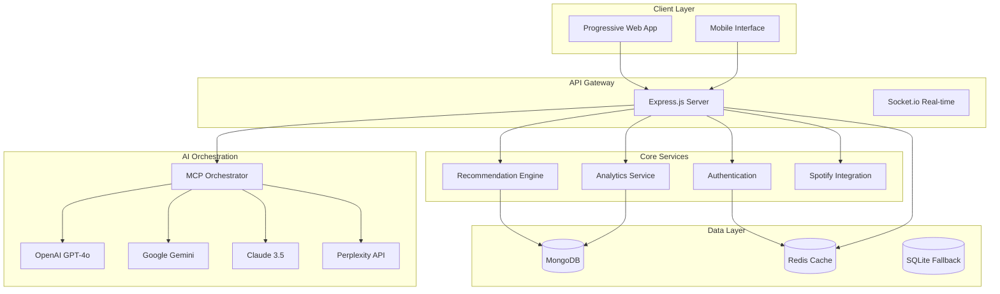

# EchoTune AI - Advanced Music Discovery Platform

<div align="center">


[](https://github.com/dzp5103/Spotify-echo)
[](https://nodejs.org/)
[](https://reactjs.org/)
[](LICENSE)

**AI-powered music discovery platform with conversational search, intelligent recommendations, and comprehensive analytics**

[🚀 Quick Start](#quick-start) • [📚 Documentation](#documentation) • [🔧 API Reference](#api-documentation) • [🤝 Contributing](#contributing)

</div>

## 🎵 Project Overview

EchoTune AI is a sophisticated music discovery platform that combines artificial intelligence, conversational interfaces, and advanced analytics to revolutionize how users discover and interact with music. Built with cutting-edge technologies including React 19, Node.js 20+, and comprehensive Model Context Protocol (MCP) integration.

### ✨ Key Features

- **🤖 Multi-Provider AI Integration**: OpenAI GPT-4o, Google Gemini 2.0, Claude 3.5, and Perplexity API
- **🎤 Conversational Music Discovery**: Natural language chat interface for music exploration  
- **🎯 Intelligent Recommendations**: Hybrid collaborative and content-based filtering algorithms
- **📊 Real-time Analytics**: Comprehensive user behavior and music preference tracking
- **🔄 Progressive Web App**: Optimized mobile experience with offline capabilities
- **🔧 MCP Orchestration**: Advanced Model Context Protocol server ecosystem
- **🎸 Spotify Integration**: Full OAuth integration with audio feature analysis
- **⚡ Performance Optimized**: Redis caching, compression, and advanced monitoring

## 🚀 Quick Start

### Prerequisites

- **Node.js** 20.0.0+ and npm 10.0.0+
- **Python** 3.8+ (for ML components)
- **MongoDB** 6.18+ or SQLite (fallback)
- **Redis** 4.7.1+ (caching layer)

### 1. Clone & Install

```bash
git clone https://github.com/dzp5103/Spotify-echo.git
cd Spotify-echo
npm install
```

### 2. Environment Setup

```bash
cp .env.example .env
# Configure your API keys and database connections
```

**Required Environment Variables:**
```env
# Core Services
MONGODB_URI=your_mongodb_connection_string
REDIS_URL=your_redis_connection_string

# AI Providers
OPENAI_API_KEY=your_openai_key
GOOGLE_AI_API_KEY=your_gemini_key
ANTHROPIC_API_KEY=your_claude_key
PERPLEXITY_API_KEY=your_perplexity_key

# Music Services
SPOTIFY_CLIENT_ID=your_spotify_client_id
SPOTIFY_CLIENT_SECRET=your_spotify_client_secret

# Security
JWT_SECRET=your_jwt_secret
SESSION_SECRET=your_session_secret
```

### 3. Database Setup

```bash
# MongoDB setup
npm run setup-db

# Redis configuration
npm run setup:redis
```

### 4. Launch Application

```bash
# Development mode
npm run dev

# Production mode
npm run build && npm start

# With MCP orchestrator
npm run mcp:orchestrated-start
```

Visit `http://localhost:3000` to start discovering music!

## 🏗️ Technology Stack

### Frontend
- **React 19.1.1** - Latest React with concurrent features
- **Material-UI 7.3.1** - Modern component library
- **Vite 7.0.6** - Ultra-fast build tool
- **Socket.io Client** - Real-time communication

### Backend
- **Node.js 20+** - Runtime environment
- **Express 4.18** - Web framework
- **Socket.io 4.7** - Real-time features
- **MongoDB 6.18** - Primary database
- **Redis 4.7.1** - Caching and session storage

### AI & ML
- **OpenAI GPT-4o** - Conversational AI
- **Google Gemini 2.0** - Advanced reasoning
- **Claude 3.5** - Natural language processing
- **Perplexity API** - Real-time research
- **Custom ML Models** - Recommendation algorithms

### Infrastructure
- **Docker** - Containerization
- **nginx** - Reverse proxy and SSL
- **DigitalOcean** - Cloud deployment
- **GitHub Actions** - CI/CD automation

## 🔧 Architecture

### System Design



### MCP Server Ecosystem

EchoTune AI leverages an extensive Model Context Protocol server network:

- **Filesystem MCP** - File operations and repository management
- **Memory MCP** - Conversation context and user preferences
- **Browser MCP** - Web research and data extraction
- **Sequential Thinking MCP** - Complex reasoning workflows
- **Analytics MCP** - Performance monitoring and insights
- **Testing MCP** - Automated quality assurance
- **GitHub MCP** - Repository operations and CI/CD
- **Music Research MCP** - Trend analysis and discovery

## 📚 API Documentation

### Core Endpoints

#### Authentication
```http
POST /api/auth/login          # User authentication
POST /api/auth/register       # User registration
GET  /api/auth/profile        # User profile
```

#### Music Discovery
```http
GET  /api/music/search        # Search tracks/artists
POST /api/music/recommendations # Get personalized recommendations
GET  /api/music/trending      # Current trending music
```

#### AI Chat
```http
POST /api/chat/message        # Send chat message
GET  /api/chat/history        # Chat history
POST /api/chat/preferences    # Update music preferences
```

#### Analytics
```http
GET  /api/analytics/dashboard # User analytics dashboard
POST /api/analytics/track     # Track user interactions
GET  /api/analytics/insights  # Personalized insights
```

### Spotify Integration

Full OAuth 2.0 implementation with comprehensive scopes:

```javascript
// Required Spotify scopes
const SPOTIFY_SCOPES = [
  'user-read-private',
  'user-read-email', 
  'playlist-read-private',
  'playlist-modify-public',
  'playlist-modify-private',
  'user-library-read',
  'user-library-modify',
  'user-top-read',
  'user-read-recently-played'
];
```

## 🤖 AI Capabilities

### Multi-Provider Architecture

EchoTune AI implements intelligent routing across multiple AI providers:

```javascript
// AI Provider Selection Logic
const routeQuery = (queryType, complexity) => {
  const routing = {
    'music-discovery': complexity > 0.7 ? 'gpt-4o' : 'gemini-2.0',
    'conversation': 'claude-3.5',
    'research': 'perplexity-sonar',
    'analysis': 'gpt-4o',
    'recommendations': 'gemini-2.0'
  };
  
  return routing[queryType] || 'gpt-4o';
};
```

### Advanced Features

- **Context-Aware Conversations** - Maintains music context across chat sessions
- **Preference Learning** - Adapts to user behavior and feedback
- **Real-time Research** - Live music trend analysis via Perplexity
- **Multi-Modal Understanding** - Text, audio features, and user behavior
- **Collaborative Intelligence** - Multiple AI models for consensus

## ⚡ Performance Features

### Optimization Strategies

- **Redis Caching** - Audio features, recommendations, and session data
- **Compression** - Gzip/Brotli compression for static assets
- **CDN Integration** - Global content delivery
- **Bundle Optimization** - Code splitting and lazy loading
- **Database Indexing** - Optimized MongoDB queries
- **Connection Pooling** - Efficient database connections

### Monitoring & Analytics

```bash
# Performance monitoring commands
npm run performance:baseline      # Establish performance baseline
npm run performance:smoke-test    # Quick performance validation
npm run redis:stats              # Cache performance metrics
npm run mcp:health-monitor       # MCP server health tracking
```

## 🔐 Security

### Security Measures

- **Helmet.js** - Security headers and protection
- **Rate Limiting** - API endpoint protection
- **JWT Authentication** - Secure token-based auth
- **Input Sanitization** - XSS and injection prevention
- **CORS Configuration** - Cross-origin request security
- **Environment Isolation** - Secure credential management

### Security Commands

```bash
npm run security:audit           # Security vulnerability scan
npm run security:check          # Comprehensive security check
npm run production:validate     # Production security validation
```

## 🧪 Testing

### Test Suites

```bash
# Unit testing
npm run test:unit

# Integration testing  
npm run test:integration

# End-to-end testing
npm run test:e2e

# Performance testing
npm run test:performance

# MCP testing
npm run test:mcp

# Music-specific testing
npm run test:music-integration
```

### Quality Assurance

- **Jest 29.7** - Unit and integration testing
- **Puppeteer** - E2E browser automation
- **ESLint** - Code quality and consistency
- **Prettier** - Code formatting
- **Comprehensive Coverage** - 90%+ test coverage target

## 🚀 Deployment

### DigitalOcean Deployment

```bash
# Quick deployment
npm run deploy:digitalocean

# Production deployment
npm run production-deploy

# Docker deployment
npm run deploy:docker

# Ubuntu setup
npm run deploy:ubuntu
```

### Production Readiness

```bash
# Production validation
npm run production-ready

# Production analysis
npm run production-analysis

# Deployment validation
npm run validate:deployment
```

## 📊 MCP Integration

### Available MCP Servers

| Server | Purpose | Status |
|--------|---------|--------|
| `filesystem` | File operations | ✅ Active |
| `memory` | Context management | ✅ Active |
| `browser` | Web automation | ✅ Active |
| `spotify` | Music integration | ✅ Active |
| `perplexity` | Research capabilities | ✅ Active |
| `analytics` | Performance monitoring | ✅ Active |
| `testing` | Quality assurance | ✅ Active |

### MCP Commands

```bash
# Start all MCP servers
npm run mcp:start:all

# Health monitoring
npm run mcp:health:all

# Performance testing
npm run mcp:test:all

# Enhanced validation
npm run mcp:enhanced-validation
```

## 📈 Analytics & Insights

### User Analytics
- **Listening Behavior** - Track user music consumption patterns
- **Preference Evolution** - Monitor changing musical tastes
- **Engagement Metrics** - Chat interaction and feature usage
- **Recommendation Effectiveness** - Success rate tracking

### System Analytics
- **Performance Metrics** - Response times and throughput
- **AI Model Performance** - Accuracy and user satisfaction
- **Cache Efficiency** - Redis performance optimization
- **Error Tracking** - Sentry integration for issue monitoring

## 🤝 Contributing

### Development Setup

1. Fork the repository
2. Create a feature branch: `git checkout -b feature/your-feature`
3. Install dependencies: `npm install`
4. Run tests: `npm test`
5. Submit a pull request

### Code Standards

- **ESLint Configuration** - Enforce coding standards
- **Prettier Formatting** - Consistent code style
- **Conventional Commits** - Structured commit messages
- **Test Coverage** - Maintain high test coverage
- **Documentation** - Update docs for new features

### Development Commands

```bash
# Development server
npm run dev

# Linting and formatting
npm run lint && npm run format

# Comprehensive validation
npm run validate:comprehensive

# Production readiness check
npm run production-check
```

## 🗺️ Roadmap

### Q1 2025 - Foundation Complete ✅
- [x] Multi-provider AI integration
- [x] MCP server ecosystem
- [x] Advanced analytics dashboard
- [x] Production deployment

### Q2 2025 - Enhanced Features 🚧
- [ ] Enhanced mobile optimization
- [ ] Voice interaction capabilities
- [ ] Advanced playlist generation
- [ ] Social sharing features

### Q3 2025 - Platform Expansion 📋
- [ ] Multi-platform music service support
- [ ] Enterprise features
- [ ] Advanced social features
- [ ] Machine learning improvements

### Q4 2025 - Innovation 💡
- [ ] Next-generation AI models
- [ ] VR/AR music experiences
- [ ] Music therapy applications
- [ ] Global expansion features

## 📞 Support

- **Issues**: [GitHub Issues](https://github.com/dzp5103/Spotify-echo/issues)
- **Documentation**: [Wiki](https://github.com/dzp5103/Spotify-echo/wiki)
- **Discussions**: [GitHub Discussions](https://github.com/dzp5103/Spotify-echo/discussions)

## 📄 License

This project is licensed under the MIT License - see the [LICENSE](LICENSE) file for details.

## 🙏 Acknowledgments

- Spotify Web API for music data
- OpenAI, Google, and Anthropic for AI capabilities
- Model Context Protocol community
- React and Node.js communities
- All contributors and users

---

<div align="center">

**Built with ❤️ for music lovers everywhere**

[⭐ Star this project](https://github.com/dzp5103/Spotify-echo) • [🍴 Fork it](https://github.com/dzp5103/Spotify-echo/fork) • [📝 Report issues](https://github.com/dzp5103/Spotify-echo/issues)

</div>