# 🎵 EchoTune AI - Advanced Music Discovery Platform

<div align="center">


**Enterprise-grade music recommendation system with AI-powered discovery, conversational interfaces, and comprehensive analytics**

[](https://nodejs.org/)
[](https://python.org/)
[](LICENSE)
[](docs/DEPLOYMENT.md)

[🚀 Quick Start](#-quick-start) • [📖 Documentation](#-documentation) • [🤖 AI Integration](#-ai-integration) • [🔧 Configuration](#-configuration) • [🚢 Deployment](#-deployment)

</div>

---

## 🌟 Overview

EchoTune AI is a sophisticated music recommendation platform that combines the power of Spotify's music catalog with cutting-edge AI technologies. It provides personalized music discovery through conversational interfaces, advanced machine learning algorithms, and comprehensive analytics.

### ✨ Key Features

- **🎯 Multi-Provider AI Integration**: Vertex AI, Gemini 2.5 Pro, Claude Opus 4.1, Claude 3.5 Sonnet, OpenAI, and more
- **🤖 Conversational Music Discovery**: Natural language music search and recommendations
- **📊 Advanced Analytics**: Real-time insights into listening patterns and preferences
- **🔄 Intelligent Routing**: Automatic provider selection based on cost, latency, and quality
- **📈 Enterprise Monitoring**: Prometheus metrics, circuit breakers, and health checks
- **🎵 Spotify Integration**: Seamless integration with Spotify Web API
- **🔧 MCP Automation**: 81+ tracked MCP servers for enhanced development workflow

---

## 🏗️ Architecture

### System Architecture Overview

```mermaid
graph TB
    %% User Interface Layer
    UI[Frontend UI<br/>React + TypeScript] --> API[Express API Gateway]
    
    %% API Gateway
    API --> Auth[Authentication Layer]
    API --> RateLimit[Rate Limiting & Security]
    API --> Router[AI Agent Router]
    
    %% AI Provider Layer
    Router --> VertexAI[🤖 Vertex AI<br/>text-bison, embeddings]
    Router --> Gemini[🧠 Gemini 2.5 Pro<br/>Multimodal, 2M tokens]
    Router --> Claude[üé≠ Claude 3.5 Sonnet<br/>Analysis, reasoning]
    Router --> ClaudeOpus[üöÄ Claude Opus 4.1<br/>Coding, agents, extended thinking]
    Router --> OpenAI[🔮 OpenAI GPT<br/>Fallback provider]
    Router --> Mock[üé™ Mock Provider<br/>Testing & CI]
    
    %% Routing Intelligence
    Router --> CircuitBreaker[Circuit Breaker<br/>Failure Management]
    Router --> CostOpt[Cost Optimizer<br/>Budget Controls]
    Router --> LoadBalancer[Load Balancer<br/>Performance Routing]
    
    %% Core Services
    API --> SpotifyAPI[üéµ Spotify Integration<br/>Web API + OAuth]
    API --> ChatService[💬 Chat Service<br/>Conversation Management]
    API --> RecommendEngine[🎯 Recommendation Engine<br/>ML Algorithms]
    
    %% Data Layer
    SpotifyAPI --> MongoDB[(🗄️ MongoDB<br/>User Data, History)]
    RecommendEngine --> Redis[(‚ö° Redis<br/>Caching, Sessions)]
    ChatService --> VectorDB[(🧮 Vector Database<br/>Embeddings, Similarity)]
    
    %% External Services
    SpotifyAPI <--> SpotifyWeb[üéß Spotify Web API]
    VertexAI <--> GCP[☁️ Google Cloud Platform]
    Gemini <--> GoogleAI[🤖 Google AI Studio]
    Claude <--> AnthropicAPI[üîó Anthropic API]
    ClaudeOpus <--> VertexAnthropicAPI[üîó Vertex AI Anthropic Publisher]
    
    %% Monitoring & Observability
    API --> Metrics[üìà Prometheus Metrics]
    Router --> Tracing[üîç OpenTelemetry Tracing]
    API --> Logging[üìù Structured Logging]
    
    %% DevOps & Automation
    API --> MCP[üîß MCP Orchestrator<br/>81+ Servers]
    MCP --> MCPServers[📦 MCP Ecosystem<br/>Package Mgmt, Analytics, Testing]
    
    %% Deployment
    Metrics --> Dashboard[üìä Grafana Dashboard]
    API --> Deploy[üöÄ Multi-Platform Deploy<br/>DigitalOcean, Vercel, Docker]
    
    classDef ai fill:#e1f5fe,stroke:#01579b,stroke-width:2px
    classDef data fill:#f3e5f5,stroke:#4a148c,stroke-width:2px
    classDef service fill:#e8f5e8,stroke:#1b5e20,stroke-width:2px
    classDef external fill:#fff3e0,stroke:#e65100,stroke-width:2px
    classDef monitoring fill:#fce4ec,stroke:#880e4f,stroke-width:2px
    
    class VertexAI,Gemini,Claude,ClaudeOpus,OpenAI,Router ai
    class MongoDB,Redis,VectorDB data
    class API,ChatService,RecommendEngine service
    class SpotifyWeb,GCP,GoogleAI,AnthropicAPI,VertexAnthropicAPI external
    class Metrics,Tracing,Logging,Dashboard monitoring
```



### AI Provider Architecture

```mermaid
graph LR
    %% Request Flow
    Request[User Request] --> AgentRouter[üß≠ Agent Router]
    
    %% Routing Decision
    AgentRouter --> Strategy{Routing Strategy}
    Strategy -->|Low Cost| CostOpt[Cost Optimizer]
    Strategy -->|Low Latency| LatencyOpt[Latency Optimizer]
    Strategy -->|High Quality| QualityOpt[Quality Optimizer]
    Strategy -->|Balanced| BalancedOpt[Balanced Optimizer]
    
    %% Provider Selection
    CostOpt --> ProviderSelect[Provider Selection]
    LatencyOpt --> ProviderSelect
    QualityOpt --> ProviderSelect
    BalancedOpt --> ProviderSelect
    
    %% AI Providers
    ProviderSelect --> Vertex[🤖 Vertex AI<br/>Enterprise Grade<br/>$0.000125/1K tokens]
    ProviderSelect --> Gemini[🧠 Gemini 2.5 Pro<br/>2M Context Window<br/>$0.00125/1K tokens]
    ProviderSelect --> Claude[üé≠ Claude 3.5 Sonnet<br/>200K Context<br/>$0.003/1K tokens]
    ProviderSelect --> OpenAI[🔮 OpenAI GPT<br/>Fallback Provider<br/>$0.001/1K tokens]
    
    %% Error Handling
    Vertex --> CircuitBreaker[🛡️ Circuit Breaker]
    Gemini --> CircuitBreaker
    Claude --> CircuitBreaker
    OpenAI --> CircuitBreaker
    
    %% Fallback Chain
    CircuitBreaker -->|Failure| Fallback[Fallback Chain]
    Fallback --> Vertex
    Fallback --> OpenAI
    Fallback --> Mock[üé™ Mock Provider]
    
    %% Response Processing
    Vertex --> ResponseProcessor[üìù Response Processor]
    Gemini --> ResponseProcessor
    Claude --> ResponseProcessor
    OpenAI --> ResponseProcessor
    Mock --> ResponseProcessor
    
    %% Metrics & Monitoring
    ResponseProcessor --> Metrics[üìä Metrics Collection]
    Metrics --> Cost[üí∞ Cost Tracking]
    Metrics --> Performance[‚ö° Performance Metrics]
    Metrics --> Health[üè• Health Monitoring]
    
    %% Final Response
    ResponseProcessor --> Response[üéµ Music Recommendations]
    
    classDef router fill:#e3f2fd,stroke:#0277bd,stroke-width:2px
    classDef provider fill:#f1f8e9,stroke:#388e3c,stroke-width:2px
    classDef error fill:#ffebee,stroke:#c62828,stroke-width:2px
    classDef monitoring fill:#fce4ec,stroke:#ad1457,stroke-width:2px
    
    class AgentRouter,Strategy,ProviderSelect router
    class Vertex,Gemini,Claude,OpenAI,Mock provider
    class CircuitBreaker,Fallback error
    class Metrics,Cost,Performance,Health monitoring
```



---

## 🤖 AI Integration

### Multi-Provider Support

EchoTune AI supports multiple AI providers with intelligent routing and fallback mechanisms:

#### 🤖 Vertex AI (Google Cloud)
- **Models**: text-bison@latest, textembedding-gecko@latest
- **Features**: Enterprise-grade reliability, cost optimization, auto-scaling endpoints
- **Use Cases**: Production workloads, high-volume requests, embedding generation
- **Pricing**: $0.000125/1K tokens (input/output)

#### 🧠 Gemini 2.5 Pro (Google AI)
- **Models**: gemini-2.5-pro (2M context window)
- **Features**: Multimodal capabilities, massive context, advanced reasoning
- **Use Cases**: Complex analysis, long conversations, multimodal content
- **Pricing**: $0.00125/1K input, $0.005/1K output

#### 🎭 Claude 3.5 Sonnet (Anthropic)
- **Models**: claude-3-5-sonnet-20241022, claude-3-opus-20240229
- **Features**: Superior reasoning, analysis, function calling
- **Use Cases**: Complex reasoning, detailed analysis, structured output
- **Pricing**: $0.003/1K input, $0.015/1K output

#### 🚀 Claude Opus 4.1 (Vertex AI + Anthropic)
- **Models**: claude-opus-4-1@20250805 via publishers/anthropic/models/claude-opus-4-1
- **Features**: Industry-leading coding capabilities, extended thinking, agent workflows, long-horizon tasks
- **Capabilities**: Advanced coding, multimodal analysis, memory management, multi-step reasoning
- **Context**: 200K input tokens, 32K output tokens
- **Use Cases**: Complex development tasks, agent automation, agentic search, coding assistance
- **Pricing**: $0.015/1K input, $0.075/1K output (premium)
- **Provider**: Accessed through Vertex AI publisher system (not direct Anthropic API)

#### 🔮 OpenAI (Fallback)
- **Models**: gpt-4-turbo, gpt-3.5-turbo
- **Features**: Reliable fallback, streaming support, function calling
- **Use Cases**: Fallback provider, testing, compatibility
- **Pricing**: Variable based on model

### Routing Strategies

The AI Agent Router intelligently selects providers based on:

1. **Cost Optimization**: Selects the most cost-effective provider for the task
2. **Latency Optimization**: Prioritizes fastest response times
3. **Quality Optimization**: Chooses providers with highest quality for complex tasks
4. **Balanced**: Optimizes for a balance of cost, latency, and quality

### Provider Selection Logic

```javascript
// Example: Smart routing based on requirements
const router = new AgentRouter();

// Low-cost strategy for simple tasks
const costOptimized = await router.route(request, {
  strategy: 'low-cost',
  maxCost: 0.001,
  taskType: 'simple-recommendation'
});

// High-quality for complex analysis
const qualityOptimized = await router.route(request, {
  strategy: 'high-quality',
  maxCost: 0.01,
  taskType: 'complex-analysis'
});

// Balanced for general use
const balanced = await router.route(request, {
  strategy: 'balanced',
  maxLatency: 5000,
  maxCost: 0.005
});
```

---

## 🚀 Quick Start

### Prerequisites

- **Node.js** 20.x or higher
- **Python** 3.8 or higher
- **MongoDB** Atlas account (recommended) or local instance
- **Redis** for caching (optional but recommended)
- **Spotify Developer** account for music integration

### 1. Clone and Install

```bash
# Clone the repository
git clone https://github.com/primoscope/Spotify-echo.git
cd Spotify-echo

# Install Node.js dependencies
npm install

# Install Python dependencies (for ML features)
pip install -r requirements.txt
```

### 2. Configure Environment

```bash
# Copy environment template
cp .env.example .env

# Edit .env with your configuration
nano .env
```

**Required Configuration:**

```env
# Core Application
JWT_SECRET=your-secure-jwt-secret
MONGODB_URI=mongodb://localhost:27017/echotune_ai
PORT=3000

# Spotify Integration
SPOTIFY_CLIENT_ID=your_spotify_client_id
SPOTIFY_CLIENT_SECRET=your_spotify_client_secret
SPOTIFY_REDIRECT_URI=http://localhost:3000/auth/callback

# AI Providers (configure at least one)
GEMINI_API_KEY=your_gemini_api_key
ANTHROPIC_API_KEY=your_anthropic_api_key
OPENAI_API_KEY=your_openai_api_key

# Vertex AI (for enterprise features)
GCP_PROJECT_ID=your-project-id
GCP_VERTEX_LOCATION=us-central1
```

### 3. Deploy AI Providers

```bash
# Test configuration (dry run)
npm run ai:deploy:all-providers:dry-run

# Deploy and test all providers
npm run ai:deploy:all-providers

# Test specific providers
npm run ai:test:providers
```

### 4. Start the Application

```bash
# Development mode
npm run dev

# Production mode
npm start

# With MCP orchestration
npm run mcp-orchestrator &
npm start
```

### 5. Verify Installation

Visit `http://localhost:3000` and check:

- ✅ Web interface loads correctly
- ✅ Spotify authentication works
- ✅ AI providers respond to requests
- ✅ Music recommendations are generated

---

## 🔧 Configuration

### AI Provider Configuration

#### Vertex AI Setup

1. **Enable APIs** in Google Cloud Console:
   - Vertex AI API
   - Cloud Resource Manager API
   - IAM Service Account Credentials API

2. **Configure Authentication**:
   ```bash
   # Option 1: Service Account Key
   export GOOGLE_APPLICATION_CREDENTIALS="/path/to/service-account-key.json"
   
   # Option 2: Application Default Credentials
   gcloud auth application-default login
   ```

3. **Deploy Endpoints**:
   ```bash
   npm run ai:deploy
   npm run ai:status  # Check deployment status
   ```

#### Gemini 2.5 Pro Setup

1. **Get API Key** from [Google AI Studio](https://aistudio.google.com/)
2. **Configure Model**:
   ```env
   GEMINI_API_KEY=your_api_key
   GEMINI_MODEL=gemini-2.5-pro
   ```
3. **Test Connection**:
   ```bash
   npm run ai:test:providers
   ```

#### Anthropic Claude Setup

1. **Get API Key** from [Anthropic Console](https://console.anthropic.com/)
2. **Configure Model**:
   ```env
   ANTHROPIC_API_KEY=your_api_key
   ANTHROPIC_MODEL=claude-3-5-sonnet-20241022
   ```
3. **Test Connection**:
   ```bash
   npm run ai:test:providers
   ```

#### Claude Opus 4.1 (Vertex AI) Setup

1. **Prerequisites**:
   - Google Cloud Project with Vertex AI API enabled
   - Access to Anthropic models through Vertex AI Publisher
   - Proper IAM permissions for Vertex AI

2. **Configure Project**:
   ```env
   GCP_PROJECT_ID=your-project-id
   GCP_VERTEX_LOCATION=us-central1
   GOOGLE_APPLICATION_CREDENTIALS=/path/to/service-account.json
   ```

3. **Deploy Model**:
   ```bash
   # Deploy all AI providers including Claude Opus 4.1
   npm run ai:deploy:all-providers
   
   # Deploy specific model (requires manual Vertex AI setup)
   # 1. Go to Vertex AI Model Garden
   # 2. Find Claude Opus 4.1 under Anthropic publisher
   # 3. Deploy to endpoint or use on-demand
   ```

4. **Test Integration**:
   ```bash
   npm run ai:test:providers         # Test all providers
   npm run ai:deploy:all-providers:dry-run  # Dry run test
   ```

5. **Extended Thinking Mode** (Optional):
   ```javascript
   // Enable extended thinking for complex tasks
   const response = await vertexAnthropicProvider.generateCompletion(messages, {
     model: 'claude-opus-4-1',
     enableExtendedThinking: true,
     maxTokens: 32000
   });
   ```

### Routing Configuration

Configure routing behavior in your environment:

```env
# AI Provider Configuration
AI_ROUTING_STRATEGY=balanced  # balanced|low-cost|low-latency|high-quality
AI_FALLBACK_ENABLED=true
AI_COST_OPTIMIZATION=true
AI_CIRCUIT_BREAKER_ENABLED=true

# Cost Controls
AI_MAX_COST_PER_REQUEST=0.01  # USD
AI_DAILY_BUDGET=10.00         # USD

# Performance Settings
AI_TIMEOUT_MS=30000
AI_RETRY_MAX_ATTEMPTS=3
AI_RETRY_BASE_DELAY=1000
```

---

## 📖 Documentation

### API Documentation

#### AI Chat Endpoint

**POST** `/api/chat`

Generate music recommendations using conversational AI.

```javascript
// Request
{
  "message": "I want energetic rock music for my workout",
  "context": {
    "user_id": "user123",
    "session_id": "session456"
  },
  "options": {
    "provider": "auto",        // auto|vertex|gemini|claude|openai
    "strategy": "balanced",    // balanced|low-cost|low-latency|high-quality
    "max_cost": 0.01,
    "streaming": false
  }
}

// Response
{
  "response": {
    "text": "Here are some energetic rock songs perfect for your workout...",
    "recommendations": [
      {
        "track": "Don't Stop Me Now",
        "artist": "Queen",
        "spotify_id": "7hQHGHGbNH0gWzj93DOA",
        "reason": "High energy, motivational lyrics, perfect tempo"
      }
    ]
  },
  "metadata": {
    "provider": "gemini",
    "model": "gemini-2.5-pro",
    "latency_ms": 1250,
    "cost_usd": 0.0045,
    "tokens_used": {
      "input": 150,
      "output": 300
    }
  }
}
```

#### Provider Health Check

**GET** `/api/ai/health`

Check the health status of all AI providers.

```javascript
// Response
{
  "overall_status": "healthy",
  "providers": {
    "vertex": {
      "status": "healthy",
      "latency_ms": 890,
      "last_check": "2025-01-17T10:30:00Z"
    },
    "gemini": {
      "status": "healthy",
      "latency_ms": 1200,
      "last_check": "2025-01-17T10:30:00Z"
    },
    "claude": {
      "status": "healthy",
      "latency_ms": 1100,
      "last_check": "2025-01-17T10:30:00Z"
    }
  }
}
```

#### Provider Analytics

**GET** `/api/ai/analytics`

Get routing and performance analytics.

```javascript
// Response
{
  "period": "last_24h",
  "total_requests": 1547,
  "cost_total_usd": 2.34,
  "avg_latency_ms": 1150,
  "provider_distribution": {
    "vertex": 45.2,
    "gemini": 32.1,
    "claude": 18.4,
    "openai": 4.3
  },
  "routing_decisions": {
    "low-cost": 678,
    "balanced": 542,
    "high-quality": 327
  },
  "success_rate": 99.7
}
```

### Available Scripts

#### AI Management

```bash
# Deployment
npm run ai:deploy                    # Deploy Vertex AI endpoints
npm run ai:deploy:dry-run           # Preview deployment
npm run ai:deploy:all-providers     # Deploy all providers
npm run ai:list                     # List deployed endpoints
npm run ai:status                   # Check deployment status

# Testing
npm run ai:test                     # Full AI system test
npm run ai:test:providers           # Test individual providers
npm run ai:test:health             # Health checks only
npm run ai:test:routing            # Test routing logic

# Monitoring
npm run ai:health                   # Check provider health
npm run ai:analytics               # View analytics
npm run ai:metrics                 # Prometheus metrics

# Evaluation
npm run ai:eval:list               # List test suites
npm run ai:eval:baseline           # Run baseline tests
npm run ai:eval -- --suite custom  # Run custom test suite
```

#### MCP Automation

```bash
# MCP Server Management
npm run mcp-orchestrator           # Start MCP orchestrator
npm run mcp:health:all             # Check all MCP servers
npm run mcp:validate:all           # Validate MCP integrations
npm run mcp:test:comprehensive     # Comprehensive MCP testing

# Specific MCP Servers
npm run mcp:package-mgmt           # Package management server
npm run mcp:code-sandbox           # Code execution server
npm run mcp:analytics              # Analytics server
npm run mcp:sentry                 # Error tracking server
```

---

## 🧪 Testing & Validation

### AI Provider Testing

Run comprehensive tests for all AI providers:

```bash
# Full test suite
npm run ai:test

# Test specific aspects
npm run ai:test:providers    # Provider functionality
npm run ai:test:health      # Health checks
npm run ai:test:routing     # Routing logic
```

### Quality Evaluation

Test music recommendation quality:

```bash
# Run baseline evaluation
npm run ai:eval:baseline

# List available test suites
npm run ai:eval:list

# Run specific test suite
npm run ai:eval -- --model gemini-2.5-pro --suite music_recommendations
```

### Example Test Results

```
🧪 Testing All AI Providers...

📡 Testing VERTEX provider...
✅ vertex test passed
   Latency: 890ms
   Model: text-bison@latest
   Preview: "Here are some upbeat rock songs perfect for your workout: 1. 'Eye of the Tiger' by Survivor..."

📡 Testing GEMINI provider...
✅ gemini test passed
   Latency: 1250ms
   Model: gemini-2.5-pro
   Preview: "For an energetic workout playlist, I recommend these rock classics: 'Don't Stop Me Now' by Queen..."

📡 Testing ANTHROPIC provider...
✅ anthropic test passed
   Latency: 1100ms
   Model: claude-3-5-sonnet-20241022
   Preview: "Here's a selection of high-energy rock tracks that will power your workout session..."

🎯 OVERALL STATUS: ✅ System Ready for Production
```

---

## 🚢 Deployment

### DigitalOcean Deployment

Deploy to DigitalOcean App Platform with one command:

```bash
# Configure DigitalOcean deployment
npm run setup-digitalocean

# Deploy to production
npm run deploy:digitalocean

# Monitor deployment
npm run deploy:digitalocean:status
```

### Vercel Deployment

Deploy frontend to Vercel:

```bash
# Configure Vercel
npm run vercel:setup

# Deploy
npm run deploy:vercel

# Check deployment status
npm run deploy:vercel:check
```

### Docker Deployment

Deploy using Docker containers:

```bash
# Build and deploy
npm run docker:deploy

# Monitor containers
npm run docker:monitor

# Check health
npm run docker:check
```

### Environment-Specific Configuration

#### Production Environment

```env
NODE_ENV=production
PORT=3000

# AI Configuration
AI_CIRCUIT_BREAKER_ENABLED=true
AI_RETRY_MAX_ATTEMPTS=3
AI_ENABLE_METRICS=true
AI_COST_OPTIMIZATION=true

# Performance
REDIS_URL=redis://your-redis-instance
MONGODB_URI=mongodb+srv://your-atlas-cluster

# Security
JWT_SECRET=your-production-jwt-secret
SESSION_SECRET=your-production-session-secret
```

#### Development Environment

```env
NODE_ENV=development
PORT=3000

# AI Configuration
AI_CIRCUIT_BREAKER_ENABLED=false
AI_ENABLE_METRICS=false
VERTEX_DEV_MIN_REPLICAS=0
VERTEX_DEV_MAX_REPLICAS=1

# Local Services
MONGODB_URI=mongodb://localhost:27017/echotune_dev
REDIS_URL=redis://localhost:6379
```

---

## 📊 Monitoring & Analytics

### Prometheus Metrics

Access metrics at `/metrics` endpoint:

```bash
# View metrics
curl http://localhost:3000/metrics

# Monitor with Prometheus
npm run ai:metrics
```

**Available Metrics:**

- `echotune_ai_requests_total` - Total AI requests by provider/model
- `echotune_ai_request_duration_seconds` - Request latency histograms
- `echotune_ai_request_cost_usd` - Cost tracking by provider
- `echotune_ai_tokens_total` - Token usage statistics
- `echotune_ai_circuit_breaker_state` - Circuit breaker status
- `echotune_ai_provider_health` - Provider health indicators

### Health Monitoring

```bash
# Check overall health
curl http://localhost:3000/health

# AI provider health
npm run ai:health

# MCP server health
npm run mcp:health:all
```

### Performance Analytics

```bash
# View routing analytics
npm run ai:analytics

# Performance baseline
npm run performance:baseline

# MCP performance
npm run performance:mcp-analytics
```

---

## 🤝 Contributing

### Development Setup

1. **Fork the repository**
2. **Clone your fork**:
   ```bash
   git clone https://github.com/your-username/Spotify-echo.git
   ```
3. **Install dependencies**:
   ```bash
   npm install
   pip install -r requirements.txt
   ```
4. **Configure environment**:
   ```bash
   cp .env.example .env
   # Configure with your API keys
   ```
5. **Run tests**:
   ```bash
   npm test
   npm run ai:test
   ```

### Code Quality

```bash
# Linting
npm run lint
npm run lint:fix

# Formatting
npm run format
npm run format:check

# Testing
npm run test:unit
npm run test:integration
npm run test:e2e
```

### AI Provider Development

To add a new AI provider:

1. **Create provider class** extending `BaseLLMProvider`
2. **Add to agent router** initialization
3. **Update configuration** files
4. **Add pricing information**
5. **Create tests**
6. **Update documentation**

Example provider template:

```javascript
const BaseLLMProvider = require('./base-provider');

class NewAIProvider extends BaseLLMProvider {
  constructor(config) {
    super(config);
    this.defaultModel = config.model || 'default-model';
  }

  async initialize() {
    // Initialize API client
  }

  async generateCompletion(messages, options = {}) {
    // Implement completion logic
  }

  getCapabilities() {
    return {
      streaming: true,
      functionCalling: false,
      maxTokens: 4096,
      supportedModels: ['model1', 'model2'],
      features: ['chat', 'completion']
    };
  }
}

module.exports = NewAIProvider;
```

---

## 📄 License

This project is licensed under the MIT License - see the [LICENSE](LICENSE) file for details.

---

## 🙏 Acknowledgments

- **Spotify** for their comprehensive Web API
- **Google Cloud** for Vertex AI and Gemini models
- **Anthropic** for Claude's advanced reasoning capabilities
- **OpenAI** for GPT models and API standards
- **Model Context Protocol (MCP)** community for automation tools
- **Open Source Community** for the amazing libraries and tools

---

## 📞 Support

- **Documentation**: [docs/](docs/)
- **Issues**: [GitHub Issues](https://github.com/primoscope/Spotify-echo/issues)
- **Discussions**: [GitHub Discussions](https://github.com/primoscope/Spotify-echo/discussions)

---

<div align="center">

**Built with ❤️ by the EchoTune AI Team**

*Revolutionizing music discovery through AI*

</div>
