# 🤖 EchoTune AI - Continuous Validation Workflow Guide

**Version:** 2.0  
**Last Updated:** August 8, 2025  
**Status:** ✅ Fully Operational with MCP Integration

---

## 🎯 Overview

The EchoTune AI Continuous Validation Workflow is an autonomous system that ensures code quality, functionality, and deployment readiness through comprehensive pre-task and post-task validation. This system leverages the operational MCP (Model Context Protocol) server ecosystem to provide automated testing, documentation validation, and end-to-end functionality verification.

### 🔄 Workflow Philosophy

**Every change must pass the complete validation pipeline before integration.**

This ensures:
- ✅ **Code Quality**: Automated linting, formatting, and syntax validation
- ✅ **Functionality**: Comprehensive testing suite execution
- ✅ **Documentation Coherence**: Real-time validation against implementation
- ✅ **Deployment Readiness**: Infrastructure and service validation
- ✅ **User Experience**: End-to-end workflow testing

---

## 🛠️ System Architecture

### MCP Server Integration

The validation system leverages **12 operational MCP servers**:

```javascript
// MCP Server Ecosystem
{
  "community_servers": {
    "package_management": "dependency-analysis, security-scanning, version-management",
    "code_sandbox": "code-execution, validation, testing", 
    "analytics": "metrics-collection, performance-monitoring, telemetry"
  },
  "built_in_servers": {
    "orchestrator": "server-coordination, workflow-management",
    "coordination": "multi-server-management, resource-allocation",
    "workflow_manager": "task-automation, pipeline-management",
    "spotify": "music-api, authentication, playlist-management",
    "enhanced_server": "general-purpose automation"
  },
  "utility_servers": {
    "validator": "system-validation, health-checks",
    "browser_tools": "web-automation, ui-testing",
    "file_utilities": "filesystem-operations, file-management",
    "browserbase": "browser-orchestration, e2e-testing"
  }
}
```

### Validation Pipeline Stages

```mermaid
graph TD
    A[Code Change] --> B[Pre-Task Validation]
    B --> C{All Checks Pass?}
    C -->|No| D[Fail Fast - Report Issues]
    C -->|Yes| E[Execute Change]
    E --> F[Post-Task Validation]
    F --> G[Browser E2E Testing]
    F --> H[API Validation]
    F --> I[Deployment Check]
    G --> J{All Tests Pass?}
    H --> J
    I --> J
    J -->|Yes| K[✅ Change Accepted]
    J -->|No| L[⚠️ Partial Success - Review Required]
```



---

## 🚀 Pre-Task Validation

**Executed before any code changes are made**

### Validation Steps:
1. **Environment Variables Validation**
   ```bash
   npm run validate:env
   ```

2. **Code Quality Checks**
   ```bash
   npm run lint          # ESLint code analysis
   npm run format:check  # Prettier formatting validation
   ```

3. **Unit Testing Suite**
   ```bash
   npm run test:unit     # Jest unit tests
   npm run test:integration  # Integration tests
   ```

4. **Documentation Coherence**
   ```bash
   node scripts/documentation-coherence-checker.js
   ```

5. **Security & Dependencies**
   ```bash
   npm audit             # Security vulnerability scan
   ```

### Configuration:
```javascript
preTaskValidation: {
  enabled: true,
  tasks: [
    'lint',
    'format', 
    'test:unit',
    'test:integration',
    'validate:env',
    'validate:docs'
  ],
  failFast: true  // Stop on first failure
}
```

---

## 🎯 Post-Task Validation

**Executed after code changes are implemented**

### Browser E2E Testing
Automated browser testing using MCP browser automation servers:

#### Settings UI Validation (`/settings`)
- ✅ **Health Categories Display**: Verify 8 system health categories are visible
- ✅ **System Status Monitoring**: Check real-time status updates
- ✅ **Configuration Interface**: Test settings modification capabilities

#### AI Chat Interface Testing (`/chat`)
- ✅ **Message Processing**: Send test query "Play something chill for studying"
- ✅ **Response Generation**: Verify AI response and tracklist generation
- ✅ **Provider Integration**: Test multi-LLM provider switching

#### User Workflow Testing
- ✅ **Authentication**: OAuth flow validation
- ✅ **Recommendations**: Music suggestion system testing
- ✅ **Playlists**: Creation and management functionality

### API Endpoint Validation
Comprehensive testing of all documented APIs:

```javascript
const criticalEndpoints = [
  { url: '/health', method: 'GET', expected: 200 },
  { url: '/api/user/profile', method: 'GET', authenticated: true },
  { url: '/api/recommendations', method: 'GET', responseType: 'json' },
  { url: '/api/user/top-genres', method: 'GET', cacheEnabled: true },
  { url: '/api/chat/models', method: 'GET', rateLimited: true }
];
```

### Deployment Infrastructure Validation
- ✅ **Docker Environment**: Container build and run testing
- ✅ **DigitalOcean Integration**: App Platform deployment readiness
- ✅ **Environment Configuration**: Production variable validation
- ✅ **SSL & Security**: Certificate and header validation

---

## 📋 Usage Guide

### Running the Complete Workflow

```bash
# Full validation workflow (pre + post task)
node scripts/continuous-validation-workflow.js

# Pre-task validation only
node scripts/continuous-validation-workflow.js pre-task

# Post-task validation only  
node scripts/continuous-validation-workflow.js post-task

# Demo mode (simulated testing)
node scripts/validation-workflow-demo.js
```

### Integration with Development Process

#### 1. Before Making Changes
```bash
# Always run pre-task validation first
npm run validate:pre-task

# Or use the full workflow
node scripts/continuous-validation-workflow.js pre-task
```

#### 2. After Making Changes
```bash
# Run post-task validation
npm run validate:post-task

# Or run complete validation
node scripts/continuous-validation-workflow.js
```

#### 3. Reviewing Results
```bash
# View validation report
cat CONTINUOUS_VALIDATION_REPORT.md

# Check JSON results for automation
cat CONTINUOUS_VALIDATION_REPORT.json
```

---

## 🔧 MCP Server Health Monitoring

### Health Check Commands
```bash
# Check all MCP servers
npm run mcp-health

# Individual server testing
npm run mcp:package-mgmt     # Package management server
npm run mcp:code-sandbox     # Code execution sandbox  
npm run mcp:analytics        # Analytics and telemetry
npm run test:servers         # Infrastructure servers
```

### Server Status Indicators
- ✅ **Healthy**: Response time < 100ms, all capabilities functional
- ⚠️ **Degraded**: Response time 100-500ms, limited functionality  
- ❌ **Unhealthy**: No response or error state, requires intervention

---

## 📊 Validation Reports

### Generated Reports
1. **CONTINUOUS_VALIDATION_REPORT.md** - Human-readable status and results
2. **CONTINUOUS_VALIDATION_REPORT.json** - Machine-readable data for automation
3. **BROWSER_E2E_TEST_REPORT.md** - Detailed browser testing results
4. **MCP_STATUS_REPORT.md** - MCP server health and capabilities

### Report Structure
```json
{
  "timestamp": "2025-08-08T19:30:00.000Z",
  "validationRun": {
    "id": 1691518200000,
    "phase": "full",
    "status": "passed"
  },
  "preTask": {
    "executed": true,
    "passed": ["lint", "test", "docs"],
    "failed": [],
    "totalTime": 15432
  },
  "postTask": {
    "executed": true, 
    "passed": ["e2e", "api", "deployment"],
    "failed": [],
    "totalTime": 45678
  },
  "recommendations": [
    "All validations passed - ready for deployment"
  ]
}
```

---

## ⚙️ Configuration

### Workflow Configuration (`scripts/continuous-validation-workflow.js`)

```javascript
const config = {
  preTaskValidation: {
    enabled: true,
    tasks: ['lint', 'format', 'test:unit', 'validate:env', 'validate:docs'],
    failFast: true,      // Stop on first failure
    timeout: 120000      // 2 minute timeout
  },
  postTaskValidation: {
    enabled: true,
    tasks: ['test:e2e', 'validate:api-endpoints', 'validate:deployment'],
    failFast: false,     // Continue testing even with failures
    timeout: 300000      // 5 minute timeout
  },
  mcpServers: {
    packageManagement: 'mcp-servers/package-management/package-version-mcp.js',
    codeSandbox: 'mcp-servers/code-sandbox/code-sandbox-mcp.js',
    analytics: 'mcp-servers/analytics-server/analytics-mcp.js',
    browserTools: 'mcp-servers/enhanced-browser-tools.js',
    validator: 'mcp-servers/comprehensive-validator.js'
  }
};
```

### Environment Variables Required
```bash
# Core validation settings
VALIDATION_ENABLED=true
VALIDATION_FAIL_FAST=true
VALIDATION_TIMEOUT=120000

# Browser testing
BROWSERBASE_API_KEY=your_key_here
PUPPETEER_HEADLESS=true

# API testing
API_BASE_URL=http://localhost:3000
API_TIMEOUT=15000

# MCP server configuration
MCP_SERVER_PORT=3001
MCP_HEALTH_CHECK_INTERVAL=60000
```

---

## 🚨 Error Handling and Troubleshooting

### Common Issues and Solutions

#### Pre-Task Validation Failures
```bash
# Linting errors
npm run lint:fix

# Test failures  
npm run test:unit -- --verbose

# Documentation issues
node scripts/documentation-coherence-checker.js
```

#### Post-Task Validation Issues
```bash
# Browser E2E failures
DEBUG=true node scripts/browser-e2e-test-suite.js

# API endpoint failures
curl -v http://localhost:3000/health
npm run health-check

# Deployment issues
docker build -t echotune-test .
docker run --rm echotune-test
```

#### MCP Server Problems
```bash
# Check server health
node scripts/comprehensive-mcp-audit.js

# Restart specific server
npm run mcp:package-mgmt

# Full server restart
npm run mcp-orchestrator
```

### Debug Mode
```bash
# Enable verbose logging
DEBUG=true node scripts/continuous-validation-workflow.js

# Run with extended timeout
VALIDATION_TIMEOUT=300000 node scripts/continuous-validation-workflow.js
```

---

## 🎯 Best Practices

### 1. Pre-Development Validation
- **Always run pre-task validation** before starting development
- **Fix all validation issues** before proceeding with changes
- **Update documentation** as you modify code

### 2. Development Workflow Integration
```bash
# Recommended development cycle
npm run validate:pre-task    # Before changes
# ... make your changes ...
npm run validate:post-task   # After changes
npm run validate:full        # Before commit
```

### 3. Continuous Integration
- **Embed validation in CI/CD pipelines**
- **Block deployments on validation failures**
- **Generate validation reports for review**

### 4. Performance Optimization
- **Run unit tests frequently** (fast feedback)
- **Run E2E tests less frequently** (resource intensive)
- **Cache validation results** when possible

---

## 📈 Success Metrics

### Validation Success Indicators
- ✅ **100% Pre-task Pass Rate**: No validation failures before development
- ✅ **95%+ Post-task Pass Rate**: Minimal issues after implementation  
- ✅ **<2 minute Pre-task Time**: Fast feedback for developers
- ✅ **<5 minute Post-task Time**: Comprehensive validation without blocking

### Quality Metrics
- **Code Coverage**: >90% for critical components
- **API Response Time**: <200ms for all endpoints
- **Documentation Coherence**: 0 inconsistencies between docs and code
- **Deployment Success**: 100% successful automated deployments

---

## 🔄 Future Enhancements

### Phase 3 Roadmap
1. **AI-Powered Test Generation**: Automatically generate E2E tests from user workflows
2. **Performance Regression Detection**: Automated performance baseline comparison
3. **Security Vulnerability Scanning**: Real-time security analysis during validation
4. **Visual Regression Testing**: Automated UI screenshot comparison
5. **Load Testing Integration**: Stress testing as part of validation pipeline

### Advanced MCP Integration
- **Custom MCP Server Development**: Domain-specific validation servers
- **Machine Learning Validation**: AI-powered code quality assessment
- **Predictive Issue Detection**: ML-based failure prediction

---

## 📞 Support and Resources

### Quick Reference Commands
```bash
# Essential validation commands
npm run validate:full                    # Complete validation workflow
npm run validate:pre-task               # Pre-development validation
npm run validate:post-task              # Post-development validation
node scripts/validation-workflow-demo.js # Demo mode testing

# MCP server management
npm run mcp-health                      # Check all server health
npm run mcp-orchestrator               # Start MCP orchestration
node scripts/comprehensive-mcp-audit.js # Complete server audit

# Report generation
cat CONTINUOUS_VALIDATION_REPORT.md    # View latest validation results
cat MCP_STATUS_REPORT.md               # View MCP server status
```

### Documentation References
- **Phase 1 Analysis**: `PHASE1_COMPREHENSIVE_ANALYSIS_REPORT.md`
- **MCP Server Status**: `MCP_STATUS_REPORT.md`
- **Filesystem Analysis**: `FILESYSTEM_ANALYSIS_REPORT.md`
- **Documentation Coherence**: `DOCUMENTATION_COHERENCE_REPORT.md`

---

*This guide represents the implementation of Phase 2 of the autonomous validation system. The continuous validation workflow ensures EchoTune AI remains stable, well-documented, and deployment-ready through comprehensive automated testing and validation.*