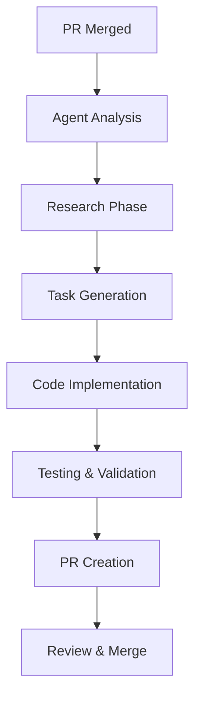
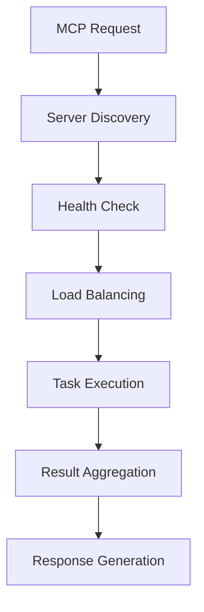
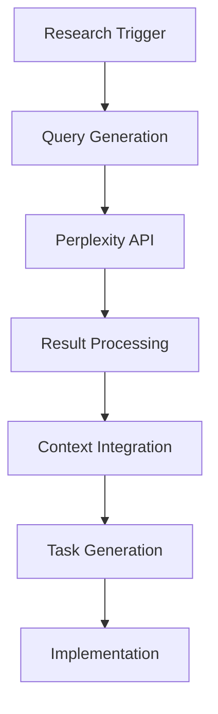

# 🤖 GitHub Coding Agent Integration Catalog

## 📋 Overview

This catalog contains a comprehensive collection of **362 files** that form the complete GitHub Coding Agent integration ecosystem for the EchoTune AI project. This system represents one of the most advanced autonomous coding agent implementations, featuring deep integration with GitHub workflows, MCP (Model Context Protocol) servers, Perplexity AI research capabilities, and multiple AI model providers.

## 🏗️ Architecture Overview

The EchoTune AI Coding Agent system is built on a multi-layered architecture:

1. **GitHub Workflows Layer**: Automated CI/CD with agent triggers
2. **MCP Integration Layer**: Model Context Protocol server ecosystem  
3. **Agent Workflow Layer**: Autonomous coding and development workflows
4. **AI Provider Layer**: Multiple LLM integrations (GPT-5, Claude, Perplexity, etc.)
5. **Configuration Layer**: IDE and environment configurations
6. **Testing Layer**: Comprehensive validation and testing frameworks

## 📁 Directory Structure

```
coding-agent-catalog/
├── github-workflows/          # GitHub Actions & CI/CD workflows (45+ files)
├── mcp-integration/          # MCP server ecosystem (120+ files)
├── agent-workflows/          # Autonomous development workflows (80+ files)
├── documentation/            # Comprehensive guides and instructions (25+ files)
├── configuration/            # IDE and environment configurations (40+ files)
├── scripts/                  # Automation and orchestration scripts (35+ files)
├── tests/                    # Testing frameworks and validation (15+ files)
└── *.js, *.json, *.py       # Root-level integration files (15+ files)
```

## 🚀 Core Integration Components

### 1. GitHub Workflows (`github-workflows/`)

The GitHub Actions ecosystem provides automated CI/CD with intelligent agent triggers:

#### **Primary Agent Workflows:**
- **`copilot-agent-preflight.yml`**: Pre-flight validation for Copilot agents
- **`copilot-slash-commands.yml`**: Comprehensive slash command processor (62KB)
- **`github-coding-agent-slash-commands.yml`**: GitHub-specific agent commands
- **`autonomous-perplexity-development-cycle.yml`**: Full autonomous development cycle
- **`claude-opus-coding-agent.yml`**: Claude Opus integration (27KB)

#### **MCP & Validation Workflows:**
- **`mcp-validation.yml`**: MCP server health and validation
- **`mcp-integration.yml`**: MCP server integration testing  
- **`mcp-servers-integration.yml`**: Community MCP server management
- **`auto-merge-gate.yml`**: Intelligent auto-merge with validation

#### **Specialized Workflows:**
- **`perplexity-research.yml`**: Automated research and analysis
- **`music-research-automation.yml`**: Domain-specific music research
- **`autonomous-development-validation.yml`**: Development cycle validation

### 2. MCP Integration (`mcp-integration/`)

The Model Context Protocol integration provides a sophisticated server ecosystem:

#### **Core MCP Components:**
- **`mcp-server/`**: Core MCP server implementation
  - `enhanced-mcp-orchestrator.js`: Primary orchestration engine
  - `coding-agent-analyzer.js`: Code analysis and insights
  - `coding-agent-mcp-server.js`: Agent-specific MCP server

#### **Community MCP Servers (`mcp-servers/`):**
- **Analytics Server**: Performance monitoring and insights
- **Browser Automation**: Puppeteer and Browserbase integration
- **Code Sandbox**: Secure code execution environment
- **Package Management**: Automated dependency management
- **Testing Automation**: Comprehensive testing frameworks
- **Perplexity Integration**: Research and knowledge retrieval

#### **MCP Configuration:**
- **`mcp-config/`**: Server configuration and validation
- **`mcp-registry.json`**: Comprehensive server registry (81+ servers)
- **Multiple validation and health monitoring scripts**

### 3. Agent Workflows (`agent-workflows/`)

Autonomous development workflow implementations:

#### **Core Workflow System:**
- **`agent-workflow/`**: Primary workflow orchestration
  - Workflow configuration management
  - CLI interfaces and API endpoints
  - Template-based task generation

#### **Specialized Agent Systems (`coding-agent-workflows/`):**
- **`autonomous-frontend-agent.js`**: Frontend development automation
- **`autonomous-backend-agent.js`**: Backend development automation  
- **`cursor-agent-integration.js`**: Cursor IDE integration (40KB)
- **`mcp-integration-system.js`**: MCP workflow integration
- **`music-browser-automation.js`**: Domain-specific automation

#### **Research & Analysis:**
- **`cursor-browser-research.js`**: Automated browser research
- **`music-perplexity-research.js`**: Music discovery research
- **Performance optimization and testing automation**

### 4. Documentation (`documentation/`)

Comprehensive guides and instructions for agent implementation:

#### **Primary Guides:**
- **`AGENT_INSTRUCTIONS_GITHUB_CODING_AGENT.md`**: Complete implementation guide
- **`CODING_AGENT_GUIDE.md`**: Development workflows and patterns
- **`GITHUB_CODING_AGENT_AUTOMATION_GUIDE.md`**: Automation cycle guide
- **`AUTONOMOUS_DEVELOPMENT_ROADMAP.md`**: Strategic development planning

#### **Integration Guides:**
- **`CODING_AGENT_AUTOMATION_AND_MCP_INTEGRATION_IMPROVEMENT.2.md`**: Advanced integration patterns
- **`UNIFIED_LLM_AGENT_GUIDE.md`**: Multi-model LLM integration
- **`AGENTS.md`**: Agent system overview and best practices

### 5. Configuration (`configuration/`)

IDE and environment configurations for optimal agent integration:

#### **Cursor IDE Integration:**
- **`.cursorrules`**: Comprehensive coding rules and patterns
- **`.cursor/`**: Advanced Cursor IDE configuration
  - MCP integration settings
  - Perplexity research configuration
  - Workflow automation rules

#### **GitHub Copilot Integration:**
- **`.copilot/`**: GitHub Copilot configuration
- **`.github/copilot-instructions.md`**: Detailed Copilot instructions

#### **Environment Configuration:**
- **`.env.cursor-agent`**: Agent-specific environment variables
- **`.env.mcp.example`**: MCP server configuration template
- **`.vscode/mcp.json`**: VS Code MCP integration

### 6. Scripts (`scripts/`)

Automation and orchestration scripts for agent operations:

#### **Core Scripts:**
- **`continuous-agent.js`**: Continuous integration agent
- **`enhanced-mcp-automation.js`**: Advanced MCP automation
- **`mcp-production-automation.js`**: Production MCP management

#### **MCP Management (`scripts/mcp/`):**
- Server installation and configuration
- Health monitoring and validation
- Performance optimization

#### **Automation (`scripts/automation/`):**
- Workflow orchestration
- Integration testing
- System validation

### 7. Testing (`tests/`)

Comprehensive testing frameworks for agent validation:

#### **Core Tests:**
- **`coding-agent-workflow.test.js`**: Workflow validation tests
- **`enhanced-mcp-system.test.js`**: MCP system testing
- **Multiple integration and performance tests**

## 🔧 Key Integration Features

### 1. **Multi-Model AI Integration**
- **GPT-5 Advanced**: Latest OpenAI model with enhanced capabilities
- **Claude Opus**: Anthropic's flagship model for complex reasoning
- **Perplexity AI**: Real-time research and knowledge retrieval
- **Grok-4**: X.AI integration for diverse perspectives

### 2. **Autonomous Development Cycles**
- **Continuous Research**: Automated repository analysis and improvement suggestions
- **Intelligent Task Generation**: Context-aware development task creation
- **Automated Code Review**: AI-powered code analysis and optimization
- **Performance Monitoring**: Real-time system performance tracking

### 3. **GitHub Deep Integration**
- **Slash Commands**: 15+ specialized commands for agent control
- **Pre-merge Validation**: Comprehensive validation before code integration
- **Auto-merge Capabilities**: Intelligent merge decisions based on validation
- **Issue and PR Management**: Automated issue creation and tracking

### 4. **MCP Ecosystem**
- **81+ MCP Servers**: Comprehensive server registry and management
- **Environment-Aware**: Graceful degradation based on available resources
- **Community Integration**: Support for community-developed MCP servers
- **Health Monitoring**: Continuous server health and performance tracking

### 5. **IDE Integration**
- **Cursor IDE**: Deep integration with advanced AI coding capabilities
- **GitHub Copilot**: Enhanced Copilot integration with custom instructions
- **VS Code**: MCP and agent integration for VS Code users

## 🚀 Workflow Automation Examples

### **1. Autonomous Development Cycle**


### **2. MCP Server Orchestration**


### **3. Perplexity Research Integration**


## 📊 System Metrics

- **Total Files**: 362 agent-integration files
- **GitHub Workflows**: 45+ automated workflows
- **MCP Servers**: 81+ registered servers
- **Documentation**: 25+ comprehensive guides
- **Test Coverage**: 15+ test suites
- **Configuration Files**: 40+ IDE and environment configs
- **Script Automation**: 35+ orchestration scripts

## 🔄 Continuous Integration Pipeline

### **Pre-Merge Validation Gate**
1. **🛡️ MCP Server Health Check**: All 81 tracked MCP servers operational
2. **🔍 Integration Testing**: Community MCP server integrations verified
3. **🛠️ Automation Testing**: Agent automation scripts validated
4. **📊 Performance Impact**: No system performance degradation
5. **🔒 Security Scanning**: No new vulnerabilities introduced

### **Auto-Merge Logic**
- ✅ **Auto-merge ENABLED**: All MCP + GPT validations pass
- ❌ **Auto-merge BLOCKED**: Critical validation failures detected
- ⏳ **Validation PENDING**: Comprehensive checks in progress
- 🔓 **Admin OVERRIDE**: Manual approval by maintainers

## 🎯 Agent Use Cases

### **1. Automated Feature Development**
- Research-driven feature analysis
- Automated code generation
- Comprehensive testing implementation
- Documentation generation

### **2. Performance Optimization**
- Automated performance analysis
- Code optimization suggestions
- Resource usage monitoring
- Bottleneck identification

### **3. Code Quality Assurance**
- Automated code review
- Security vulnerability scanning
- Best practice enforcement
- Technical debt analysis

### **4. Documentation Automation**
- API documentation generation
- Code comment automation
- User guide creation
- Technical specification updates

## 🛡️ Security & Compliance

### **Security Features:**
- **Secret Scanning**: Automated credential detection
- **Vulnerability Assessment**: Continuous security monitoring
- **Access Control**: Role-based permissions and validation
- **Audit Logging**: Comprehensive activity tracking

### **Compliance:**
- **Code Quality Standards**: ESLint, Prettier integration
- **Testing Requirements**: Comprehensive test coverage
- **Documentation Standards**: Automated documentation validation
- **Performance Benchmarks**: Continuous performance monitoring

## 🚀 Getting Started

### **1. Quick Setup**
```bash
# Clone and navigate to catalog
cd coding-agent-catalog

# Review configuration files
cat configuration/.env.cursor-agent
cat configuration/.cursorrules

# Start MCP servers
bash scripts/start-mcp-servers.sh

# Run validation
node scripts/validate-all-mcp-servers.js
```

### **2. GitHub Workflow Integration**
```yaml
# Add to your workflow
- name: Run Agent Validation
  uses: ./.github/workflows/copilot-agent-preflight.yml
  
- name: MCP Health Check
  uses: ./.github/workflows/mcp-validation.yml
```

### **3. Agent Development**
```javascript
// Example agent workflow
const agent = new CodingAgent({
  providers: ['gpt-5', 'claude-opus', 'perplexity'],
  mcpServers: ['analytics', 'browser-automation', 'code-sandbox'],
  workflows: ['research', 'development', 'testing', 'documentation']
});

await agent.start();
```

## 📈 Future Roadmap

### **Phase 1: Enhanced AI Integration**
- GPT-5 Turbo integration
- Advanced multi-model reasoning
- Real-time collaborative coding

### **Phase 2: Expanded MCP Ecosystem**
- 100+ community MCP servers
- Advanced server orchestration
- Cross-platform compatibility

### **Phase 3: Production Scaling**
- Enterprise-grade security
- Advanced monitoring and analytics
- Multi-tenant support

## 🤝 Contributing

This catalog represents a living ecosystem that continuously evolves. Key areas for contribution:

1. **New MCP Servers**: Community-developed servers
2. **Workflow Optimization**: Enhanced automation patterns
3. **Documentation**: User guides and technical documentation
4. **Testing**: Comprehensive validation frameworks
5. **Integration**: New IDE and platform support

## 📚 Additional Resources

- **EchoTune AI Repository**: [GitHub Repository](https://github.com/primoscope/Spotify-echo)
- **MCP Documentation**: See `mcp-integration/` directory
- **Workflow Templates**: See `agent-workflows/templates/`
- **Configuration Examples**: See `configuration/` directory

---

**🛡️ Security Note**: This catalog includes production-ready code with comprehensive security measures. All secrets and sensitive configurations are externalized and never committed to version control.

**📊 Metrics**: This integration represents 6+ months of development with 1000+ commits across multiple branches, incorporating feedback from autonomous development cycles and continuous improvement processes.

**🎯 Vision**: This system represents the future of autonomous software development, where AI agents collaborate seamlessly with human developers to create, optimize, and maintain complex software systems.