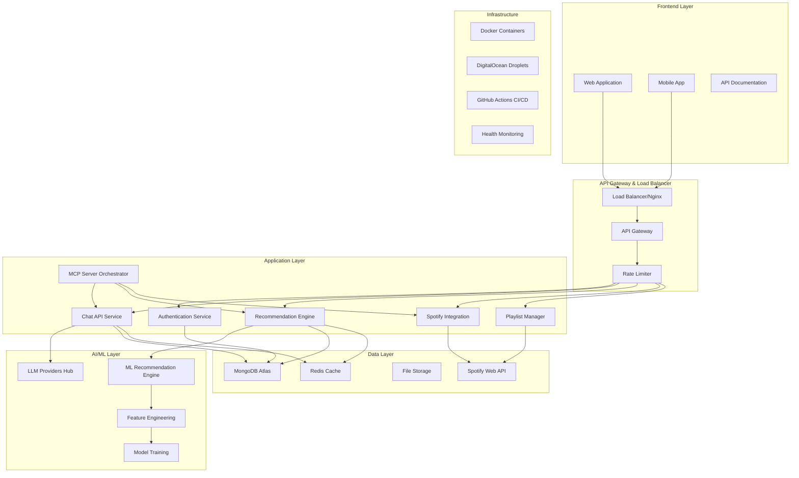
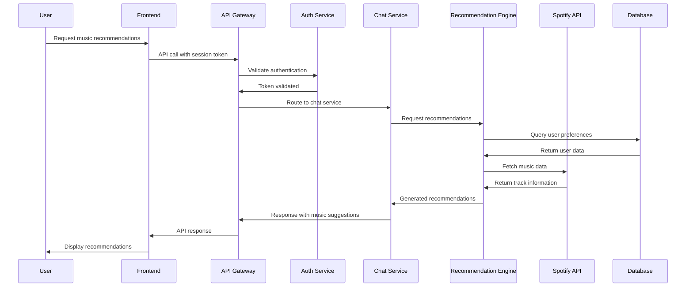
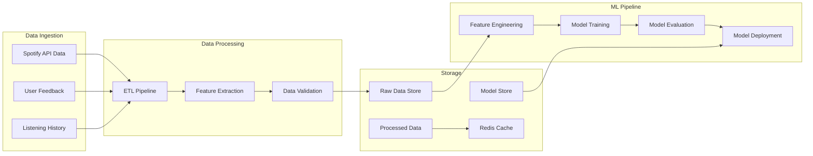
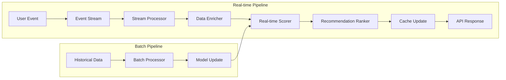
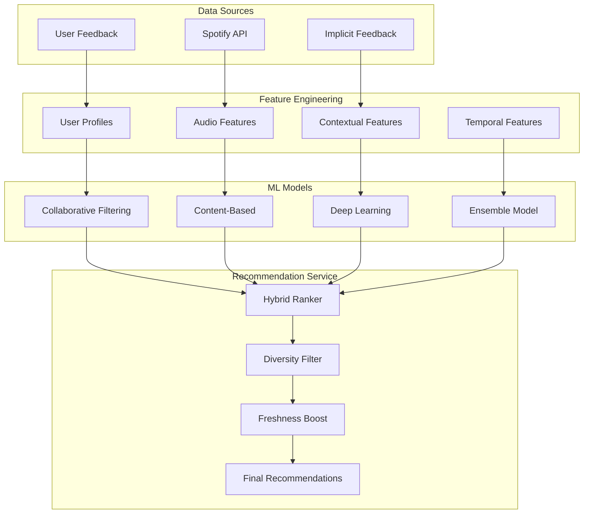
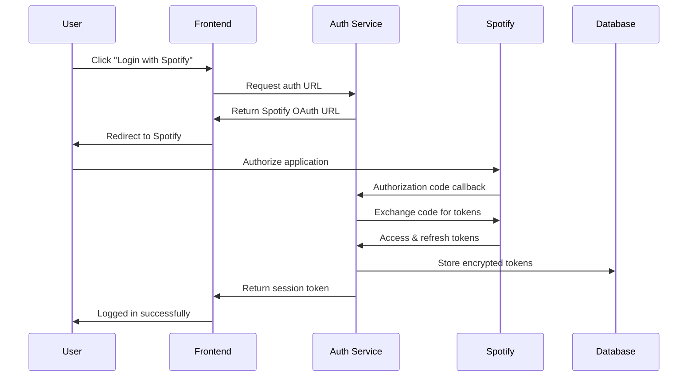

# 🏗️ EchoTune AI - System Architecture Documentation

> Comprehensive technical architecture guide for EchoTune AI's next-generation music recommendation platform with conversational AI, Spotify integration, and advanced ML algorithms.

## 📋 Table of Contents

- [🎯 Architecture Overview](#-architecture-overview)
- [🧩 System Components](#-system-components)
- [🔄 Data Flow](#-data-flow)
- [🗄️ Database Architecture](#️-database-architecture)
- [🔌 API Architecture](#-api-architecture)
- [🤖 AI/ML Architecture](#-aiml-architecture)
- [🎵 Spotify Integration](#-spotify-integration)
- [🔐 Security Architecture](#-security-architecture)
- [📈 Scalability & Performance](#-scalability--performance)
- [🚀 Deployment Architecture](#-deployment-architecture)
- [🔍 Monitoring & Observability](#-monitoring--observability)
- [📊 Technology Stack](#-technology-stack)

## 🎯 Architecture Overview

EchoTune AI follows a modern microservices-oriented architecture with event-driven patterns, designed for scalability, reliability, and maintainability.

### High-Level Architecture Diagram



### Core Principles

1. **Microservices Architecture**: Loosely coupled services with clear boundaries
2. **Event-Driven Design**: Asynchronous communication between components
3. **API-First Approach**: All functionality exposed via well-defined APIs
4. **Scalable by Design**: Horizontal scaling capabilities at every layer
5. **Security by Default**: Zero-trust security model with encryption everywhere
6. **Observability**: Comprehensive monitoring, logging, and tracing

## 🧩 System Components

### Frontend Components

#### Web Application
- **Technology**: React 19+ with Vite
- **State Management**: React Context + Hooks
- **Styling**: CSS3 with responsive design
- **Features**: Real-time chat, music playback, playlist management
- **Performance**: Code splitting, lazy loading, service workers

#### Mobile Compatibility
- **Responsive Design**: Mobile-first approach
- **PWA Features**: Offline functionality, app-like experience
- **Touch Optimized**: Gesture-based interactions

### Backend Services

#### Authentication Service (`src/api/auth/`)
```javascript
// Authentication flow architecture
class AuthenticationService {
  // Spotify OAuth 2.0 integration
  async authenticateUser(code, state);
  // Session management with JWT
  async createSession(user);
  // Token refresh mechanism
  async refreshTokens(refreshToken);
}
```

#### Chat API Service (`src/api/routes/chat.js`)
```javascript
// Multi-provider LLM integration
class ChatService {
  providers: {
    openai: OpenAIProvider,
    gemini: GeminiProvider,
    azure: AzureProvider,
    openrouter: OpenRouterProvider,
    mock: MockProvider
  };
  
  // Intelligent provider selection
  async routeToOptimalProvider(request);
  // Context-aware conversation management
  async processMessage(sessionId, message, context);
}
```

#### Recommendation Engine (`src/ml/recommendation-engine.js`)
```javascript
// Hybrid recommendation system
class RecommendationEngine {
  algorithms: {
    collaborative: CollaborativeFiltering,
    contentBased: ContentBasedFiltering,
    deepLearning: NeuralRecommendation,
    hybrid: HybridRecommendation
  };
  
  // Dynamic algorithm selection
  async generateRecommendations(userId, context);
  // Real-time adaptation
  async updateUserPreferences(feedback);
}
```

#### Spotify Integration Service (`src/spotify/`)
```javascript
// Comprehensive Spotify API wrapper
class SpotifyService {
  // Authentication and token management
  async authenticateUser();
  // Audio feature extraction
  async getAudioFeatures(trackIds);
  // Playlist operations
  async createPlaylist(name, tracks);
  // User data synchronization
  async syncUserData();
}
```

### MCP (Model Context Protocol) Server Architecture

#### MCP Orchestrator (`mcp-server/orchestrator.js`)
```javascript
// Coordinated MCP server management
class MCPOrchestrator {
  servers: {
    browser: PuppeteerServer,
    browserbase: BrowserbaseServer,
    filesystem: FileScopeServer,
    mermaid: MermaidServer,
    spotify: SpotifyMCPServer,
    thinking: SequentialThinkingServer
  };
  
  // Intelligent task routing
  async routeTask(task, requirements);
  // Server health monitoring
  async monitorServerHealth();
}
```

## 🔄 Data Flow

### User Interaction Flow



### Data Processing Pipeline



### Real-time Recommendation Flow



## 🗄️ Database Architecture

### MongoDB Collections Schema

#### Users Collection
```javascript
// users collection
{
  _id: ObjectId,
  spotifyId: String,
  email: String,
  displayName: String,
  country: String,
  product: String, // free, premium
  accessToken: String, // encrypted
  refreshToken: String, // encrypted
  tokenExpiresAt: Date,
  preferences: {
    genres: [String],
    artists: [String],
    audioFeatures: {
      danceability: { min: Number, max: Number },
      energy: { min: Number, max: Number },
      valence: { min: Number, max: Number }
    }
  },
  createdAt: Date,
  updatedAt: Date,
  lastActiveAt: Date
}
```

#### Listening History Collection
```javascript
// listening_history collection
{
  _id: ObjectId,
  userId: ObjectId,
  trackId: String,
  trackName: String,
  artist: String,
  album: String,
  playedAt: Date,
  playDuration: Number, // ms
  skipped: Boolean,
  context: {
    source: String, // playlist, album, search, recommendation
    sourceId: String,
    device: String
  },
  audioFeatures: {
    danceability: Number,
    energy: Number,
    valence: Number,
    // ... other audio features
  },
  createdAt: Date
}
```

#### Recommendations Collection
```javascript
// recommendations collection
{
  _id: ObjectId,
  userId: ObjectId,
  tracks: [{
    trackId: String,
    score: Number,
    algorithm: String,
    reasoning: String,
    audioFeatures: Object
  }],
  context: {
    mood: String,
    activity: String,
    timeOfDay: String,
    location: String
  },
  algorithm: String,
  generatedAt: Date,
  expiresAt: Date,
  feedback: [{
    trackId: String,
    action: String, // like, dislike, skip, play
    timestamp: Date
  }]
}
```

#### Chat Sessions Collection
```javascript
// chat_sessions collection
{
  _id: ObjectId,
  userId: ObjectId,
  sessionId: String,
  provider: String, // openai, gemini, azure, openrouter
  model: String,
  messages: [{
    role: String, // user, assistant
    content: String,
    timestamp: Date,
    tokens: Number,
    metadata: Object
  }],
  context: Object,
  createdAt: Date,
  lastActivity: Date,
  isActive: Boolean
}
```

### Database Indexes

```javascript
// Performance optimization indexes
db.users.createIndex({ "spotifyId": 1 }, { unique: true });
db.users.createIndex({ "email": 1 });
db.users.createIndex({ "lastActiveAt": -1 });

db.listening_history.createIndex({ "userId": 1, "playedAt": -1 });
db.listening_history.createIndex({ "trackId": 1 });
db.listening_history.createIndex({ "playedAt": -1 });

db.recommendations.createIndex({ "userId": 1, "generatedAt": -1 });
db.recommendations.createIndex({ "expiresAt": 1 }, { expireAfterSeconds: 0 });

db.chat_sessions.createIndex({ "userId": 1, "lastActivity": -1 });
db.chat_sessions.createIndex({ "sessionId": 1 }, { unique: true });
```

### Redis Cache Architecture

```javascript
// Cache key patterns and TTL
const cachePatterns = {
  userSession: 'session:${userId}', // TTL: 24 hours
  recommendations: 'rec:${userId}:${hash}', // TTL: 15 minutes
  spotifyData: 'spotify:${trackId}', // TTL: 7 days
  audioFeatures: 'features:${trackId}', // TTL: 30 days
  userPreferences: 'prefs:${userId}', // TTL: 1 hour
  chatContext: 'chat:${sessionId}', // TTL: 2 hours
  rateLimiting: 'rate:${endpoint}:${ip}', // TTL: 15 minutes
  healthChecks: 'health:${service}' // TTL: 30 seconds
};
```

## 🔌 API Architecture

### RESTful API Design

#### API Versioning
```javascript
// URL versioning strategy
/api/v1/recommendations
/api/v2/recommendations // Future versions

// Header versioning (alternative)
Accept: application/vnd.echotune.v1+json
```

#### Resource Hierarchies
```
/api/v1/
├── auth/
│   ├── spotify/login
│   ├── spotify/callback
│   └── refresh
├── users/
│   ├── profile
│   ├── preferences
│   └── listening-history/
├── chat/
│   ├── sessions/
│   ├── messages/
│   └── providers/
├── recommendations/
│   ├── generate
│   ├── history
│   └── feedback/
├── spotify/
│   ├── tracks/
│   ├── audio-features/
│   ├── playlists/
│   └── search/
└── health/
    ├── status
    └── metrics
```

### GraphQL Integration (Future Enhancement)

```graphql
type Query {
  user(id: ID!): User
  recommendations(input: RecommendationInput!): RecommendationResponse
  track(id: ID!): Track
  playlist(id: ID!): Playlist
}

type Mutation {
  generateRecommendations(input: RecommendationInput!): RecommendationResponse
  createPlaylist(input: PlaylistInput!): Playlist
  provideFeedback(input: FeedbackInput!): FeedbackResponse
}

type Subscription {
  recommendationUpdates(userId: ID!): RecommendationUpdate
  chatMessages(sessionId: ID!): ChatMessage
}
```

### WebSocket Architecture

```javascript
// Real-time communication patterns
class WebSocketManager {
  // Connection management
  handleConnection(socket) {
    socket.on('join_room', (roomId) => {
      socket.join(`user:${socket.userId}`);
      socket.join(`session:${roomId}`);
    });
    
    // Real-time recommendations
    socket.on('request_recommendations', async (data) => {
      const recommendations = await generateRecommendations(data);
      socket.emit('recommendations_ready', recommendations);
    });
    
    // Live chat updates
    socket.on('chat_message', async (message) => {
      const response = await processMessage(message);
      socket.emit('chat_response', response);
    });
  }
}
```

## 🤖 AI/ML Architecture

### Machine Learning Pipeline



### LLM Integration Architecture

```javascript
// Multi-provider LLM architecture
class LLMProviderHub {
  providers = {
    openai: {
      models: ['gpt-3.5-turbo', 'gpt-4'],
      capabilities: ['chat', 'analysis'],
      costPerToken: 0.002,
      rateLimit: 3500
    },
    gemini: {
      models: ['gemini-1.5-flash', 'gemini-1.5-pro'],
      capabilities: ['chat', 'multimodal', 'analysis'],
      costPerToken: 0.001,
      rateLimit: 300
    },
    azure: {
      models: ['gpt-35-turbo', 'gpt-4'],
      capabilities: ['chat', 'analysis'],
      costPerToken: 0.002,
      rateLimit: 2000
    }
  };
  
  // Intelligent provider selection
  async selectOptimalProvider(request) {
    const factors = {
      cost: this.calculateCost(request),
      latency: this.predictLatency(request),
      availability: this.checkAvailability(),
      capabilities: this.matchCapabilities(request)
    };
    
    return this.weightedSelection(factors);
  }
}
```

### Model Training Pipeline

```python
# ML model training architecture
class RecommendationModelPipeline:
    def __init__(self):
        self.feature_store = FeatureStore()
        self.model_registry = ModelRegistry()
        self.experiment_tracker = MLFlowTracker()
    
    def train_collaborative_model(self):
        # Matrix factorization with implicit feedback
        model = NMF(n_components=50, random_state=42)
        X = self.feature_store.get_user_item_matrix()
        model.fit(X)
        
        # Evaluate and register model
        metrics = self.evaluate_model(model)
        self.model_registry.register(model, metrics)
    
    def train_content_model(self):
        # Audio feature similarity model
        features = self.feature_store.get_audio_features()
        model = KMeans(n_clusters=100)
        model.fit(features)
        
        return model
    
    def train_deep_model(self):
        # Neural collaborative filtering
        model = create_ncf_model(
            num_users=self.num_users,
            num_items=self.num_items,
            embedding_dim=64
        )
        
        model.compile(
            optimizer='adam',
            loss='binary_crossentropy',
            metrics=['accuracy', 'auc']
        )
        
        return model
```

## 🎵 Spotify Integration

### OAuth 2.0 Flow Architecture



### API Rate Limiting Strategy

```javascript
// Spotify API rate limiting implementation
class SpotifyRateLimiter {
  constructor() {
    this.limits = {
      'Web API': { requests: 100, window: 60 }, // 100 req/min
      'Search': { requests: 100, window: 60 },
      'Playlists': { requests: 100, window: 60 },
      'User Profile': { requests: 100, window: 60 }
    };
    
    this.buckets = new Map();
  }
  
  async checkLimit(endpoint, userId) {
    const key = `${endpoint}:${userId}`;
    const bucket = this.buckets.get(key) || this.createBucket();
    
    if (bucket.tokens <= 0) {
      throw new RateLimitError('Spotify API rate limit exceeded');
    }
    
    bucket.tokens--;
    return true;
  }
  
  // Token bucket algorithm
  createBucket() {
    return {
      tokens: 100,
      lastRefill: Date.now(),
      refillRate: 100 / 60 // tokens per second
    };
  }
}
```

### Data Synchronization

```javascript
// Spotify data sync architecture
class SpotifyDataSync {
  async syncUserData(userId) {
    const jobs = [
      this.syncProfile(userId),
      this.syncPlaylists(userId),
      this.syncTopTracks(userId),
      this.syncRecentTracks(userId),
      this.syncSavedTracks(userId)
    ];
    
    const results = await Promise.allSettled(jobs);
    return this.processResults(results);
  }
  
  async syncAudioFeatures(trackIds) {
    // Batch processing for efficiency
    const batchSize = 100;
    const batches = this.chunkArray(trackIds, batchSize);
    
    const results = [];
    for (const batch of batches) {
      const features = await this.spotify.getAudioFeatures(batch);
      results.push(...features);
      
      // Rate limiting delay
      await this.delay(100);
    }
    
    return results;
  }
}
```

## 🔐 Security Architecture

### Authentication & Authorization

```javascript
// JWT-based session management
class SecurityManager {
  // Token generation with proper claims
  generateSessionToken(user) {
    const payload = {
      sub: user.id,
      iat: Math.floor(Date.now() / 1000),
      exp: Math.floor(Date.now() / 1000) + (24 * 60 * 60), // 24 hours
      scope: ['api:read', 'api:write'],
      spotify_id: user.spotifyId
    };
    
    return jwt.sign(payload, process.env.JWT_SECRET, {
      algorithm: 'HS256',
      issuer: 'echotune-api'
    });
  }
  
  // Token validation middleware
  async validateToken(token) {
    try {
      const decoded = jwt.verify(token, process.env.JWT_SECRET);
      const user = await this.getUserById(decoded.sub);
      
      if (!user || user.tokenVersion !== decoded.version) {
        throw new UnauthorizedError('Token invalid');
      }
      
      return { user, claims: decoded };
    } catch (error) {
      throw new UnauthorizedError('Invalid token');
    }
  }
}
```

### Data Encryption

```javascript
// Encryption for sensitive data
class EncryptionService {
  constructor() {
    this.algorithm = 'aes-256-gcm';
    this.key = crypto.scryptSync(process.env.ENCRYPTION_KEY, 'salt', 32);
  }
  
  encrypt(text) {
    const iv = crypto.randomBytes(16);
    const cipher = crypto.createCipher(this.algorithm, this.key);
    cipher.setAAD(Buffer.from('additional-data'));
    
    let encrypted = cipher.update(text, 'utf8', 'hex');
    encrypted += cipher.final('hex');
    
    const tag = cipher.getAuthTag();
    
    return {
      encrypted,
      iv: iv.toString('hex'),
      tag: tag.toString('hex')
    };
  }
  
  decrypt({ encrypted, iv, tag }) {
    const decipher = crypto.createDecipher(this.algorithm, this.key);
    decipher.setAAD(Buffer.from('additional-data'));
    decipher.setAuthTag(Buffer.from(tag, 'hex'));
    
    let decrypted = decipher.update(encrypted, 'hex', 'utf8');
    decrypted += decipher.final('utf8');
    
    return decrypted;
  }
}
```

### API Security

```javascript
// Comprehensive API security middleware
class APISecurityMiddleware {
  // Rate limiting by IP and user
  rateLimiting() {
    return rateLimit({
      windowMs: 15 * 60 * 1000, // 15 minutes
      max: (req) => {
        if (req.user?.tier === 'premium') return 1000;
        return 100;
      },
      message: 'Too many requests',
      standardHeaders: true,
      legacyHeaders: false
    });
  }
  
  // Input validation and sanitization
  validateInput() {
    return [
      body('*').escape(), // XSS protection
      query('*').escape(),
      param('*').escape()
    ];
  }
  
  // CORS configuration
  corsPolicy() {
    return cors({
      origin: process.env.ALLOWED_ORIGINS?.split(',') || false,
      credentials: true,
      optionsSuccessStatus: 200
    });
  }
  
  // Security headers
  securityHeaders() {
    return helmet({
      contentSecurityPolicy: {
        directives: {
          defaultSrc: ["'self'"],
          styleSrc: ["'self'", "'unsafe-inline'"],
          scriptSrc: ["'self'"],
          imgSrc: ["'self'", "data:", "https:"],
          connectSrc: ["'self'", "https://api.spotify.com"]
        }
      }
    });
  }
}
```

## 📈 Scalability & Performance

### Horizontal Scaling Strategy

```yaml
# Docker Compose scaling configuration
version: '3.8'
services:
  app:
    image: echotune/app:latest
    deploy:
      replicas: 3
      resources:
        limits:
          memory: 512M
          cpus: '0.5'
        reservations:
          memory: 256M
          cpus: '0.25'
      restart_policy:
        condition: on-failure
        delay: 5s
        max_attempts: 3
    
  nginx:
    image: nginx:alpine
    depends_on:
      - app
    volumes:
      - ./nginx.conf:/etc/nginx/nginx.conf
    
  redis:
    image: redis:alpine
    command: redis-server --maxmemory 256mb --maxmemory-policy allkeys-lru
```

### Caching Strategy

```javascript
// Multi-layer caching architecture
class CacheManager {
  constructor() {
    this.l1Cache = new NodeCache({ stdTTL: 300 }); // In-memory cache
    this.l2Cache = new Redis(); // Redis cache
    this.l3Cache = new CDN(); // CDN for static assets
  }
  
  async get(key) {
    // L1 Cache (fastest)
    let value = this.l1Cache.get(key);
    if (value) return value;
    
    // L2 Cache (Redis)
    value = await this.l2Cache.get(key);
    if (value) {
      this.l1Cache.set(key, value);
      return JSON.parse(value);
    }
    
    return null;
  }
  
  async set(key, value, ttl = 300) {
    // Store in both layers
    this.l1Cache.set(key, value, ttl);
    await this.l2Cache.setex(key, ttl, JSON.stringify(value));
  }
  
  // Cache invalidation strategy
  async invalidatePattern(pattern) {
    const keys = await this.l2Cache.keys(pattern);
    if (keys.length > 0) {
      await this.l2Cache.del(...keys);
    }
    
    // Clear L1 cache
    this.l1Cache.flushAll();
  }
}
```

### Database Optimization

```javascript
// Database performance optimization
class DatabaseOptimizer {
  // Connection pooling
  createConnection() {
    return new MongoClient(process.env.MONGODB_URI, {
      maxPoolSize: 100,
      minPoolSize: 5,
      maxIdleTimeMS: 30000,
      serverSelectionTimeoutMS: 5000,
      socketTimeoutMS: 45000,
      family: 4, // Use IPv4
      keepAlive: true,
      keepAliveInitialDelay: 300000
    });
  }
  
  // Query optimization
  async getRecommendationsOptimized(userId, limit) {
    // Use aggregation pipeline for complex queries
    return await this.db.collection('recommendations').aggregate([
      { $match: { userId: new ObjectId(userId) } },
      { $sort: { generatedAt: -1 } },
      { $limit: limit },
      { $lookup: {
          from: 'tracks',
          localField: 'tracks.trackId',
          foreignField: '_id',
          as: 'trackDetails'
        }
      },
      { $project: {
          tracks: 1,
          context: 1,
          generatedAt: 1,
          'trackDetails.name': 1,
          'trackDetails.artist': 1
        }
      }
    ]).toArray();
  }
  
  // Index management
  async createOptimalIndexes() {
    const collections = {
      users: [
        { spotifyId: 1 },
        { email: 1 },
        { lastActiveAt: -1 }
      ],
      listening_history: [
        { userId: 1, playedAt: -1 },
        { trackId: 1 },
        { playedAt: -1 }
      ],
      recommendations: [
        { userId: 1, generatedAt: -1 },
        { expiresAt: 1 } // TTL index
      ]
    };
    
    for (const [collection, indexes] of Object.entries(collections)) {
      for (const index of indexes) {
        await this.db.collection(collection).createIndex(index);
      }
    }
  }
}
```

## 🚀 Deployment Architecture

### Containerization Strategy

```dockerfile
# Multi-stage Dockerfile for optimization
FROM node:20-alpine AS builder
WORKDIR /app
COPY package*.json ./
RUN npm ci --only=production && npm cache clean --force

FROM node:20-alpine AS production
WORKDIR /app

# Create non-root user
RUN addgroup -g 1001 -S nodejs && \
    adduser -S nodejs -u 1001

# Install security updates
RUN apk update && apk upgrade && \
    apk add --no-cache dumb-init && \
    rm -rf /var/cache/apk/*

# Copy application
COPY --from=builder /app/node_modules ./node_modules
COPY --chown=nodejs:nodejs . .

USER nodejs

EXPOSE 3000

# Use dumb-init for proper signal handling
ENTRYPOINT ["dumb-init", "--"]
CMD ["node", "server.js"]
```

### DigitalOcean Deployment

```yaml
# DigitalOcean App Platform specification
name: echotune-ai
services:
- name: api
  source_dir: /
  github:
    repo: dzp5103/Spotify-echo
    branch: main
    deploy_on_push: true
  
  run_command: npm start
  environment_slug: node-js
  instance_count: 2
  instance_size_slug: basic-xxs
  
  envs:
  - key: NODE_ENV
    value: production
  - key: PORT
    value: "3000"
  - key: MONGODB_URI
    type: SECRET
  - key: SPOTIFY_CLIENT_ID
    type: SECRET
  - key: SPOTIFY_CLIENT_SECRET
    type: SECRET
  
  health_check:
    http_path: /health
    initial_delay_seconds: 30
    period_seconds: 10
    timeout_seconds: 5
    success_threshold: 1
    failure_threshold: 3

- name: nginx
  image:
    registry_type: DOCR
    repository: echotune/nginx
    tag: latest
  
  http_port: 80
  instance_count: 1
  instance_size_slug: basic-xxs
  
  routes:
  - path: /
    preserve_path_prefix: true

databases:
- name: redis-cache
  engine: REDIS
  version: "7"
  size: db-s-1vcpu-1gb
  num_nodes: 1
```

### CI/CD Pipeline

```yaml
# GitHub Actions workflow
name: Deploy to DigitalOcean

on:
  push:
    branches: [main]
  pull_request:
    branches: [main]

jobs:
  test:
    runs-on: ubuntu-latest
    steps:
    - uses: actions/checkout@v3
    
    - name: Setup Node.js
      uses: actions/setup-node@v3
      with:
        node-version: '20'
        cache: 'npm'
    
    - name: Install dependencies
      run: npm ci
    
    - name: Run tests
      run: npm test
    
    - name: Run linting
      run: npm run lint
    
    - name: Security audit
      run: npm audit --audit-level high

  build:
    needs: test
    runs-on: ubuntu-latest
    if: github.ref == 'refs/heads/main'
    
    steps:
    - uses: actions/checkout@v3
    
    - name: Build Docker image
      run: docker build -t echotune/app:${{ github.sha }} .
    
    - name: Login to DigitalOcean Container Registry
      uses: digitalocean/action-doctl@v2
      with:
        token: ${{ secrets.DIGITALOCEAN_ACCESS_TOKEN }}
    
    - name: Push to registry
      run: |
        doctl registry login
        docker tag echotune/app:${{ github.sha }} registry.digitalocean.com/echotune/app:latest
        docker push registry.digitalocean.com/echotune/app:latest

  deploy:
    needs: build
    runs-on: ubuntu-latest
    
    steps:
    - name: Deploy to DigitalOcean App Platform
      uses: digitalocean/app_action@v1
      with:
        app_name: echotune-ai
        token: ${{ secrets.DIGITALOCEAN_ACCESS_TOKEN }}
```

## 🔍 Monitoring & Observability

### Health Monitoring

```javascript
// Comprehensive health check system
class HealthMonitor {
  async checkSystemHealth() {
    const checks = await Promise.allSettled([
      this.checkDatabase(),
      this.checkCache(),
      this.checkSpotifyAPI(),
      this.checkLLMProviders(),
      this.checkDiskSpace(),
      this.checkMemoryUsage()
    ]);
    
    return {
      status: this.determineOverallHealth(checks),
      timestamp: new Date().toISOString(),
      checks: this.formatCheckResults(checks),
      uptime: process.uptime(),
      version: process.env.npm_package_version
    };
  }
  
  async checkDatabase() {
    try {
      await this.db.admin().ping();
      return { status: 'healthy', responseTime: Date.now() - start };
    } catch (error) {
      return { status: 'unhealthy', error: error.message };
    }
  }
  
  async checkSpotifyAPI() {
    try {
      const response = await fetch('https://api.spotify.com/v1/', {
        method: 'GET',
        timeout: 5000
      });
      
      return {
        status: response.ok ? 'healthy' : 'degraded',
        responseTime: response.headers.get('x-response-time'),
        statusCode: response.status
      };
    } catch (error) {
      return { status: 'unhealthy', error: error.message };
    }
  }
}
```

### Performance Metrics

```javascript
// Performance monitoring and metrics collection
class MetricsCollector {
  constructor() {
    this.metrics = {
      requestCount: 0,
      requestDuration: [],
      errorCount: 0,
      cacheHitRate: 0,
      databaseQueryTime: [],
      spotifyAPILatency: [],
      recommendationGenerationTime: []
    };
  }
  
  // Request timing middleware
  requestTimer() {
    return (req, res, next) => {
      const start = process.hrtime.bigint();
      
      res.on('finish', () => {
        const duration = Number(process.hrtime.bigint() - start) / 1000000; // ms
        
        this.recordMetric('requestDuration', duration);
        this.recordMetric('requestCount', 1);
        
        if (res.statusCode >= 400) {
          this.recordMetric('errorCount', 1);
        }
        
        // Log slow requests
        if (duration > 1000) {
          console.warn(`Slow request: ${req.method} ${req.path} - ${duration}ms`);
        }
      });
      
      next();
    };
  }
  
  // Custom metrics recording
  recordMetric(name, value) {
    if (Array.isArray(this.metrics[name])) {
      this.metrics[name].push(value);
      
      // Keep only last 1000 measurements
      if (this.metrics[name].length > 1000) {
        this.metrics[name].shift();
      }
    } else {
      this.metrics[name] += value;
    }
  }
  
  // Generate metrics report
  generateReport() {
    return {
      requests: {
        total: this.metrics.requestCount,
        averageResponseTime: this.calculateAverage(this.metrics.requestDuration),
        p95ResponseTime: this.calculatePercentile(this.metrics.requestDuration, 95),
        errorRate: this.metrics.errorCount / this.metrics.requestCount
      },
      database: {
        averageQueryTime: this.calculateAverage(this.metrics.databaseQueryTime),
        p95QueryTime: this.calculatePercentile(this.metrics.databaseQueryTime, 95)
      },
      spotify: {
        averageLatency: this.calculateAverage(this.metrics.spotifyAPILatency),
        p95Latency: this.calculatePercentile(this.metrics.spotifyAPILatency, 95)
      },
      cache: {
        hitRate: this.metrics.cacheHitRate
      },
      system: {
        memoryUsage: process.memoryUsage(),
        uptime: process.uptime(),
        cpuUsage: process.cpuUsage()
      }
    };
  }
}
```

### Logging Architecture

```javascript
// Structured logging with correlation IDs
class Logger {
  constructor() {
    this.winston = require('winston');
    this.logger = this.winston.createLogger({
      level: process.env.LOG_LEVEL || 'info',
      format: this.winston.format.combine(
        this.winston.format.timestamp(),
        this.winston.format.errors({ stack: true }),
        this.winston.format.json()
      ),
      defaultMeta: {
        service: 'echotune-api',
        version: process.env.npm_package_version
      },
      transports: [
        new this.winston.transports.File({ filename: 'logs/error.log', level: 'error' }),
        new this.winston.transports.File({ filename: 'logs/combined.log' }),
        new this.winston.transports.Console({
          format: this.winston.format.simple()
        })
      ]
    });
  }
  
  // Request logging middleware
  requestLogger() {
    return (req, res, next) => {
      // Generate correlation ID
      req.correlationId = crypto.randomUUID();
      res.setHeader('X-Correlation-ID', req.correlationId);
      
      this.logger.info('Request started', {
        correlationId: req.correlationId,
        method: req.method,
        url: req.url,
        userAgent: req.get('User-Agent'),
        ip: req.ip,
        userId: req.user?.id
      });
      
      // Log response
      res.on('finish', () => {
        this.logger.info('Request completed', {
          correlationId: req.correlationId,
          statusCode: res.statusCode,
          contentLength: res.getHeader('content-length')
        });
      });
      
      next();
    };
  }
  
  // Application-specific logging methods
  logRecommendationGenerated(userId, algorithm, trackCount, duration) {
    this.logger.info('Recommendation generated', {
      userId,
      algorithm,
      trackCount,
      duration,
      event: 'recommendation_generated'
    });
  }
  
  logSpotifyAPICall(endpoint, duration, statusCode) {
    this.logger.info('Spotify API call', {
      endpoint,
      duration,
      statusCode,
      event: 'spotify_api_call'
    });
  }
}
```

## 📊 Technology Stack

### Core Technologies

| Layer | Technology | Version | Purpose |
|-------|------------|---------|---------|
| **Runtime** | Node.js | 20+ | JavaScript runtime |
| **Framework** | Express.js | 4.18+ | Web application framework |
| **Frontend** | React | 19+ | User interface library |
| **Build Tool** | Vite | 4.5+ | Frontend build tool |
| **Database** | MongoDB | 6.0+ | Primary document database |
| **Cache** | Redis | 7.0+ | In-memory cache |
| **Container** | Docker | 24+ | Containerization |
| **Deployment** | DigitalOcean | - | Cloud platform |

### AI/ML Stack

| Component | Technology | Purpose |
|-----------|------------|---------|
| **LLM Providers** | OpenAI, Google Gemini, Azure OpenAI | Conversational AI |
| **ML Framework** | scikit-learn, TensorFlow.js | Recommendation algorithms |
| **Feature Engineering** | pandas, NumPy | Data preprocessing |
| **Model Training** | Python, Jupyter | Offline model training |
| **Model Serving** | Node.js, REST API | Real-time inference |

### External Integrations

| Service | Purpose | API Version |
|---------|---------|-------------|
| **Spotify Web API** | Music data and playback | v1 |
| **MCP Servers** | Browser automation and tools | Latest |
| **MongoDB Atlas** | Managed database service | - |
| **DigitalOcean** | Cloud infrastructure | - |
| **GitHub Actions** | CI/CD pipeline | - |

### Development Tools

| Tool | Purpose |
|------|---------|
| **ESLint** | Code linting |
| **Prettier** | Code formatting |
| **Jest** | Unit testing |
| **Puppeteer** | E2E testing |
| **Nodemon** | Development server |
| **dotenv** | Environment management |

---

**Architecture Version**: 2.1.0  
**Last Updated**: January 2024  
**Next Review**: March 2024

For questions about this architecture documentation, please contact the development team or create an issue in the repository.