# 🤖 Enhanced GPT-5 + MCP Integration Guide

## Overview

This document provides comprehensive guidance on the enhanced integration between GitHub Copilot, GPT-5 models, and the MCP (Model Context Protocol) ecosystem in EchoTune AI.

## 🚀 Enhanced Features

### 1. Advanced GPT-5 Multi-Model Workflow (`gpt5-advanced-multimodel.yml`)

#### Key Enhancements
- **Multiple Trigger Types**: PR events, issue comments, workflow dispatch, labels
- **Advanced Command Parsing**: Slash commands (`/gpt5`, `/analyze-gpt5`) and natural language
- **Comprehensive Task Support**: analyze, review, document, roadmap, optimize
- **Unified Result Reporting**: Consolidated PR comments with validation status
- **Pre-Merge Validation Gating**: Integration with MCP validation for auto-merge decisions

#### Supported Models
```yaml
GPT Models:
  - gpt-5: Latest GPT model with enhanced capabilities
  - gpt-5-chat: Conversational variant optimized for dialogue  
  - gpt-5-turbo: High-performance variant with faster response
  - gpt-4-turbo: Proven high-performance model for fallback
```

#### Usage Examples

**Slash Commands:**
```bash
/gpt5 analyze                    # Full repository analysis
/analyze-gpt5                    # Quick analysis trigger
/review-gpt5                     # Code review focus
/optimize-gpt5                   # Performance optimization
/gpt5 roadmap                    # Strategic planning
```

**Natural Language:**
```bash
"use model gpt-5 for full analysis and documentation"
"use gpt-5-chat to review and optimize the recommendation engine" 
"analyze this PR with gpt-5-turbo for performance recommendations"
```

**Manual Dispatch:**
- Navigate to Actions → Advanced Multi-Model GPT-5 Workflow
- Select model, tasks, and optional target
- Run workflow manually

### 2. Enhanced MCP Validation Gateway (`agent-mcp-automation.yml`)

#### Pre-Merge Validation Gate
Automatically activated for:
- Copilot/Agent generated PRs
- PRs with `copilot-coding-agent` or `needs-mcp-validation` labels
- PRs modifying MCP-related files (`mcp-*`, `scripts/*mcp*`, etc.)
- PRs changing automation scripts
- Force validation via `/force-validation` command

#### Validation Requirements
1. **🛡️ MCP Server Health**: All 81 tracked servers operational
2. **🔍 Integration Testing**: Community MCP server validation
3. **🛠️ Automation Testing**: Script and workflow validation
4. **📊 Performance Impact**: No system degradation
5. **🔒 Security Scanning**: Vulnerability assessment

#### Auto-Merge Logic

```mermaid
graph LR
    A[PR Created] --> B{Requires MCP Validation?}
    B -->|No| C[Standard Review Process]
    B -->|Yes| D[🚪 Pre-Merge Gate Activated]
    D --> E[Run Comprehensive Validation]
    E --> F{All Checks Pass?}
    F -->|Yes| G[✅ Auto-Merge Ready]
    F -->|No| H[❌ Merge Blocked]
    H --> I[Fix Issues & Retry]
    I --> E
    G --> J[🚀 Auto-Merge Enabled]
```


### 3. MCP Slash Commands Handler (`mcp-slash-commands.yml`)

#### Available Commands

**MCP Validation Commands:**
```bash
/run-mcp-all                     # Comprehensive validation suite
/run-mcp-validation              # Standard validation
/mcp-health-check                # Quick health check
/mcp-discover                    # Discover new MCP servers
```

**GPT-5 Integration Commands:**
```bash
/analyze-gpt5 [target]           # Trigger GPT-5 analysis
/review-gpt5 [target]            # Trigger GPT-5 review
/optimize-gpt5 [target]          # Trigger optimization analysis
```

**Admin Override Commands (Maintainers Only):**
```bash
/approve-merge                   # Override validation, approve merge
/force-validation                # Force validation for any PR
```

#### Command Authorization
- **Standard Commands**: Available to OWNER, COLLABORATOR, MEMBER, copilot
- **Admin Commands**: Limited to OWNER, COLLABORATOR only
- **Automatic Parsing**: Supports both slash commands and natural language

## 🔄 Workflow Integration Flow

### 1. PR Creation/Update Flow
```
PR Event → Parse Requirements → Route to Appropriate Workflows
    ↓
    ├─ Standard PR → Normal Review Process  
    ├─ Copilot PR → Pre-Merge Validation Gate → MCP + GPT Validation
    └─ Labeled PR → Workflow Based on Labels
```

### 2. Command-Driven Flow
```
Comment with Command → Parse Command → Route to Handler
    ↓
    ├─ /gpt5 commands → Trigger Enhanced GPT-5 Workflow
    ├─ /mcp commands → Execute MCP Operations
    └─ /admin commands → Process Admin Overrides
```

### 3. Validation Gate Flow
```
MCP Validation Required → Run Comprehensive Checks → Determine Merge Readiness
    ↓
    ├─ All Pass → Auto-Merge Ready → Enable Merge
    ├─ Some Fail → Merge Blocked → Require Fixes
    └─ Admin Override → Force Enable → Allow Merge
```

## 📊 Status Reporting & Feedback

### Unified PR Comments
All workflows post comprehensive status comments including:

```markdown
## 🤖 Enhanced Analysis Summary

**Validation Gateway:** 🛡️ VALIDATION REQUIRED
**MCP Status:** ✅ PASSING | ❌ FAILING  
**GPT Analysis:** ✅ COMPLETED | ⏭️ SKIPPED
**Merge Status:** ✅ READY FOR AUTO-MERGE | ⚠️ MERGE BLOCKED

### Detailed Results
- MCP Server Health: ✅ All operational
- Integration Tests: ✅ All passing  
- Security Scan: ✅ No vulnerabilities
- Performance: ✅ No degradation

### Available Commands
- `/run-mcp-all` - Re-run validation
- `/analyze-gpt5` - Trigger analysis
- `/approve-merge` - Admin override
```

### Status Checks
Enhanced status checks provide merge gating:
- `MCP Validation Gateway / Auto-Merge Ready` ✅
- `MCP Validation Gateway / Merge Blocked` ❌
- `Enhanced GPT-5 + MCP Validation Gateway` (Combined)

Individual detailed checks:
- `MCP Validation / Server Health`
- `MCP Validation / Integration Tests` 
- `MCP Validation / Security Scan`

## 🛠️ Development Guidelines

### For Copilot/Agent PRs
1. **Always Required**: Full MCP validation must pass
2. **Documentation**: Update MCP status and integration guides
3. **Testing**: Include validation for all modified MCP servers
4. **Performance**: Monitor impact on system performance
5. **Security**: Ensure no new vulnerabilities introduced

### For Maintainers
1. **Review Process**: Check both automated validation and manual review
2. **Override Usage**: Use `/approve-merge` sparingly and document reasons
3. **Monitoring**: Watch for validation failures and system health
4. **Command Usage**: Leverage slash commands for efficient workflow management

### For Contributors
1. **Understanding**: Familiarize with validation requirements
2. **Testing**: Use `/mcp-health-check` before submitting PRs
3. **Commands**: Utilize `/gpt5` commands for code improvement insights
4. **Compliance**: Ensure changes don't break MCP integrations

## 🔍 Troubleshooting

### Common Issues

**MCP Validation Failures:**
```bash
# Check specific server health
/mcp-health-check

# Run comprehensive validation  
/run-mcp-all

# View detailed logs in workflow run
```

**GPT-5 Analysis Issues:**
```bash
# Retry with different model
/gpt5 analyze  # Uses gpt-5
"use model gpt-4-turbo for analysis"  # Fallback model

# Check workflow dispatch logs
```

**Merge Blocked Issues:**
```bash
# Check validation status
/run-mcp-validation

# Admin override if necessary
/approve-merge  # Maintainers only

# Re-trigger validation
/force-validation
```

### Debug Commands
```bash
# System health
/mcp-health-check

# Discovery status  
/mcp-discover

# Force comprehensive check
/run-mcp-all

# Manual workflow trigger
# Navigate to Actions → Select Workflow → Run workflow
```

## 📈 Monitoring & Analytics

### Automated Tracking
- **Validation Success Rate**: Tracked per PR type
- **Command Usage**: Analytics on slash command adoption
- **Performance Impact**: Monitoring validation overhead
- **System Health**: Continuous MCP server health tracking

### Reports Generated
- **Weekly Discovery Reports**: New MCP servers found
- **Validation Summary**: Success/failure rates and trends  
- **Performance Metrics**: Workflow execution times
- **Command Analytics**: Usage patterns and effectiveness

## 🔮 Future Enhancements

### Planned Features
1. **Advanced AI Models**: Integration with Claude, Gemini Pro
2. **Predictive Validation**: AI-powered pre-validation
3. **Smart Routing**: Intelligent workflow selection
4. **Enhanced Reporting**: Real-time dashboards and metrics
5. **Voice Commands**: Integration with voice assistants

### Roadmap
- **Q1 2024**: Enhanced model integration and performance optimization
- **Q2 2024**: Advanced validation algorithms and predictive analysis  
- **Q3 2024**: Voice interface and mobile integration
- **Q4 2024**: Full automation and self-healing systems

---

**For the most up-to-date information, check the workflow files in `.github/workflows/` and refer to the comprehensive MCP registry documentation.**