# EchoTune AI - Comprehensive Integration Map 🗺️

> **Document Version**: 2.1.0  
> **Last Updated**: January 2025  
> **Architecture Status**: Production Ready with Advanced MCP Integration  

## 🎯 Overview

This integration map provides a comprehensive view of EchoTune AI's system architecture, data flows, API integrations, and the extensive Model Context Protocol (MCP) server ecosystem. It serves as the definitive guide for understanding how all components work together to deliver an intelligent music discovery experience.

## 🏗️ System Architecture Overview

### High-Level Architecture Diagram

```mermaid
graph TB
    subgraph "🌐 Client Layer"
        PWA[Progressive Web App<br/>React 19 + Vite 7]
        Mobile[Mobile Interface<br/>Responsive + Touch]
        Voice[Voice Interface<br/>Speech Recognition]
    end
    
    subgraph "⚡ API Gateway & Load Balancing"
        Gateway[Express.js Server<br/>Port 3000]
        Socket[Socket.io Real-time<br/>WebSocket + HTTP]
        RateLimit[Rate Limiting<br/>express-rate-limit]
    end
    
    subgraph "🤖 AI Orchestration Layer"
        MCP[MCP Orchestrator<br/>15+ Servers]
        AIRouter[AI Provider Router<br/>Multi-model Selection]
        
        subgraph "AI Providers"
            GPT[OpenAI GPT-4o<br/>Conversational AI]
            Gemini[Google Gemini 2.0<br/>Advanced Reasoning]
            Claude[Claude 3.5<br/>Natural Language]
            Perplexity[Perplexity API<br/>Real-time Research]
        end
    end
    
    subgraph "🎵 Core Services Layer"
        Auth[Authentication<br/>JWT + Sessions]
        Recommendations[Recommendation Engine<br/>Hybrid ML Algorithms]
        Analytics[Analytics Service<br/>Real-time Insights]
        SpotifyAPI[Spotify Integration<br/>OAuth + Audio Features]
        Chat[Chat System<br/>Context-aware AI]
    end
    
    subgraph "💾 Data Layer"
        MongoDB[(MongoDB 6.18<br/>Primary Database)]
        Redis[(Redis 4.7.1<br/>Cache + Sessions)]
        SQLite[(SQLite<br/>Fallback Database)]
        FileSystem[File System<br/>MCP Managed)]
    end
    
    subgraph "🔧 Infrastructure Layer"
        Docker[Docker Containers<br/>Multi-stage Builds]
        Nginx[nginx Reverse Proxy<br/>SSL + Compression]
        DigitalOcean[DigitalOcean Platform<br/>Cloud Deployment]
        GitHub[GitHub Actions<br/>CI/CD Pipeline]
    end
    
    PWA --> Gateway
    Mobile --> Gateway
    Voice --> Gateway
    
    Gateway --> Socket
    Gateway --> RateLimit
    Gateway --> MCP
    Gateway --> Auth
    Gateway --> Recommendations
    Gateway --> Analytics
    Gateway --> SpotifyAPI
    Gateway --> Chat
    
    MCP --> AIRouter
    AIRouter --> GPT
    AIRouter --> Gemini
    AIRouter --> Claude
    AIRouter --> Perplexity
    
    Auth --> Redis
    Recommendations --> MongoDB
    Analytics --> MongoDB
    SpotifyAPI --> Redis
    Chat --> MongoDB
    
    MongoDB --> Docker
    Redis --> Docker
    SQLite --> Docker
    FileSystem --> Docker
    
    Docker --> Nginx
    Nginx --> DigitalOcean
    DigitalOcean --> GitHub
```

## 🔗 Integration Points & Data Flows

### 1. User Interaction Flow


### 2. Real-time Chat Flow


### 3. Recommendation Generation Flow


## 🤖 MCP Server Ecosystem

### Active MCP Servers

| Server Name | Purpose | Port | Status | Integration Level |
|-------------|---------|------|--------|-------------------|
| **filesystem** | File operations & repository management | 3001 | ✅ Active | Core |
| **memory** | Conversation context & user preferences | 3002 | ✅ Active | Core |
| **browser** | Web automation & research | 3003 | ✅ Active | Core |
| **spotify** | Music API integration | 3004 | ✅ Active | Core |
| **perplexity** | Real-time research capabilities | 3005 | ✅ Active | Core |
| **analytics** | Performance monitoring & insights | 3006 | ✅ Active | Core |
| **testing** | Automated quality assurance | 3007 | ✅ Active | Core |
| **sequential-thinking** | Complex reasoning workflows | 3008 | ✅ Active | Enhanced |
| **github-repos** | Repository operations & CI/CD | 3009 | ✅ Active | Enhanced |
| **brave-search** | Alternative search capabilities | 3010 | ✅ Active | Enhanced |
| **browserbase** | Cloud browser automation | 3011 | ✅ Active | Enhanced |
| **sentry** | Error tracking & monitoring | 3012 | ✅ Active | Enhanced |
| **package-management** | Dependency management | 3013 | ✅ Active | Extended |
| **code-sandbox** | Code execution environment | 3014 | ✅ Active | Extended |
| **mongodb** | Database operations | 3015 | ✅ Active | Extended |

### MCP Server Architecture

```mermaid
graph TB
    subgraph "🎛️ MCP Orchestrator"
        Orchestrator[Enhanced MCP Orchestrator<br/>Port 3002]
        Registry[Server Registry<br/>Health Monitoring]
        Router[Request Router<br/>Load Balancing]
    end
    
    subgraph "🔧 Core MCP Servers"
        FS[Filesystem MCP<br/>File Operations]
        Memory[Memory MCP<br/>Context Storage]
        Browser[Browser MCP<br/>Web Automation]
        Spotify[Spotify MCP<br/>Music Integration]
    end
    
    subgraph "🧠 AI Enhancement Servers"
        Perplexity[Perplexity MCP<br/>Research Engine]
        Sequential[Sequential Thinking<br/>Complex Reasoning]
        Analytics[Analytics MCP<br/>Insights Engine]
        Testing[Testing MCP<br/>Quality Assurance]
    end
    
    subgraph "🚀 Extended Functionality"
        GitHub[GitHub MCP<br/>Repository Ops]
        BraveSearch[Brave Search<br/>Alternative Research]
        Browserbase[Browserbase<br/>Cloud Browsers]
        Sentry[Sentry MCP<br/>Error Tracking]
    end
    
    subgraph "🛠️ Development Servers"
        PackageMgmt[Package Management<br/>Dependencies]
        CodeSandbox[Code Sandbox<br/>Execution Environment]
        MongoDB[MongoDB MCP<br/>Database Operations]
    end
    
    Orchestrator --> Registry
    Orchestrator --> Router
    
    Router --> FS
    Router --> Memory
    Router --> Browser
    Router --> Spotify
    Router --> Perplexity
    Router --> Sequential
    Router --> Analytics
    Router --> Testing
    Router --> GitHub
    Router --> BraveSearch
    Router --> Browserbase
    Router --> Sentry
    Router --> PackageMgmt
    Router --> CodeSandbox
    Router --> MongoDB
```



## 🔐 Security Architecture

### Security Layers & Integration Points

```mermaid
graph TB
    subgraph "🛡️ Application Security"
        Helmet[Helmet.js<br/>Security Headers]
        RateLimit[Rate Limiting<br/>API Protection]
        CORS[CORS Configuration<br/>Cross-origin Security]
        InputVal[Input Validation<br/>XSS Prevention]
    end
    
    subgraph "🔑 Authentication & Authorization"
        JWT[JWT Tokens<br/>Stateless Auth]
        OAuth[Spotify OAuth 2.0<br/>Secure Integration]
        Sessions[Session Management<br/>Redis-backed]
        RBAC[Role-based Access<br/>Permission System]
    end
    
    subgraph "🔒 Data Protection"
        Encryption[Data Encryption<br/>At Rest & Transit]
        SecretMgmt[Secret Management<br/>Environment Variables]
        Privacy[Privacy Controls<br/>GDPR Compliance]
        Audit[Audit Logging<br/>Security Events]
    end
    
    subgraph "🌐 Infrastructure Security"
        SSL[SSL/TLS Encryption<br/>HTTPS Enforcement]
        Firewall[Cloud Firewall<br/>Network Protection]
        VPN[Secure Access<br/>Admin Operations]
        Monitoring[Security Monitoring<br/>Threat Detection]
    end
    
    Helmet --> JWT
    RateLimit --> OAuth
    CORS --> Sessions
    InputVal --> RBAC
    
    JWT --> Encryption
    OAuth --> SecretMgmt
    Sessions --> Privacy
    RBAC --> Audit
    
    Encryption --> SSL
    SecretMgmt --> Firewall
    Privacy --> VPN
    Audit --> Monitoring
```



### API Security Integration

| Endpoint Category | Security Measures | Rate Limits | Authentication |
|-------------------|-------------------|--------------|----------------|
| **Public APIs** | CORS, Helmet, Input validation | 100 req/min | Optional |
| **User APIs** | JWT required, session validation | 500 req/min | Required |
| **Admin APIs** | RBAC, audit logging | 50 req/min | Admin JWT |
| **AI APIs** | API key validation, usage tracking | 200 req/min | Service auth |
| **Spotify APIs** | OAuth 2.0, token refresh | Platform limits | OAuth token |

## 📊 Data Architecture & Storage

### Data Flow & Storage Strategy

```mermaid
graph TB
    subgraph "📥 Data Ingestion"
        UserInput[User Interactions<br/>Chat, Preferences]
        SpotifyData[Spotify API<br/>Tracks, Features, Playlists]
        AIData[AI Responses<br/>Recommendations, Analysis]
        AnalyticsData[System Metrics<br/>Performance, Usage]
    end
    
    subgraph "🔄 Data Processing"
        Validation[Data Validation<br/>Schema Enforcement]
        Transformation[Data Transformation<br/>Normalization]
        Enrichment[Data Enrichment<br/>AI Enhancement]
        Aggregation[Data Aggregation<br/>Analytics Processing]
    end
    
    subgraph "💾 Storage Layer"
        MongoDB[(MongoDB<br/>Primary Data Store)]
        Redis[(Redis<br/>Cache & Sessions)]
        SQLite[(SQLite<br/>Fallback Storage)]
        FileSystem[File System<br/>Temporary Files)]
    end
    
    subgraph "📤 Data Access"
        API[REST APIs<br/>Client Access]
        RealTime[WebSocket<br/>Real-time Updates]
        Analytics[Analytics Dashboard<br/>Insights & Reports]
        Export[Data Export<br/>User Data Download]
    end
    
    UserInput --> Validation
    SpotifyData --> Validation
    AIData --> Validation
    AnalyticsData --> Validation
    
    Validation --> Transformation
    Transformation --> Enrichment
    Enrichment --> Aggregation
    
    Aggregation --> MongoDB
    Aggregation --> Redis
    Aggregation --> SQLite
    Aggregation --> FileSystem
    
    MongoDB --> API
    Redis --> RealTime
    SQLite --> Analytics
    FileSystem --> Export
```

### Database Schema Overview

#### MongoDB Collections

| Collection | Purpose | Indexes | Size Estimate |
|------------|---------|---------|---------------|
| **users** | User profiles and preferences | email, user_id | ~1KB per user |
| **conversations** | Chat history and context | user_id, timestamp | ~10KB per user |
| **recommendations** | Generated music recommendations | user_id, created_at | ~5KB per rec |
| **analytics** | User behavior and system metrics | user_id, event_type, timestamp | ~100B per event |
| **spotify_data** | Cached Spotify API responses | track_id, user_id | ~2KB per track |
| **ai_responses** | Cached AI model responses | query_hash, provider | ~1KB per response |

#### Redis Cache Structure

| Key Pattern | Purpose | TTL | Size Estimate |
|-------------|---------|-----|---------------|
| `user:session:{id}` | User session data | 1 hour | ~500B |
| `recommendation:{user_id}` | Cached recommendations | 30 minutes | ~5KB |
| `spotify:track:{id}` | Audio features cache | 24 hours | ~1KB |
| `ai:response:{hash}` | AI response cache | 6 hours | ~1KB |
| `analytics:realtime` | Real-time metrics | 5 minutes | ~10KB |

## ⚡ Performance Architecture

### Caching Strategy

```mermaid
graph LR
    subgraph "🌐 Client-side Caching"
        Browser[Browser Cache<br/>Static Assets]
        LocalStorage[Local Storage<br/>User Preferences]
        ServiceWorker[Service Worker<br/>Offline Data]
    end
    
    subgraph "🔧 Application Caching"
        Redis[(Redis Cache<br/>Hot Data)]
        NodeCache[Node.js Cache<br/>In-memory Objects]
        QueryCache[Query Cache<br/>Database Results]
    end
    
    subgraph "🗄️ Database Optimization"
        Indexes[Database Indexes<br/>Query Optimization]
        ConnectionPool[Connection Pooling<br/>Resource Management]
        ReadReplicas[Read Replicas<br/>Load Distribution]
    end
    
    subgraph "🌍 CDN & Edge"
        CloudFlare[CloudFlare CDN<br/>Global Distribution]
        EdgeCache[Edge Caching<br/>Geographic Optimization]
        Compression[Gzip/Brotli<br/>Transfer Optimization]
    end
    
    Browser --> Redis
    LocalStorage --> NodeCache
    ServiceWorker --> QueryCache
    
    Redis --> Indexes
    NodeCache --> ConnectionPool
    QueryCache --> ReadReplicas
    
    Indexes --> CloudFlare
    ConnectionPool --> EdgeCache
    ReadReplicas --> Compression
```



### Performance Metrics & Targets

| Metric | Current | Target Q2 2025 | Target Q4 2025 |
|--------|---------|----------------|----------------|
| **API Response Time** | <200ms | <150ms | <100ms |
| **Page Load Time** | <3s | <2s | <1.5s |
| **Cache Hit Rate** | 85% | 90% | 95% |
| **Database Query Time** | <50ms | <30ms | <20ms |
| **AI Response Time** | <2s | <1.5s | <1s |
| **WebSocket Latency** | <100ms | <75ms | <50ms |

## 🔗 External API Integrations

### Music Platform APIs

#### Spotify Web API Integration

```mermaid
graph TB
    subgraph "🎵 Spotify API Integration"
        OAuth[OAuth 2.0 Flow<br/>Authorization Code]
        TokenMgmt[Token Management<br/>Refresh & Validation]
        RateLimit[Rate Limiting<br/>API Quotas]
        
        subgraph "API Endpoints"
            Search[Search API<br/>Tracks, Artists, Albums]
            UserProfile[User Profile<br/>Preferences & History]
            Playlists[Playlist Management<br/>Create, Read, Update]
            AudioFeatures[Audio Features<br/>Tempo, Energy, Valence]
            Recommendations[Spotify Recommendations<br/>Seed-based Discovery]
        end
    end
    
    subgraph "🔄 Data Processing"
        Normalization[Data Normalization<br/>Schema Standardization]
        Enhancement[AI Enhancement<br/>Additional Insights]
        Caching[Response Caching<br/>Performance Optimization]
        Analytics[Usage Analytics<br/>API Monitoring]
    end
    
    OAuth --> TokenMgmt
    TokenMgmt --> RateLimit
    
    RateLimit --> Search
    RateLimit --> UserProfile
    RateLimit --> Playlists
    RateLimit --> AudioFeatures
    RateLimit --> Recommendations
    
    Search --> Normalization
    UserProfile --> Enhancement
    Playlists --> Caching
    AudioFeatures --> Analytics
    Recommendations --> Analytics
```



#### API Response Processing

```javascript
// Spotify API Integration Example
class SpotifyAPIIntegration {
  constructor() {
    this.baseURL = 'https://api.spotify.com/v1';
    this.rateLimiter = new RateLimiter({ requestsPerSecond: 20 });
    this.cache = new RedisCache('spotify');
  }

  async getAudioFeatures(trackId) {
    // Check cache first
    const cached = await this.cache.get(`audio_features:${trackId}`);
    if (cached) return cached;

    // Rate limit check
    await this.rateLimiter.waitIfNeeded();

    // API call with error handling
    const response = await this.makeRequest(`/audio-features/${trackId}`);
    
    // Cache for 24 hours
    await this.cache.set(`audio_features:${trackId}`, response, 86400);
    
    return response;
  }

  async searchTracks(query, options = {}) {
    const searchParams = {
      q: query,
      type: 'track',
      limit: options.limit || 20,
      market: options.market || 'US'
    };

    return this.makeRequest('/search', { params: searchParams });
  }
}
```

### AI Provider APIs

#### Multi-Provider AI Integration


#### AI Provider Selection Logic

| Use Case | Primary Provider | Fallback | Reasoning |
|----------|------------------|----------|-----------|
| **Music Chat** | OpenAI GPT-4o | Gemini 2.0 | Best conversational abilities |
| **Complex Analysis** | Gemini 2.0 | Claude 3.5 | Advanced reasoning capabilities |
| **Creative Tasks** | Claude 3.5 | OpenAI GPT-4o | Creative writing excellence |
| **Real-time Research** | Perplexity API | Brave Search | Live web information |
| **Code Generation** | OpenAI GPT-4o | Gemini 2.0 | Technical accuracy |

## 🚀 Deployment Architecture

### Infrastructure Overview

```mermaid
graph TB
    subgraph "🌐 Global Infrastructure"
        DNS[DNS Management<br/>CloudFlare]
        CDN[CDN Distribution<br/>Global Edge Caches]
        LoadBalancer[Load Balancer<br/>Traffic Distribution]
    end
    
    subgraph "☁️ DigitalOcean Platform"
        AppPlatform[App Platform<br/>Managed Deployment]
        Droplets[Droplets<br/>Virtual Machines]
        Database[Managed Database<br/>MongoDB Cluster]
        Spaces[Spaces Object Storage<br/>Static Assets]
    end
    
    subgraph "🐳 Container Orchestration"
        Docker[Docker Containers<br/>Application Runtime]
        Registry[Container Registry<br/>Image Storage]
        Secrets[Secret Management<br/>Environment Variables]
        Monitoring[Container Monitoring<br/>Health Checks]
    end
    
    subgraph "🔧 CI/CD Pipeline"
        GitHub[GitHub Repository<br/>Source Control]
        Actions[GitHub Actions<br/>Automated Workflows]
        Testing[Automated Testing<br/>Quality Gates]
        Deployment[Automated Deployment<br/>Zero Downtime]
    end
    
    DNS --> CDN
    CDN --> LoadBalancer
    LoadBalancer --> AppPlatform
    
    AppPlatform --> Droplets
    AppPlatform --> Database
    AppPlatform --> Spaces
    
    Droplets --> Docker
    Docker --> Registry
    Registry --> Secrets
    Secrets --> Monitoring
    
    GitHub --> Actions
    Actions --> Testing
    Testing --> Deployment
    Deployment --> AppPlatform
```



### Environment Configuration

| Environment | Purpose | Resources | Deployment Method |
|-------------|---------|-----------|-------------------|
| **Development** | Local development | Docker Compose | Manual |
| **Staging** | Pre-production testing | 1x Basic Droplet | Git push to staging |
| **Production** | Live user traffic | 3x Professional Droplets | Git push to main |
| **Testing** | Automated testing | GitHub Actions runners | CI/CD triggers |

## 📈 Monitoring & Observability

### Monitoring Stack

```mermaid
graph TB
    subgraph "📊 Application Monitoring"
        AppMetrics[Application Metrics<br/>Performance Counters]
        UserAnalytics[User Analytics<br/>Behavior Tracking]
        ErrorTracking[Error Tracking<br/>Sentry Integration]
        Logging[Centralized Logging<br/>Structured Logs]
    end
    
    subgraph "🔧 Infrastructure Monitoring"
        SystemMetrics[System Metrics<br/>CPU, Memory, Disk]
        NetworkMetrics[Network Metrics<br/>Bandwidth, Latency]
        DatabaseMetrics[Database Metrics<br/>Query Performance]
        CacheMetrics[Cache Metrics<br/>Hit Rates, Memory]
    end
    
    subgraph "🤖 AI & MCP Monitoring"
        AIPerformance[AI Response Times<br/>Provider Health]
        MCPHealth[MCP Server Health<br/>Service Availability]
        APIUsage[API Usage Tracking<br/>Rate Limits & Costs]
        ModelAccuracy[Model Accuracy<br/>Recommendation Quality]
    end
    
    subgraph "🚨 Alerting & Response"
        Alerts[Alert Management<br/>Threshold Monitoring]
        Notifications[Notifications<br/>Email, Slack, SMS]
        Automation[Automated Response<br/>Auto-scaling, Recovery]
        Dashboard[Real-time Dashboard<br/>Unified View]
    end
    
    AppMetrics --> Alerts
    UserAnalytics --> Notifications
    ErrorTracking --> Automation
    Logging --> Dashboard
    
    SystemMetrics --> Alerts
    NetworkMetrics --> Notifications
    DatabaseMetrics --> Automation
    CacheMetrics --> Dashboard
    
    AIPerformance --> Alerts
    MCPHealth --> Notifications
    APIUsage --> Automation
    ModelAccuracy --> Dashboard
```



### Health Check Endpoints

| Endpoint | Purpose | Response Time | Dependencies |
|----------|---------|---------------|--------------|
| `/health` | Basic application health | <50ms | None |
| `/health/detailed` | Comprehensive system check | <200ms | All services |
| `/health/database` | Database connectivity | <100ms | MongoDB, Redis |
| `/health/ai` | AI provider availability | <500ms | OpenAI, Gemini, etc. |
| `/health/mcp` | MCP server status | <300ms | All MCP servers |
| `/health/spotify` | Spotify API connectivity | <200ms | Spotify API |

## 🔮 Future Integration Roadmap

### Planned Integrations (2025)


### Technology Evolution

| Technology Area | Current | Q2 2025 | Q4 2025 | 2026+ |
|-----------------|---------|---------|---------|-------|
| **Frontend** | React 19 | React 20 | Next.js 15 | Web Components |
| **AI/ML** | Multi-provider | Custom LLM | Edge AI | Quantum ML |
| **Database** | MongoDB + Redis | Sharded clusters | Vector DB | Distributed mesh |
| **Infrastructure** | Docker + DO | Kubernetes | Multi-cloud | Edge computing |
| **APIs** | REST + WebSocket | GraphQL | gRPC | Event-driven |

## 📞 Integration Support

### Development Guidelines

#### Adding New Integrations

1. **Assessment Phase**
   - Evaluate API capabilities and limitations
   - Review rate limits and pricing
   - Assess security requirements
   - Plan caching strategy

2. **Implementation Phase**
   - Create integration layer with error handling
   - Implement rate limiting and retry logic
   - Add comprehensive logging and monitoring
   - Build test suite with mocks

3. **Deployment Phase**
   - Deploy to staging environment
   - Run integration tests
   - Monitor performance and errors
   - Gradual rollout to production

#### Integration Best Practices

- **Error Handling**: Implement comprehensive error handling with fallbacks
- **Rate Limiting**: Respect API limits and implement backoff strategies
- **Caching**: Cache responses appropriately to reduce API calls
- **Monitoring**: Add detailed monitoring and alerting
- **Testing**: Create robust test suites with mocking
- **Documentation**: Maintain detailed integration documentation

### Support Channels

- **GitHub Issues**: [Repository Issues](https://github.com/dzp5103/Spotify-echo/issues)
- **GitHub Discussions**: [Community Discussions](https://github.com/dzp5103/Spotify-echo/discussions)
- **Documentation**: [Wiki Pages](https://github.com/dzp5103/Spotify-echo/wiki)
- **Development Chat**: Real-time development support

---

**🗺️ This integration map serves as the comprehensive guide for understanding, maintaining, and extending EchoTune AI's complex architecture and integration ecosystem.**

*For technical questions, integration proposals, or architectural discussions, please engage through our [GitHub community](https://github.com/dzp5103/Spotify-echo) channels.*