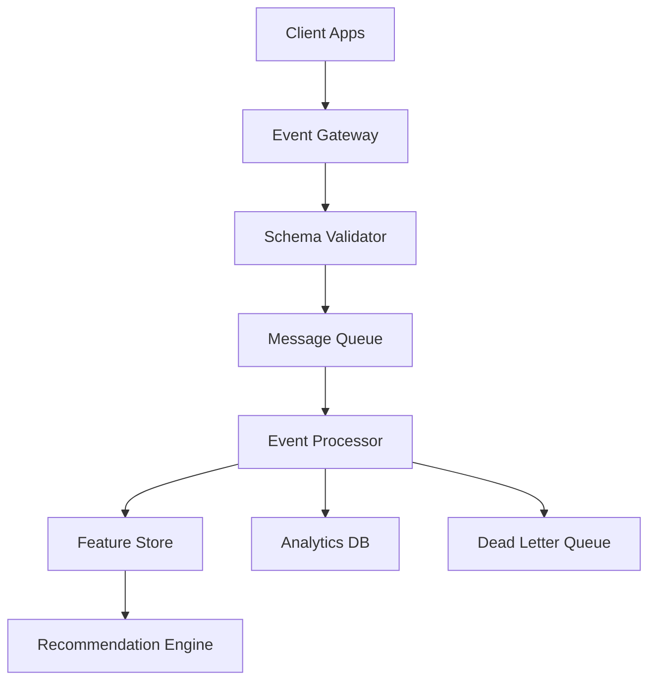

# EchoTune AI - Architecture Decision Record 003
# Event Feedback Ingestion Architecture

**Status:** Proposed  
**Date:** 2024-08-25  
**Authors:** EchoTune AI Development Team  

## Context

EchoTune AI requires a robust event feedback ingestion system to capture user interactions, preferences, and behavioral data in real-time. This system must handle high-throughput event streams, provide reliable delivery guarantees, and support real-time learning for the recommendation engine.

## Decision

We will implement a **streaming event ingestion architecture** with the following components:

1. **Event Gateway**: High-throughput HTTP/WebSocket endpoint for event collection
2. **Message Queue**: Redis Streams or Apache Kafka for reliable event buffering
3. **Event Processor**: Real-time event enrichment and validation
4. **Feature Store**: Real-time feature updates for recommendation models
5. **Dead Letter Queue**: Error handling and event replay capabilities

## Rationale

### Scalability Requirements
- **High Throughput**: Support 10K+ events per second
- **Low Latency**: Sub-100ms event processing for real-time features
- **Horizontal Scaling**: Auto-scaling based on event volume
- **Backpressure Handling**: Graceful degradation under load

### Reliability Requirements
- **At-Least-Once Delivery**: No event loss during processing
- **Idempotency**: Duplicate event handling
- **Circuit Breakers**: Fault isolation and recovery
- **Event Replay**: Historical event reprocessing capability

### Data Quality Requirements
- **Schema Validation**: Strict event format enforcement
- **Data Enrichment**: Adding context and metadata
- **Duplicate Detection**: Deduplication strategies
- **Privacy Compliance**: PII handling and anonymization

## Architecture Overview



## Implementation Strategy

### Phase 1: Basic Event Collection (Week 1)
- [ ] Create event gateway with basic HTTP endpoints
- [ ] Implement schema validation for core event types
- [ ] Set up Redis Streams for event buffering
- [ ] Basic event processor with logging

### Phase 2: Real-time Processing (Week 2)
- [ ] Implement event enrichment pipeline
- [ ] Add feature store integration
- [ ] Create monitoring and alerting
- [ ] Dead letter queue implementation

### Phase 3: Advanced Features (Week 3)
- [ ] Implement event replay capabilities
- [ ] Add batch processing for historical data
- [ ] Advanced analytics and reporting
- [ ] Performance optimization

## Event Schema

### Core Event Types
```json
{
  "user_interaction": {
    "user_id": "string",
    "session_id": "string", 
    "track_id": "string",
    "action": "play|pause|skip|like|dislike",
    "timestamp": "ISO8601",
    "context": {
      "playlist_id": "string",
      "source": "discover|search|radio",
      "device_type": "mobile|desktop|web"
    }
  }
}
```

### Feedback Events
```json
{
  "feedback_event": {
    "user_id": "string",
    "recommendation_id": "string",
    "feedback_type": "explicit|implicit",
    "rating": "number",
    "relevance_score": "number",
    "timestamp": "ISO8601"
  }
}
```

## Quality Gates

### Performance Metrics
- Event ingestion rate: >10K events/second
- Processing latency: <100ms p95
- Queue depth: <1000 events during normal operation
- Error rate: <0.1% of total events

### Reliability Metrics
- Event loss rate: <0.01%
- Duplicate rate: <0.1%
- Processor uptime: >99.9%
- Recovery time: <5 minutes

## Security Considerations

- Event payload encryption at rest and in transit
- User privacy protection and anonymization
- Rate limiting and abuse prevention
- Audit logging for compliance

## Monitoring and Alerting

- Real-time event volume and latency metrics
- Error rates and dead letter queue depth
- Resource utilization and scaling triggers
- Business metrics correlation

## Migration Strategy

- Feature flag controlled rollout
- Shadow mode validation against existing analytics
- Gradual traffic migration with monitoring
- Rollback procedures for each component

## Risks and Mitigations

| Risk | Mitigation |
|------|------------|
| Event loss during failures | Persistent queues and replication |
| Schema evolution breaking consumers | Backward compatibility validation |
| High cost of streaming infrastructure | Cost monitoring and auto-scaling |
| Privacy compliance violations | Built-in anonymization and audit trails |

## Future Considerations

- Machine learning model feedback loops
- Real-time recommendation serving
- Multi-tenant event isolation
- Advanced analytics and reporting

---
**Next Review:** 2024-09-15  
**Related ADRs:** ADR-002 (Recommendation Engine), ADR-005 (Observability)