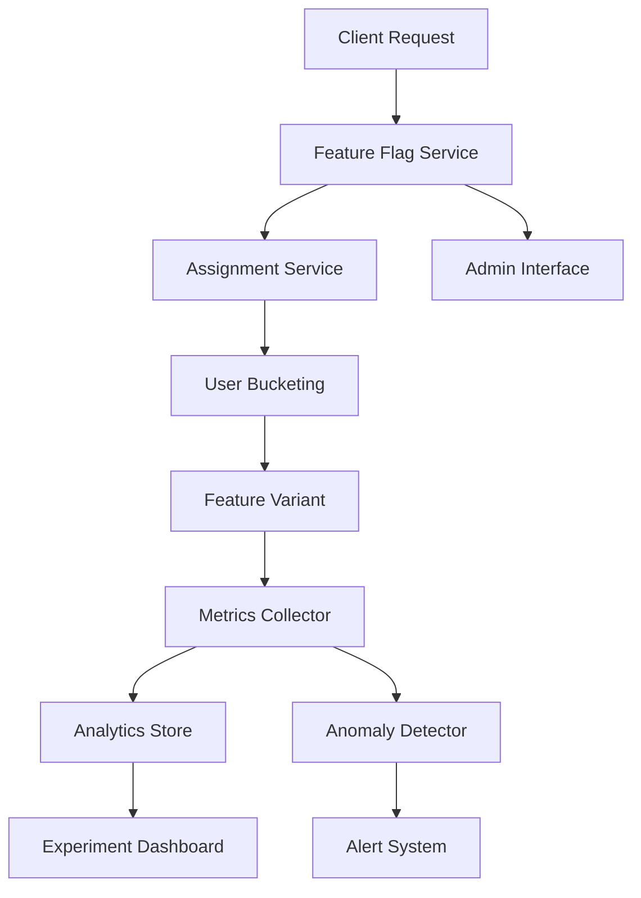

# EchoTune AI - Architecture Decision Record 004
# Feature Flags and Experiments Framework

**Status:** Proposed  
**Date:** 2024-08-25  
**Authors:** EchoTune AI Development Team  

## Context

EchoTune AI requires a robust experimentation framework to safely test new recommendation algorithms, UI changes, and feature rollouts. The system must support A/B testing, gradual feature rollouts, and data-driven decision making while maintaining system stability.

## Decision

We will implement a **comprehensive feature flag and experimentation platform** with:

1. **Feature Flag Service**: Centralized flag management with real-time updates
2. **Experiment Framework**: A/B testing with statistical significance validation
3. **Assignment Service**: Consistent user bucketing across sessions
4. **Metrics Collection**: Automated experiment result tracking
5. **Safety Guardrails**: Automated experiment termination on anomalies

## Rationale

### Development Velocity
- **Safe Deployments**: Deploy code behind flags without immediate activation
- **Gradual Rollouts**: Incrementally increase traffic to new features
- **Quick Rollbacks**: Instant feature disabling without code deployment
- **Team Independence**: Multiple teams can experiment simultaneously

### Product Optimization
- **Data-Driven Decisions**: Statistical significance testing for all changes
- **Multi-Metric Optimization**: Track business and technical metrics
- **Long-term Impact**: Extended experiment duration for learning effects
- **Personalization**: User segment-based feature targeting

### Risk Management
- **Blast Radius Control**: Limit experiment impact to small user segments
- **Automated Monitoring**: Real-time anomaly detection and alerting
- **Emergency Controls**: Circuit breakers for rapid experiment termination
- **Compliance Support**: GDPR/privacy controls for user data

## Architecture Overview



## Feature Flag Types

### Boolean Flags
```json
{
  "flag_id": "new_recommendation_ui",
  "enabled": true,
  "rollout_percentage": 15,
  "target_segments": ["beta_users", "premium"],
  "environments": ["staging", "production"]
}
```

### Multi-Variant Flags
```json
{
  "flag_id": "recommendation_algorithm",
  "variants": {
    "control": {"weight": 50, "config": {"algorithm": "collaborative"}},
    "test_a": {"weight": 25, "config": {"algorithm": "hybrid_v1"}},
    "test_b": {"weight": 25, "config": {"algorithm": "hybrid_v2"}}
  }
}
```

### Configuration Flags
```json
{
  "flag_id": "recommendation_count",
  "value_type": "number",
  "default": 20,
  "segments": {
    "premium": 50,
    "free": 10
  }
}
```

## Experiment Framework

### Experiment Definition
```json
{
  "experiment_id": "hybrid_reco_v1",
  "name": "Hybrid Recommendation Algorithm Test",
  "description": "Testing new hybrid algorithm against baseline",
  "start_date": "2024-09-01T00:00:00Z",
  "end_date": "2024-09-15T23:59:59Z",
  "hypothesis": "Hybrid algorithm will improve CTR by 5%",
  "variants": {
    "control": {"traffic": 50, "description": "Current collaborative filtering"},
    "treatment": {"traffic": 50, "description": "New hybrid algorithm"}
  },
  "success_metrics": {
    "primary": ["click_through_rate", "engagement_time"],
    "secondary": ["playlist_creation", "user_retention"],
    "guardrail": ["error_rate", "latency_p95"]
  },
  "target_audience": {
    "include": ["active_users"],
    "exclude": ["new_users", "churned_users"],
    "sample_size": 10000
  }
}
```

### Assignment Algorithm
```javascript
class ExperimentAssignment {
  assignUser(userId, experimentId) {
    // Consistent hashing for stable assignment
    const hash = this.hashFunction(userId + experimentId);
    const bucket = hash % 100;
    
    // Traffic allocation based on experiment config
    const experiment = this.getExperiment(experimentId);
    let cumulativeWeight = 0;
    
    for (const [variant, config] of Object.entries(experiment.variants)) {
      cumulativeWeight += config.traffic;
      if (bucket < cumulativeWeight) {
        return variant;
      }
    }
    
    return 'control'; // fallback
  }
}
```

## Implementation Strategy

### Phase 1: Basic Feature Flags (Week 1)
- [ ] Create feature flag service with Redis backend
- [ ] Implement client SDKs for JavaScript and Python
- [ ] Basic admin interface for flag management
- [ ] Integration with existing codebase

### Phase 2: Experimentation (Week 2)
- [ ] Implement experiment framework with user assignment
- [ ] Create metrics collection and analysis
- [ ] Statistical significance testing
- [ ] Experiment dashboard and reporting

### Phase 3: Advanced Features (Week 3)
- [ ] Automated anomaly detection and guardrails
- [ ] Multi-variate testing capabilities
- [ ] Advanced targeting and segmentation
- [ ] Integration with analytics and monitoring

## Statistical Framework

### Sample Size Calculation
```python
def calculate_sample_size(baseline_rate, minimum_detectable_effect, 
                         alpha=0.05, power=0.8):
    """Calculate required sample size for experiment"""
    # TODO: Implement statistical power calculation
    pass
```

### Significance Testing
```python
def analyze_experiment(control_data, treatment_data):
    """Analyze experiment results with statistical tests"""
    # TODO: Implement t-test, chi-square, and Bayesian analysis
    pass
```

## Guardrails and Safety

### Automated Monitoring
- Real-time metric tracking with anomaly detection
- Automatic experiment termination on negative impact
- Error rate and performance monitoring
- User experience quality gates

### Manual Controls
- Emergency stop buttons for immediate experiment termination
- Traffic ramp controls for gradual rollout
- User exclusion capabilities for problematic cases
- Rollback procedures with audit trails

## Quality Gates

### Performance Requirements
- Flag evaluation latency: <5ms p95
- Assignment consistency: 100% across sessions
- Flag update propagation: <30 seconds
- System availability: >99.9%

### Statistical Requirements
- Minimum experiment duration: 7 days
- Statistical significance: p < 0.05
- Minimum sample size: 1000 users per variant
- Effect size detection: >1% relative change

## Security and Privacy

- User assignment data encryption
- PII anonymization in experiment data
- GDPR compliance with opt-out capabilities
- Access controls for experiment management

## Migration Strategy

- Feature flag controlled rollout of experiment framework
- Gradual migration of existing configuration to flags
- Training and documentation for development teams
- Integration with existing CI/CD pipelines

## Monitoring and Alerting

### Technical Metrics
- Flag evaluation performance and errors
- Assignment service availability
- Data pipeline health and latency
- Resource utilization and scaling

### Business Metrics
- Experiment completion rates
- Statistical significance achievement
- Revenue impact measurement
- User experience quality scores

## Future Considerations

- Machine learning-powered experiment optimization
- Cross-platform experiment consistency
- Advanced statistical methods (Bayesian, multi-armed bandits)
- Real-time personalization based on experiment learnings

---
**Next Review:** 2024-09-15  
**Related ADRs:** ADR-002 (Recommendation Engine), ADR-003 (Event Ingestion), ADR-005 (Observability)