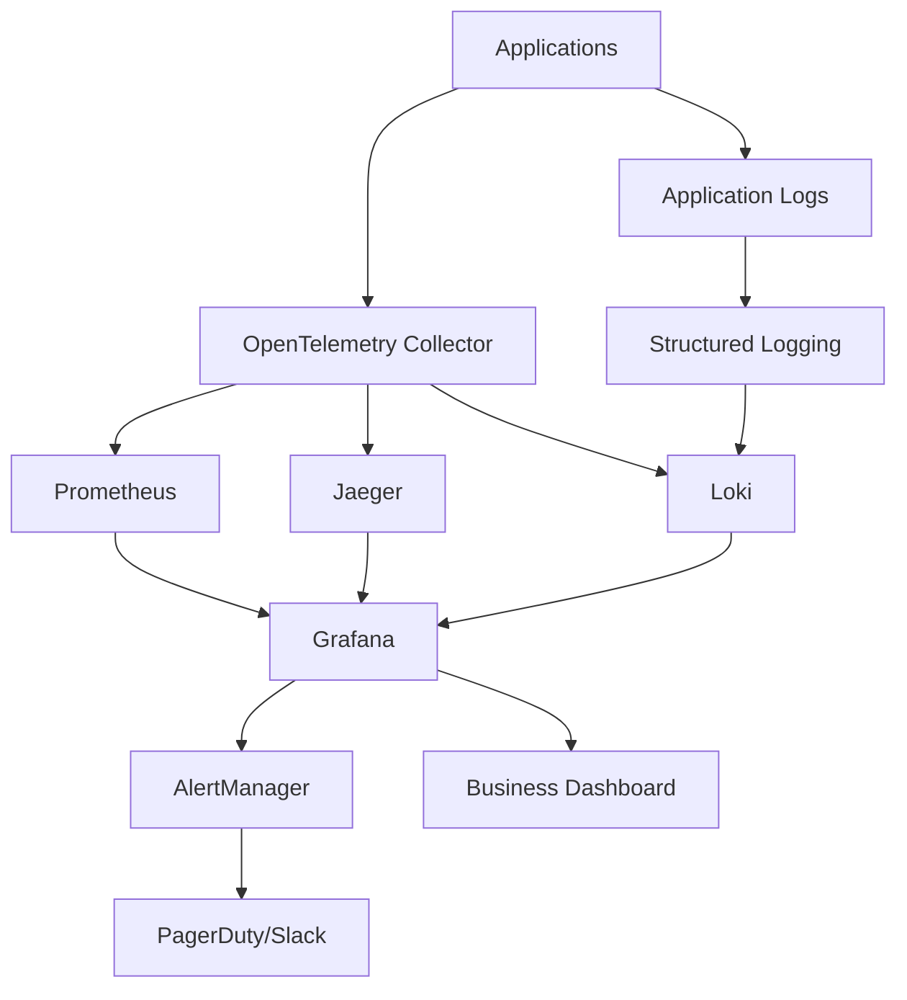

# EchoTune AI - Architecture Decision Record 005
# Observability Strategy

**Status:** Proposed  
**Date:** 2024-08-25  
**Authors:** EchoTune AI Development Team  

## Context

EchoTune AI requires comprehensive observability across its distributed architecture to ensure system reliability, performance optimization, and effective troubleshooting. The system must provide visibility into application performance, business metrics, user experience, and infrastructure health.

## Decision

We will implement a **comprehensive observability strategy** based on the three pillars of observability:

1. **Metrics**: Time-series data for performance monitoring and alerting
2. **Logs**: Structured logging for debugging and audit trails
3. **Traces**: Distributed tracing for request flow analysis
4. **Dashboards**: Grafana-based visualization and monitoring
5. **Alerting**: Proactive incident detection and notification

## Rationale

### Operational Excellence
- **Proactive Monitoring**: Detect issues before user impact
- **Root Cause Analysis**: Faster incident resolution with correlation
- **Performance Optimization**: Data-driven optimization decisions
- **Capacity Planning**: Resource utilization trend analysis

### Business Intelligence
- **User Behavior Insights**: Track engagement and satisfaction metrics
- **Recommendation Quality**: Monitor algorithm performance and accuracy
- **Revenue Impact**: Correlate technical metrics with business outcomes
- **Experiment Analysis**: A/B test result measurement and analysis

### Compliance and Security
- **Audit Trails**: Complete request and data access logging
- **Security Monitoring**: Anomaly detection and threat identification
- **Data Privacy**: PII handling and anonymization tracking
- **Regulatory Compliance**: GDPR and data protection monitoring

## Architecture Overview



## Metrics Strategy

### Application Metrics
```yaml
# HTTP Request Metrics
http_requests_total:
  type: counter
  labels: [method, endpoint, status_code, user_segment]
  
http_request_duration:
  type: histogram
  buckets: [0.1, 0.5, 1.0, 2.5, 5.0, 10.0]
  labels: [method, endpoint]

# Recommendation Engine Metrics  
recommendations_generated_total:
  type: counter
  labels: [algorithm, user_segment, experiment_variant]
  
recommendation_latency:
  type: histogram
  buckets: [0.1, 0.5, 1.0, 2.0, 5.0]
  labels: [algorithm]

recommendation_accuracy:
  type: gauge
  labels: [algorithm, time_window]
```

### Business Metrics
```yaml
# User Engagement
user_sessions_total:
  type: counter
  labels: [device_type, user_segment]

track_plays_total:
  type: counter
  labels: [source, playlist_type]

user_retention_rate:
  type: gauge
  labels: [cohort, time_period]

# Revenue Metrics
subscription_conversions:
  type: counter
  labels: [source_page, experiment_variant]

revenue_per_user:
  type: gauge
  labels: [user_segment, time_period]
```

### Infrastructure Metrics
```yaml
# System Resources
cpu_usage_percent:
  type: gauge
  labels: [service, instance]

memory_usage_bytes:
  type: gauge
  labels: [service, instance]

# Database Performance
database_query_duration:
  type: histogram
  buckets: [0.001, 0.01, 0.1, 0.5, 1.0, 5.0]
  labels: [query_type, table]

cache_hit_rate:
  type: gauge
  labels: [cache_type, service]
```

## Logging Strategy

### Structured Logging Format
```json
{
  "timestamp": "2024-08-25T12:34:56.789Z",
  "level": "INFO",
  "service": "recommendation-api",
  "version": "v2.1.0",
  "trace_id": "abc123def456",
  "span_id": "def456ghi789",
  "user_id": "user123",
  "session_id": "session456",
  "request_id": "req789",
  "message": "Generated recommendations",
  "context": {
    "algorithm": "hybrid_v1",
    "recommendations_count": 20,
    "processing_time_ms": 45,
    "cache_hit": false
  }
}
```

### Log Levels and Purposes
- **ERROR**: System errors requiring immediate attention
- **WARN**: Degraded performance or recoverable errors
- **INFO**: Important business events and state changes
- **DEBUG**: Detailed technical information for troubleshooting

### Sensitive Data Handling
```javascript
// PII Anonymization
function sanitizeLog(logData) {
  const sanitized = { ...logData };
  
  // Remove or hash sensitive fields
  if (sanitized.user_email) {
    sanitized.user_email_hash = hash(sanitized.user_email);
    delete sanitized.user_email;
  }
  
  if (sanitized.user_id) {
    sanitized.user_id = anonymizeUserId(sanitized.user_id);
  }
  
  return sanitized;
}
```

## Distributed Tracing

### Trace Structure
```yaml
Trace: user_recommendation_request
├── Span: http_request (recommendation-api)
│   ├── Span: user_profile_fetch (user-service)
│   ├── Span: recommendation_generation (reco-engine)
│   │   ├── Span: feature_extraction
│   │   ├── Span: algorithm_execution
│   │   └── Span: post_processing
│   ├── Span: database_query (mongodb)
│   └── Span: cache_operation (redis)
```

### Trace Sampling
```javascript
// Adaptive sampling strategy
const SAMPLING_RULES = {
  'recommendation-api': {
    '/health': 0.01,      // 1% sampling for health checks
    '/recommend': 0.1,     // 10% sampling for recommendations
    '/error': 1.0          // 100% sampling for errors
  },
  'user-service': {
    'default': 0.05,       // 5% default sampling
    'error': 1.0           // 100% error sampling
  }
};
```

## Dashboard Strategy

### Service Dashboards
- **API Gateway**: Request rates, latency, error rates
- **Recommendation Engine**: Algorithm performance, accuracy metrics
- **User Service**: Authentication, profile updates, user activity
- **Database**: Query performance, connection pooling, replication lag

### Business Dashboards
- **User Experience**: Page load times, conversion funnels, satisfaction scores
- **Recommendation Quality**: Click-through rates, engagement metrics, diversity
- **Revenue Impact**: Subscription conversions, premium upgrades, churn rates
- **Experiment Results**: A/B test performance, statistical significance

### Infrastructure Dashboards
- **Resource Utilization**: CPU, memory, disk, network across all services
- **Container Health**: Pod status, restart counts, resource limits
- **Network Performance**: Latency, throughput, error rates between services

## Alerting Strategy

### Alert Severity Levels
```yaml
CRITICAL:
  - Service completely down (>5 minutes)
  - Error rate >10% for >2 minutes
  - Revenue-impacting issues
  - Security incidents
  response_time: immediate
  escalation: on-call engineer

WARNING:
  - Degraded performance (>2x normal latency)
  - Error rate >5% for >5 minutes
  - Resource utilization >80%
  response_time: 15 minutes
  escalation: team notification

INFO:
  - Deployment notifications
  - Capacity threshold warnings
  - Experiment result notifications
  response_time: next business day
```

### Alert Rules
```yaml
# High Error Rate
- alert: HighErrorRate
  expr: rate(http_requests_total{status_code=~"5.."}[5m]) / rate(http_requests_total[5m]) > 0.05
  for: 2m
  labels:
    severity: warning
  annotations:
    summary: "High error rate detected"
    description: "Error rate is {{ $value | humanizePercentage }}"

# Service Down
- alert: ServiceDown
  expr: up{job="recommendation-api"} == 0
  for: 1m
  labels:
    severity: critical
  annotations:
    summary: "Service is down"
    description: "{{ $labels.instance }} has been down for more than 1 minute"
```

## Implementation Strategy

### Phase 1: Core Observability (Week 1)
- [ ] Deploy OpenTelemetry collectors
- [ ] Implement structured logging across services
- [ ] Set up Prometheus metrics collection
- [ ] Create basic Grafana dashboards

### Phase 2: Advanced Monitoring (Week 2)
- [ ] Implement distributed tracing with Jaeger
- [ ] Create business metrics dashboards
- [ ] Set up alerting rules and notification channels
- [ ] Implement log aggregation and search

### Phase 3: Intelligence Layer (Week 3)
- [ ] Anomaly detection and automated alerting
- [ ] Correlation analysis between metrics
- [ ] Performance optimization recommendations
- [ ] Custom business intelligence dashboards

## Quality Gates

### Performance Requirements
- Metric collection overhead: <1% of request latency
- Log processing delay: <10 seconds
- Dashboard load time: <5 seconds
- Alert delivery time: <1 minute

### Reliability Requirements
- Observability system uptime: >99.9%
- Data retention: 30 days for metrics, 90 days for logs
- Storage compression: >80% for logs
- Query performance: <5 seconds for dashboard queries

## Security and Privacy

### Data Protection
- PII anonymization in all observability data
- Encryption at rest and in transit
- Access controls and audit logging
- GDPR compliance for user data

### Security Monitoring
```yaml
# Security Alerts
- alert: SuspiciousLoginPattern
  expr: rate(failed_login_attempts[5m]) > 10
  labels:
    severity: warning
    
- alert: UnauthorizedAPIAccess
  expr: rate(http_requests_total{status_code="401"}[5m]) > 5
  labels:
    severity: critical
```

## Cost Optimization

### Data Retention Policies
```yaml
metrics:
  high_resolution: 7 days    # 15s resolution
  medium_resolution: 30 days # 1m resolution  
  low_resolution: 365 days   # 1h resolution

logs:
  application: 30 days
  security: 90 days
  audit: 365 days

traces:
  detailed: 7 days
  sampled: 30 days
```

### Resource Management
- Automatic scaling based on data volume
- Intelligent sampling to reduce costs
- Data compression and archival strategies
- Regular cleanup of unused dashboards and alerts

## Future Considerations

- Machine learning-powered anomaly detection
- Predictive alerting based on trend analysis
- Cross-service dependency mapping
- Advanced root cause analysis automation

---
**Next Review:** 2024-09-15  
**Related ADRs:** ADR-002 (Recommendation Engine), ADR-003 (Event Ingestion), ADR-004 (Experiments)