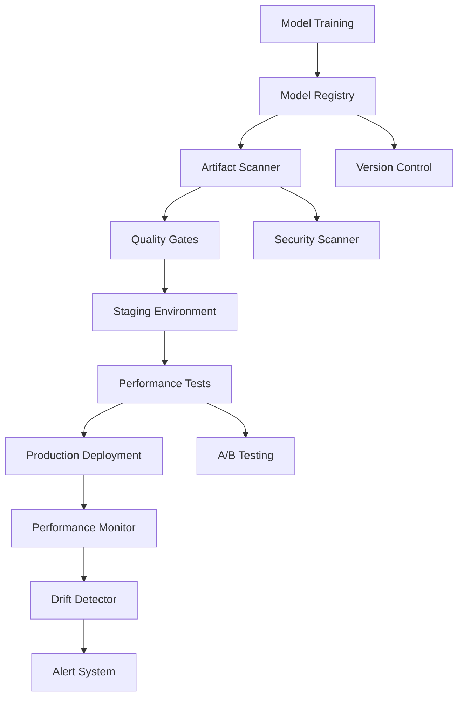

# EchoTune AI - Architecture Decision Record 006
# Model Artifact Integrity and Validation

**Status:** Proposed  
**Date:** 2024-08-25  
**Authors:** EchoTune AI Development Team  

## Context

EchoTune AI relies on machine learning models for recommendation generation, user preference prediction, and content analysis. Ensuring the integrity, security, and performance of model artifacts throughout their lifecycle is critical for system reliability and recommendation quality.

## Decision

We will implement a **comprehensive model artifact integrity framework** with:

1. **Model Versioning**: Semantic versioning and lineage tracking
2. **Artifact Validation**: Automated testing and quality gates
3. **Security Scanning**: Vulnerability detection and compliance checks
4. **Performance Monitoring**: Model drift detection and performance tracking
5. **Deployment Pipeline**: Safe model rollout with automated rollback

## Rationale

### Model Reliability
- **Quality Assurance**: Automated validation prevents degraded models in production
- **Performance Monitoring**: Early detection of model drift and degradation
- **Version Control**: Traceable model lineage and rollback capabilities
- **Consistency**: Standardized model packaging and deployment processes

### Security and Compliance
- **Supply Chain Security**: Protection against model poisoning and backdoors
- **Vulnerability Scanning**: Detection of known security issues in dependencies
- **Access Control**: Secure model storage and deployment pipelines
- **Audit Trails**: Complete tracking of model changes and deployments

### Operational Excellence
- **Automated Testing**: Comprehensive validation without manual intervention
- **Deployment Automation**: Reliable and repeatable model deployments
- **Monitoring Integration**: Real-time model performance tracking
- **Incident Response**: Rapid detection and resolution of model issues

## Architecture Overview



## Model Versioning Strategy

### Semantic Versioning
```yaml
model_version: "v2.1.3"
# Major: Breaking changes to input/output schema
# Minor: Backward-compatible functionality additions
# Patch: Bug fixes and performance improvements

version_metadata:
  major: 2        # Algorithm architecture change
  minor: 1        # New feature inputs added
  patch: 3        # Performance optimization
  build: 1647     # Build number
  commit: "abc123" # Git commit hash
```

### Model Lineage Tracking
```json
{
  "model_id": "recommendation_hybrid_v2.1.3",
  "lineage": {
    "parent_model": "recommendation_hybrid_v2.1.2",
    "training_dataset": {
      "name": "user_interactions_2024_q3",
      "version": "v1.2.1",
      "checksum": "sha256:abc123..."
    },
    "training_config": {
      "algorithm": "hybrid_collaborative_content",
      "hyperparameters": {
        "learning_rate": 0.001,
        "batch_size": 512,
        "epochs": 100
      }
    },
    "training_environment": {
      "python_version": "3.9.18",
      "dependencies": "requirements_v2.1.txt",
      "hardware": "8x NVIDIA A100"
    }
  }
}
```

## Artifact Validation Framework

### Model Schema Validation
```python
from pydantic import BaseModel
from typing import List, Dict, Any

class ModelInput(BaseModel):
    user_id: str
    user_features: Dict[str, float]
    context: Dict[str, Any]
    timestamp: int

class ModelOutput(BaseModel):
    recommendations: List[Dict[str, Any]]
    confidence_scores: List[float]
    explanation: str
    model_version: str

def validate_model_schema(model_artifact):
    """Validate model input/output schema compliance"""
    # TODO: Implement schema validation
    pass
```

### Performance Validation
```python
class ModelPerformanceValidator:
    def __init__(self, baseline_metrics):
        self.baseline_metrics = baseline_metrics
    
    def validate_performance(self, model, test_dataset):
        """Validate model performance against baseline"""
        metrics = self.evaluate_model(model, test_dataset)
        
        # Performance gates
        assert metrics['accuracy'] >= self.baseline_metrics['accuracy'] * 0.95
        assert metrics['latency_p95'] <= self.baseline_metrics['latency_p95'] * 1.1
        assert metrics['memory_usage'] <= self.baseline_metrics['memory_usage'] * 1.2
        
        return metrics
    
    def evaluate_model(self, model, dataset):
        """Run comprehensive model evaluation"""
        # TODO: Implement evaluation metrics
        pass
```

### Security Validation
```python
class ModelSecurityScanner:
    def scan_model_artifact(self, model_path):
        """Scan model for security vulnerabilities"""
        results = {
            'dependency_scan': self.scan_dependencies(model_path),
            'backdoor_detection': self.detect_backdoors(model_path),
            'privacy_check': self.check_privacy_compliance(model_path),
            'size_validation': self.validate_model_size(model_path)
        }
        return results
    
    def scan_dependencies(self, model_path):
        """Scan model dependencies for known vulnerabilities"""
        # TODO: Implement dependency scanning
        pass
    
    def detect_backdoors(self, model_path):
        """Detect potential model backdoors or poisoning"""
        # TODO: Implement backdoor detection
        pass
```

## Model Performance Monitoring

### Drift Detection
```python
class ModelDriftDetector:
    def __init__(self, reference_distribution):
        self.reference_distribution = reference_distribution
    
    def detect_data_drift(self, incoming_data):
        """Detect statistical drift in input data"""
        # Statistical tests: KS test, PSI, Jensen-Shannon divergence
        drift_score = self.calculate_drift_score(incoming_data)
        
        if drift_score > self.DRIFT_THRESHOLD:
            self.trigger_drift_alert(drift_score)
        
        return drift_score
    
    def detect_prediction_drift(self, predictions, actual_outcomes):
        """Detect drift in model prediction quality"""
        # TODO: Implement prediction drift detection
        pass
```

### Performance Monitoring
```python
class ModelPerformanceMonitor:
    def __init__(self):
        self.metrics_collector = MetricsCollector()
    
    def track_prediction_latency(self, model_version, latency_ms):
        """Track model prediction latency"""
        self.metrics_collector.histogram(
            'model_prediction_latency',
            latency_ms,
            labels={'model_version': model_version}
        )
    
    def track_prediction_accuracy(self, model_version, accuracy):
        """Track model prediction accuracy"""
        self.metrics_collector.gauge(
            'model_prediction_accuracy',
            accuracy,
            labels={'model_version': model_version}
        )
```

## Deployment Pipeline

### Staging Validation
```yaml
# Model deployment pipeline
stages:
  - name: artifact_validation
    steps:
      - schema_validation
      - security_scan
      - performance_baseline
      
  - name: staging_deployment
    steps:
      - deploy_to_staging
      - integration_tests
      - load_testing
      
  - name: canary_deployment
    steps:
      - deploy_to_5_percent_traffic
      - monitor_performance_metrics
      - compare_against_baseline
      
  - name: full_deployment
    steps:
      - gradual_traffic_increase
      - continuous_monitoring
      - automated_rollback_on_issues
```

### Rollback Strategy
```python
class ModelRollbackManager:
    def __init__(self):
        self.deployment_history = DeploymentHistory()
    
    def initiate_rollback(self, reason, severity='medium'):
        """Initiate model rollback to previous version"""
        previous_version = self.deployment_history.get_previous_stable()
        
        if severity == 'critical':
            # Immediate rollback
            self.deploy_model_immediately(previous_version)
        else:
            # Gradual rollback
            self.gradual_traffic_shift(previous_version, duration='10m')
    
    def validate_rollback_success(self, target_version):
        """Validate successful rollback"""
        # TODO: Implement rollback validation
        pass
```

## Quality Gates

### Validation Gates
```yaml
quality_gates:
  schema_validation:
    required: true
    timeout: "5m"
    
  security_scan:
    required: true
    max_vulnerabilities: 0
    timeout: "10m"
    
  performance_validation:
    required: true
    accuracy_threshold: 0.95  # 95% of baseline
    latency_threshold: 1.1    # 110% of baseline
    memory_threshold: 1.2     # 120% of baseline
    
  integration_tests:
    required: true
    success_rate: 1.0
    timeout: "15m"
```

### Performance Thresholds
```yaml
performance_thresholds:
  accuracy:
    critical: 0.85    # Below 85% accuracy
    warning: 0.90     # Below 90% accuracy
    
  latency:
    critical: 1000ms  # Above 1 second
    warning: 500ms    # Above 500ms
    
  drift_score:
    critical: 0.3     # High drift detected
    warning: 0.1      # Medium drift detected
```

## Security and Compliance

### Model Signing and Verification
```python
def sign_model_artifact(model_path, private_key):
    """Sign model artifact for integrity verification"""
    model_hash = calculate_model_hash(model_path)
    signature = create_digital_signature(model_hash, private_key)
    
    return {
        'model_hash': model_hash,
        'signature': signature,
        'signing_key_id': get_key_id(private_key),
        'timestamp': get_current_timestamp()
    }

def verify_model_integrity(model_path, signature_data, public_key):
    """Verify model artifact integrity"""
    current_hash = calculate_model_hash(model_path)
    return verify_signature(current_hash, signature_data, public_key)
```

### Access Control
```yaml
model_access_control:
  production_deployment:
    required_approvals: 2
    approved_roles: ['ml_engineer', 'senior_engineer']
    
  model_registry_write:
    required_roles: ['ml_engineer', 'data_scientist']
    
  model_registry_read:
    required_roles: ['engineer', 'analyst']
```

## Implementation Strategy

### Phase 1: Basic Validation (Week 1)
- [ ] Implement model versioning and registry
- [ ] Create basic validation pipeline
- [ ] Set up model signing and verification
- [ ] Basic performance monitoring

### Phase 2: Advanced Monitoring (Week 2)
- [ ] Implement drift detection
- [ ] Create comprehensive performance monitoring
- [ ] Set up automated alerting
- [ ] Advanced security scanning

### Phase 3: Automation (Week 3)
- [ ] Fully automated deployment pipeline
- [ ] Intelligent rollback triggers
- [ ] Performance optimization recommendations
- [ ] Advanced compliance reporting

## Monitoring and Alerting

### Model Health Metrics
```yaml
model_health_dashboard:
  - prediction_accuracy_trend
  - prediction_latency_distribution  
  - data_drift_scores
  - model_version_adoption
  - error_rates_by_model
  - resource_utilization
```

### Alert Rules
```yaml
alerts:
  - name: ModelAccuracyDrop
    condition: accuracy < baseline * 0.9
    severity: warning
    
  - name: ModelDriftDetected
    condition: drift_score > 0.2
    severity: critical
    
  - name: ModelLatencyHigh
    condition: latency_p95 > 1000ms
    severity: warning
```

## Future Considerations

- Federated learning model validation
- Automated model retraining triggers
- Advanced explainability and fairness validation
- Multi-modal model support
- Real-time model serving optimization

---
**Next Review:** 2024-09-15  
**Related ADRs:** ADR-002 (Recommendation Engine), ADR-005 (Observability)