# EchoTune AI - System Architecture

## 🏗️ Overview

EchoTune AI is a sophisticated music recommendation system built with a modern, scalable architecture that integrates multiple technologies for AI-powered music discovery, real-time recommendations, and advanced user interaction.

## 🎯 System Architecture Diagram

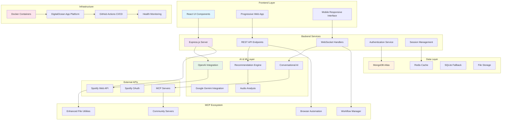

## 🔧 Component Architecture

### Frontend Architecture

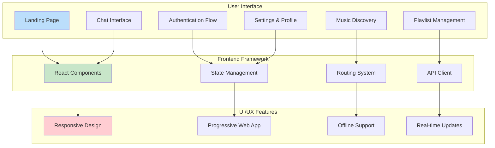

### Backend Architecture

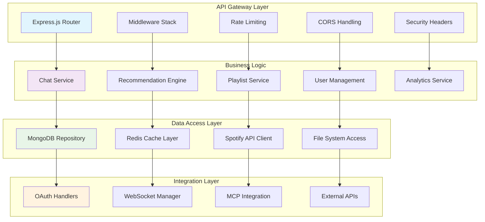

## 🤖 MCP Integration Architecture

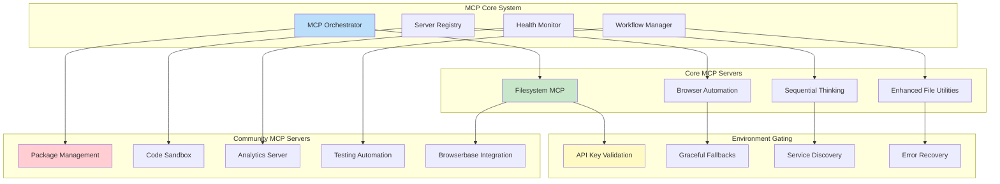

## 🎵 Music Processing Pipeline

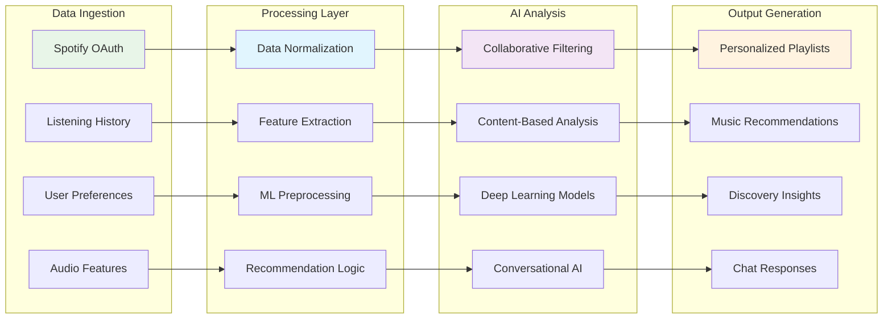

## 🔐 Security Architecture

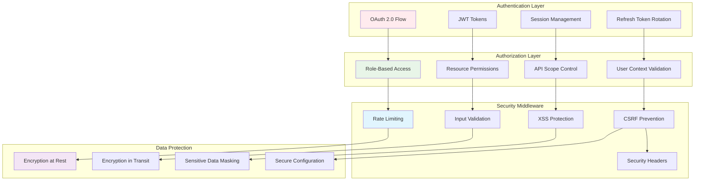

## 🚀 Deployment Architecture

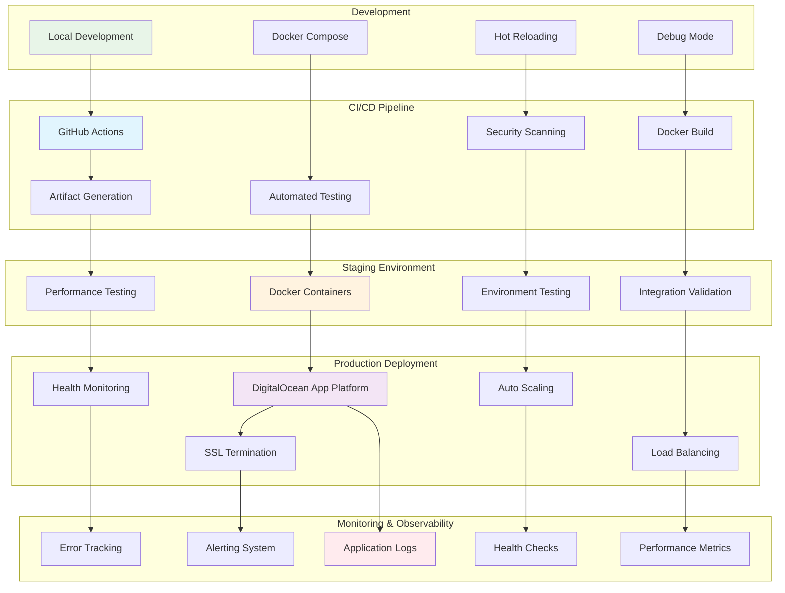

## 📊 Data Flow Architecture

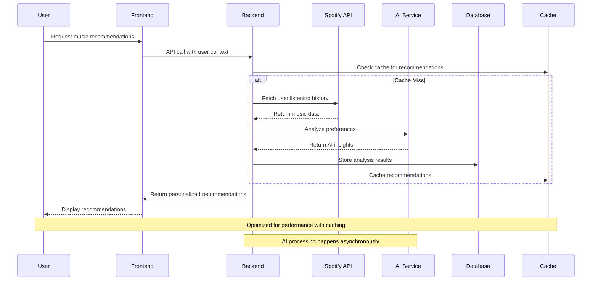

## 🔄 Continuous Improvement Flow

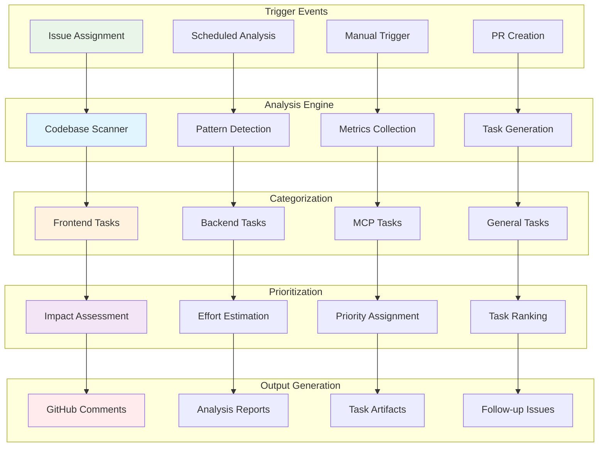

## 📈 Performance Optimization Architecture

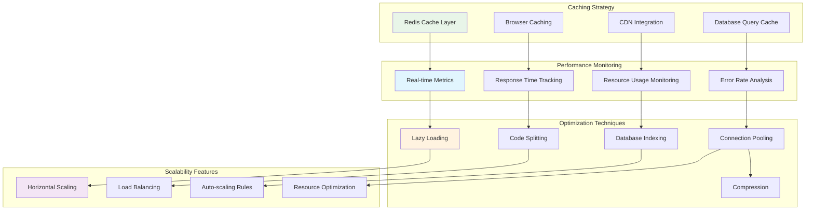

## 🔧 Technology Stack

### Frontend Technologies
- **Framework:** React 19.1.1
- **UI Library:** Material-UI (MUI) 7.3.1
- **Styling:** Emotion, CSS3
- **Build Tool:** Vite 7.0.6
- **PWA Support:** Service Workers
- **State Management:** React Context/Hooks

### Backend Technologies
- **Runtime:** Node.js 20+
- **Framework:** Express.js 4.18
- **Authentication:** JWT, OAuth 2.0
- **WebSockets:** Socket.IO 4.7
- **Security:** Helmet, CORS, Rate Limiting

### Database & Caching
- **Primary Database:** MongoDB 6.18+ (Atlas)
- **Cache Layer:** Redis 4.7+
- **Fallback Database:** SQLite 5.1+
- **Session Store:** Redis/Memory

### AI & ML Services
- **OpenAI:** GPT models for conversational AI
- **Google Gemini:** Alternative AI provider
- **Custom ML:** Recommendation algorithms
- **Audio Analysis:** Spotify Web API features

### MCP Ecosystem
- **Core Protocol:** Model Context Protocol SDK 1.17.2
- **Filesystem:** Enhanced file operations
- **Browser Automation:** Puppeteer, Browserbase
- **Community Servers:** 39+ integrated servers

### DevOps & Infrastructure
- **Containerization:** Docker with multi-stage builds
- **Orchestration:** Docker Compose
- **CI/CD:** GitHub Actions workflows
- **Deployment:** DigitalOcean App Platform
- **Monitoring:** Built-in health checks
- **Security:** Automated vulnerability scanning

## 🌐 Network Architecture

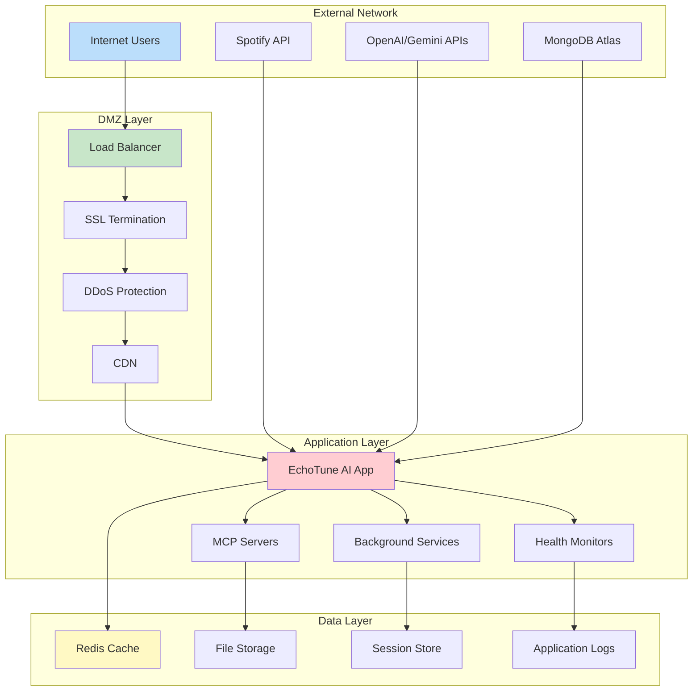

## 📱 Mobile & Progressive Web App Architecture

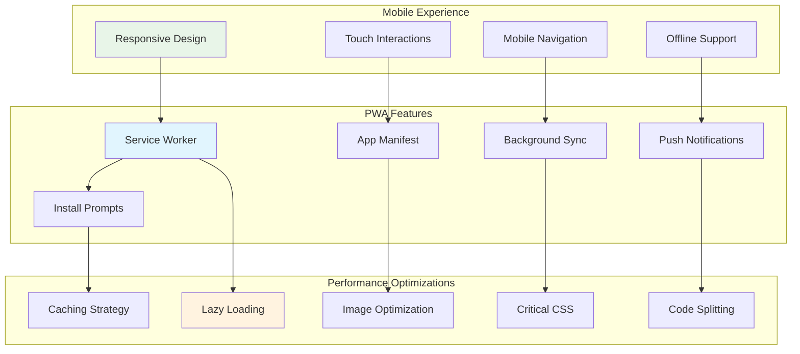

## 🔍 Error Handling & Recovery Architecture

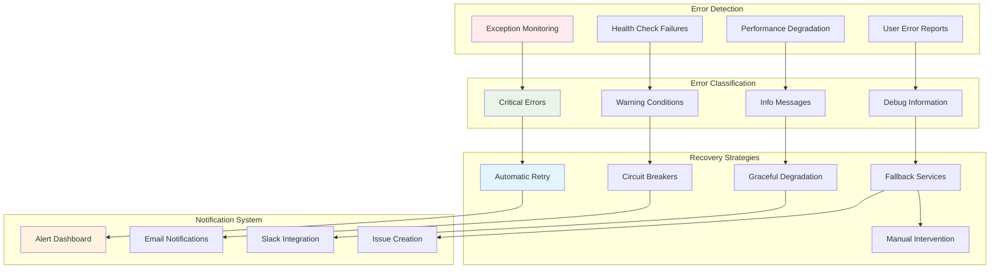

## 📋 Quality Assurance Architecture

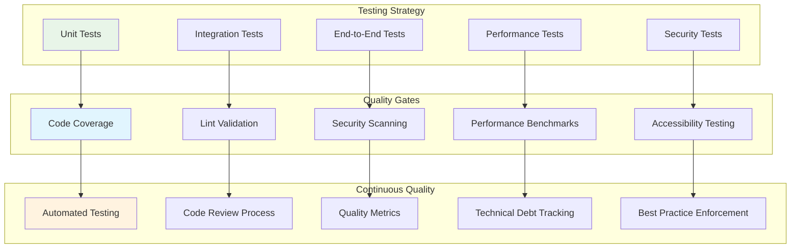

---

## 🎯 Architecture Principles

### Design Philosophy
1. **Modularity:** Components are loosely coupled and highly cohesive
2. **Scalability:** Architecture supports horizontal and vertical scaling
3. **Resilience:** System gracefully handles failures and degrades functionality
4. **Security:** Security is built-in at every layer
5. **Performance:** Optimized for fast response times and low latency
6. **Maintainability:** Code is clean, well-documented, and testable

### Key Architectural Decisions
- **Microservices-ready:** Modular design allows for future service separation
- **API-first:** RESTful APIs enable multiple client integrations
- **Event-driven:** Asynchronous processing for better user experience
- **Cache-heavy:** Multiple caching layers for optimal performance
- **Environment-agnostic:** Runs consistently across development, staging, and production

This architecture supports EchoTune AI's mission to provide intelligent, personalized music recommendations while maintaining high performance, security, and reliability standards.