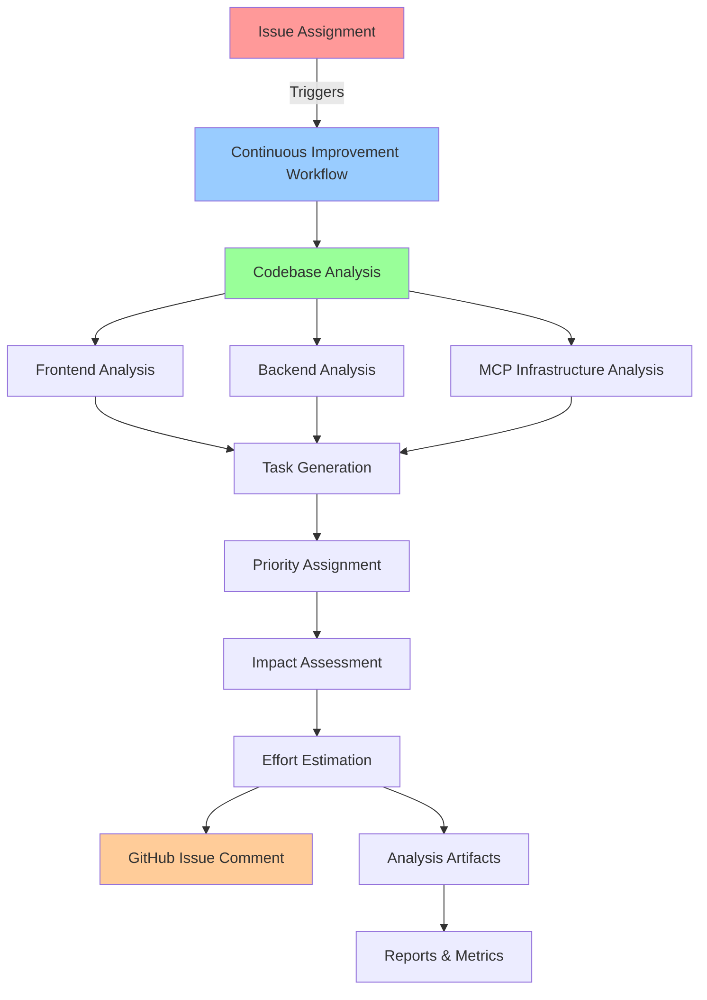

# Continuous Improvement Workflow Documentation

## 🔄 Overview

EchoTune AI features an advanced continuous improvement system that automatically analyzes the codebase and generates actionable improvement tasks whenever issues are assigned to the coding agent. This system helps maintain code quality and identifies enhancement opportunities across frontend, backend, and MCP infrastructure.

## 🎯 System Architecture



## 🚀 Trigger Conditions

### Automatic Triggers

1. **Issue Assignment to Coding Agent**
   ```yaml
   on:
     issues:
       types: [assigned]
   ```
   - When an issue is assigned to a user with login `coding-agent`
   - When an issue has the label `coding-agent` or `continuous-improvement`

2. **Issue State Changes**
   ```yaml
   on:
     issues:
       types: [reopened, labeled]
   ```
   - When issues are reopened for analysis
   - When relevant labels are added

3. **Scheduled Analysis**
   ```yaml
   on:
     schedule:
       - cron: '0 1 * * *'  # Daily at 1 AM UTC
   ```
   - Daily safety run to check for improvements
   - Proactive identification of enhancement opportunities

### Manual Triggers

1. **Workflow Dispatch**
   ```yaml
   on:
     workflow_dispatch:
       inputs:
         issue_number: "Optional issue number"
         analysis_scope: "full|frontend|backend|mcp"
   ```

2. **GitHub UI Trigger**
   - Go to Actions → Continuous Improvement
   - Click "Run workflow"
   - Select scope and target issue

## 🔍 Analysis Components

### Frontend Analysis

**Scope:** `src/frontend`, `src/components`, `public`

**Metrics Collected:**
- Total frontend files count
- JSX/JavaScript files count
- CSS files count  
- React components count
- UI/UX patterns analysis

**Task Categories Generated:**
- Component architecture improvements
- UI/UX enhancements
- Accessibility compliance
- Mobile responsiveness
- Performance optimizations

**Example Tasks:**
```json
{
  "title": "Add React components for better user interface",
  "priority": "medium",
  "category": "frontend",
  "description": "Create React components to improve user experience",
  "estimatedEffort": "medium",
  "impact": "high"
}
```

### Backend Analysis

**Scope:** `src/api`, `src/server.js`, `src/middleware`, `src/utils`

**Metrics Collected:**
- Backend files count
- API routes count
- Middleware implementations
- Database integrations
- Security patterns

**Task Categories Generated:**
- API validation and security
- Performance optimizations
- Error handling improvements
- Logging and monitoring
- Database query optimization

**Example Tasks:**
```json
{
  "title": "Add comprehensive API input validation",
  "priority": "high", 
  "category": "backend",
  "description": "Implement robust input validation for all API endpoints",
  "estimatedEffort": "medium",
  "impact": "high"
}
```

### MCP Infrastructure Analysis

**Scope:** `mcp-server`, `mcp-servers`, `scripts/mcp`

**Metrics Collected:**
- MCP server count
- Configuration files
- Health check scripts
- Integration patterns
- Automation scripts

**Task Categories Generated:**
- MCP server reliability
- Error handling and recovery
- Performance monitoring
- Integration improvements
- Documentation updates

**Example Tasks:**
```json
{
  "title": "Enhance MCP server error handling and recovery",
  "priority": "medium",
  "category": "mcp",
  "description": "Improve robustness of MCP server connections",
  "estimatedEffort": "medium", 
  "impact": "high"
}
```

## 📊 Analysis Engine

### Core Algorithm

```javascript
class ContinuousImprovementAnalyzer {
  async generateReport() {
    const scope = this.analysisResults.scope;
    
    if (scope === 'full' || scope === 'frontend') {
      await this.analyzeFrontend();
    }
    if (scope === 'full' || scope === 'backend') {
      await this.analyzeBackend();
    }
    if (scope === 'full' || scope === 'mcp') {
      await this.analyzeMCP();
    }
    
    return this.analysisResults;
  }
}
```

### Pattern Detection

The analyzer uses sophisticated pattern matching to identify:

1. **Code Quality Issues**
   - Missing error handling
   - Inconsistent patterns
   - Security vulnerabilities

2. **Performance Opportunities**
   - Unoptimized database queries
   - Missing caching layers
   - Resource inefficiencies

3. **Architecture Improvements**
   - Component organization
   - API design patterns
   - Integration opportunities

### Metrics Calculation

```javascript
// Frontend metrics
componentCount: this.countReactComponents(jsxFiles)
apiRoutes: this.countApiRoutes(backendFiles)  
mcpServers: this.countMCPServers(mcpFiles)
```

## 🎯 Task Prioritization

### Priority Levels

1. **High Priority**
   - Security vulnerabilities
   - Critical performance issues
   - Essential functionality gaps
   - User experience blockers

2. **Medium Priority**
   - Code quality improvements
   - Performance optimizations
   - Feature enhancements
   - Documentation updates

3. **Low Priority**
   - Code style improvements
   - Minor UI enhancements
   - Optional integrations
   - Refactoring opportunities

### Impact Assessment

- **High Impact:** Affects core functionality, security, or user experience
- **Medium Impact:** Improves performance, maintainability, or features
- **Low Impact:** Code quality, documentation, or minor enhancements

### Effort Estimation

- **Low Effort:** 1-4 hours of development time
- **Medium Effort:** 1-2 days of development time
- **High Effort:** Multiple days or weeks of development time

## 📋 Report Generation

### Analysis Artifacts

1. **Detailed JSON Report**
   ```json
   {
     "timestamp": "2025-01-17T00:00:00.000Z",
     "scope": "full",
     "issueNumber": "166",
     "frontend": {
       "tasks": [...],
       "metrics": {...}
     },
     "backend": {
       "tasks": [...], 
       "metrics": {...}
     },
     "mcp": {
       "tasks": [...],
       "metrics": {...}
     }
   }
   ```

2. **Markdown Summary Report**
   ```markdown
   # Continuous Improvement Analysis Report
   
   **Generated:** 2025-01-17T00:00:00.000Z
   **Total Tasks:** 12
   
   ## Executive Summary
   🎯 **High Priority Tasks:** 3
   🔧 **Medium Priority Tasks:** 6  
   📝 **Low Priority Tasks:** 3
   ```

3. **GitHub Issue Comments**
   - Executive summary with key findings
   - Priority breakdown
   - Next steps and recommendations
   - Links to detailed artifacts

### Report Structure

```markdown
## 🤖 Continuous Improvement Analysis

I've analyzed the codebase and identified actionable improvements.

**Analysis Timestamp:** 2025-01-17T00:00:00.000Z
**Triggered by:** Issue assignment to coding agent

### Executive Summary
- Frontend Tasks: 4
- Backend Tasks: 6
- MCP Tasks: 2

### High Priority Recommendations
1. Add comprehensive API input validation (Backend)
2. Implement proper error handling (Backend)  
3. Add accessibility features (Frontend)

## 📋 Next Steps
Creating follow-up issues for high-priority improvements...
```

## 🔗 Integration Points

### GitHub Integration

1. **Issue Comments**
   ```javascript
   await github.rest.issues.createComment({
     issue_number: issueNumber,
     owner: context.repo.owner, 
     repo: context.repo.repo,
     body: analysisComment
   });
   ```

2. **Workflow Artifacts**
   ```yaml
   - name: Upload analysis artifacts
     uses: actions/upload-artifact@v4
     with:
       name: continuous-improvement-analysis
       path: |
         agent-workflow/tasks/tasks-*.json
         reports/continuous-improvement.md
   ```

### CI/CD Integration

The continuous improvement workflow integrates with:
- Docker build pipeline
- Security scanning workflows
- MCP validation processes
- Deployment automation

### Follow-up Actions

1. **Automatic Issue Creation** (Future Enhancement)
   ```javascript
   // Create follow-up issues for high-priority tasks
   for (const task of highPriorityTasks) {
     await github.rest.issues.create({
       title: `[Improvement] ${task.title}`,
       body: generateIssueBody(task),
       labels: ['enhancement', task.category, task.priority]
     });
   }
   ```

## 📈 Analytics & Tracking

### Metrics Tracked

1. **Analysis Frequency**
   - Triggered analyses per week
   - Manual vs automatic triggers
   - Analysis scope distribution

2. **Task Generation**
   - Tasks identified per analysis
   - Priority distribution
   - Category breakdown

3. **Implementation Progress**
   - Tasks addressed
   - Time to resolution
   - Impact measurements

### Performance Monitoring

```yaml
# Workflow performance metrics
- Analysis execution time
- Task generation efficiency  
- Report generation speed
- GitHub API interaction latency
```

## 🔧 Configuration & Customization

### Environment Variables

```bash
ANALYSIS_OUTPUT_DIR=agent-workflow/tasks
REPORTS_DIR=reports
ANALYSIS_SCOPE=full  # full|frontend|backend|mcp
```

### Workflow Configuration

```yaml
# .github/workflows/continuous-improvement.yml
env:
  ANALYSIS_OUTPUT_DIR: agent-workflow/tasks
  REPORTS_DIR: reports

jobs:
  analyze-codebase:
    env:
      ISSUE_NUMBER: ${{ needs.trigger-check.outputs.issue-number }}
      ANALYSIS_SCOPE: ${{ needs.trigger-check.outputs.analysis-scope }}
```

### Custom Analysis Patterns

```javascript
// Custom pattern detection
const CUSTOM_PATTERNS = {
  securityIssues: /(?:password|secret|key).*=.*['"]/gi,
  performanceIssues: /synchronous.*operation/gi,
  accessibilityIssues: /<.*without.*aria-label/gi
};
```

## 🛠️ Development & Testing

### Local Testing

```bash
# Test the analysis script locally
cd scripts/automation
node continuous-improvement.js

# Set environment variables
export ANALYSIS_SCOPE=frontend
export ISSUE_NUMBER=123
node continuous-improvement.js
```

### Workflow Testing

```bash
# Trigger workflow manually
gh workflow run continuous-improvement.yml \
  -f issue_number=166 \
  -f analysis_scope=full
```

### Analysis Validation

```bash
# Validate generated artifacts
jq . agent-workflow/tasks/tasks-*.json
head -20 reports/continuous-improvement.md
```

## 🚀 Future Enhancements

### Planned Features

1. **Machine Learning Integration**
   - Pattern recognition improvement
   - Predictive task prioritization
   - Historical analysis trends

2. **Advanced GitHub Integration**
   - Automatic follow-up issue creation
   - Pull request analysis
   - Code review suggestions

3. **Multi-Repository Support**
   - Cross-repository analysis
   - Shared improvement patterns
   - Centralized analytics

4. **Team Collaboration**
   - Team-specific recommendations
   - Skill-based task assignment
   - Progress tracking dashboard

### Extension Points

```javascript
// Plugin architecture for custom analyzers
class CustomAnalyzer extends BaseAnalyzer {
  async analyze(files, patterns) {
    // Custom analysis logic
    return tasks;
  }
}
```

## 📚 Best Practices

### For Users

1. **Clear Issue Descriptions**
   - Provide context for analysis
   - Specify areas of concern
   - Include relevant labels

2. **Regular Review**
   - Check analysis results regularly
   - Act on high-priority recommendations
   - Provide feedback on task relevance

3. **Integration with Development Process**
   - Include improvements in sprint planning
   - Track implementation progress
   - Measure impact of changes

### For Maintainers

1. **Pattern Updates**
   - Keep detection patterns current
   - Add new analysis categories
   - Refine priority algorithms

2. **Performance Optimization**
   - Monitor analysis execution time
   - Optimize file processing
   - Cache analysis results when appropriate

3. **Quality Assurance**
   - Validate task relevance
   - Test with different codebases
   - Gather user feedback

## 📞 Support & Troubleshooting

### Common Issues

1. **Analysis Not Triggering**
   - Check issue assignment to `coding-agent`
   - Verify label configuration
   - Review workflow trigger conditions

2. **Incomplete Analysis Results**
   - Check file permissions
   - Verify directory structure
   - Review analysis scope settings

3. **GitHub Integration Issues**
   - Validate GITHUB_TOKEN permissions
   - Check repository access
   - Verify API rate limits

### Getting Help

- Review workflow logs in GitHub Actions
- Check analysis artifacts for detailed information
- Open issues for bug reports or feature requests

---

**The continuous improvement system is designed to evolve with your codebase, providing increasingly valuable insights and recommendations over time.**