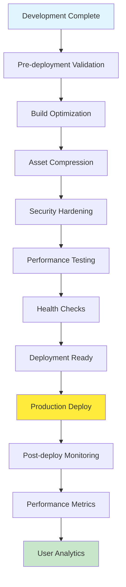

# Deployment Pipeline

```mermaid

graph TD
    A[Development Complete] --> B[Pre-deployment Validation]
    B --> C[Build Optimization]
    C --> D[Asset Compression]
    D --> E[Security Hardening]
    E --> F[Performance Testing]
    F --> G[Health Checks]
    G --> H[Deployment Ready]
    H --> I[Production Deploy]
    I --> J[Post-deploy Monitoring]
    J --> K[Performance Metrics]
    K --> L[User Analytics]
    
    style A fill:#e1f5fe
    style I fill:#ffeb3b
    style L fill:#c8e6c9
    
```
