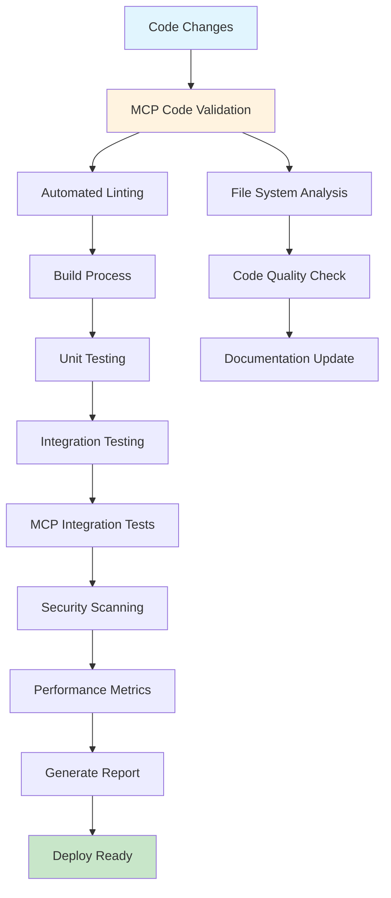

# Development Workflow

```mermaid

graph TD
    A[Code Changes] --> B[MCP Code Validation]
    B --> C[Automated Linting]
    C --> D[Build Process]
    D --> E[Unit Testing]
    E --> F[Integration Testing]
    F --> G[MCP Integration Tests]
    G --> H[Security Scanning]
    H --> I[Performance Metrics]
    I --> J[Generate Report]
    J --> K[Deploy Ready]
    
    B --> L[File System Analysis]
    L --> M[Code Quality Check]
    M --> N[Documentation Update]
    
    style A fill:#e1f5fe
    style K fill:#c8e6c9
    style B fill:#fff3e0
    
```
