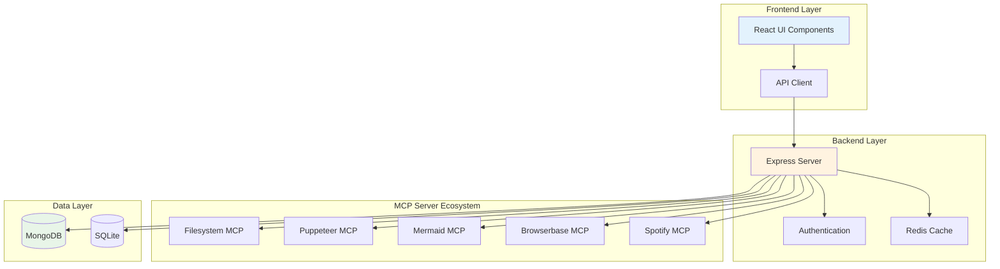

# ARCHITECTURE OVERVIEW

```mermaid

graph TB
    subgraph "Frontend Layer"
        UI[React UI Components]
        API[API Client]
    end
    
    subgraph "Backend Layer"
        EXPRESS[Express Server]
        AUTH[Authentication]
        CACHE[Redis Cache]
    end
    
    subgraph "MCP Server Ecosystem"
        MCP1[Filesystem MCP]
        MCP2[Puppeteer MCP]
        MCP3[Mermaid MCP]
        MCP4[Browserbase MCP]
        MCP5[Spotify MCP]
    end
    
    subgraph "Data Layer"
        MONGO[(MongoDB)]
        SQLITE[(SQLite)]
    end
    
    UI --> API
    API --> EXPRESS
    EXPRESS --> AUTH
    EXPRESS --> CACHE
    EXPRESS --> MCP1
    EXPRESS --> MCP2
    EXPRESS --> MCP3
    EXPRESS --> MCP4
    EXPRESS --> MCP5
    EXPRESS --> MONGO
    EXPRESS --> SQLITE
    
    style UI fill:#e3f2fd
    style EXPRESS fill:#fff3e0
    style MONGO fill:#e8f5e8

```
