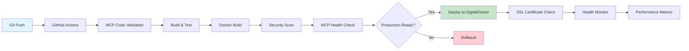

# DEPLOYMENT PIPELINE

```mermaid

flowchart LR
    A[Git Push] --> B[GitHub Actions]
    B --> C[MCP Code Validation]
    C --> D[Build & Test]
    D --> E[Docker Build]
    E --> F[Security Scan]
    F --> G[MCP Health Check]
    G --> H{Production Ready?}
    H -->|Yes| I[Deploy to DigitalOcean]
    H -->|No| J[Rollback]
    I --> K[SSL Certificate Check]
    K --> L[Health Monitor]
    L --> M[Performance Metrics]
    
    style A fill:#e1f5fe
    style I fill:#c8e6c9
    style J fill:#ffcdd2

```
