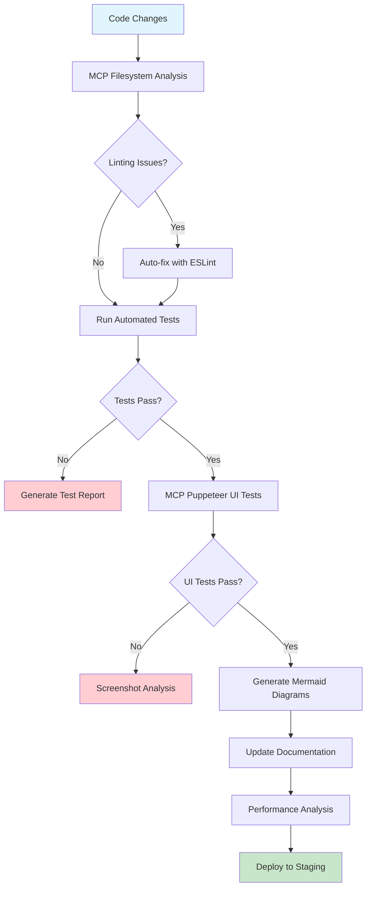

# DEVELOPMENT WORKFLOW

```mermaid

flowchart TD
    A[Code Changes] --> B[MCP Filesystem Analysis]
    B --> C{Linting Issues?}
    C -->|Yes| D[Auto-fix with ESLint]
    C -->|No| E[Run Automated Tests]
    D --> E
    E --> F{Tests Pass?}
    F -->|No| G[Generate Test Report]
    F -->|Yes| H[MCP Puppeteer UI Tests]
    H --> I{UI Tests Pass?}
    I -->|No| J[Screenshot Analysis]
    I -->|Yes| K[Generate Mermaid Diagrams]
    K --> L[Update Documentation]
    L --> M[Performance Analysis]
    M --> N[Deploy to Staging]
    
    style A fill:#e1f5fe
    style N fill:#c8e6c9
    style G fill:#ffcdd2
    style J fill:#ffcdd2

```
