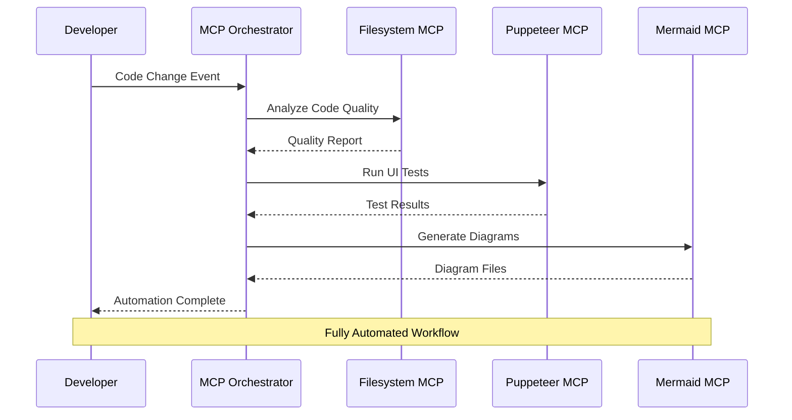

# MCP INTEGRATION

```mermaid

sequenceDiagram
    participant DEV as Developer
    participant MCP as MCP Orchestrator
    participant FS as Filesystem MCP
    participant PUP as Puppeteer MCP
    participant MER as Mermaid MCP
    
    DEV->>MCP: Code Change Event
    MCP->>FS: Analyze Code Quality
    FS-->>MCP: Quality Report
    MCP->>PUP: Run UI Tests
    PUP-->>MCP: Test Results
    MCP->>MER: Generate Diagrams
    MER-->>MCP: Diagram Files
    MCP-->>DEV: Automation Complete
    
    Note over DEV,MER: Fully Automated Workflow

```
