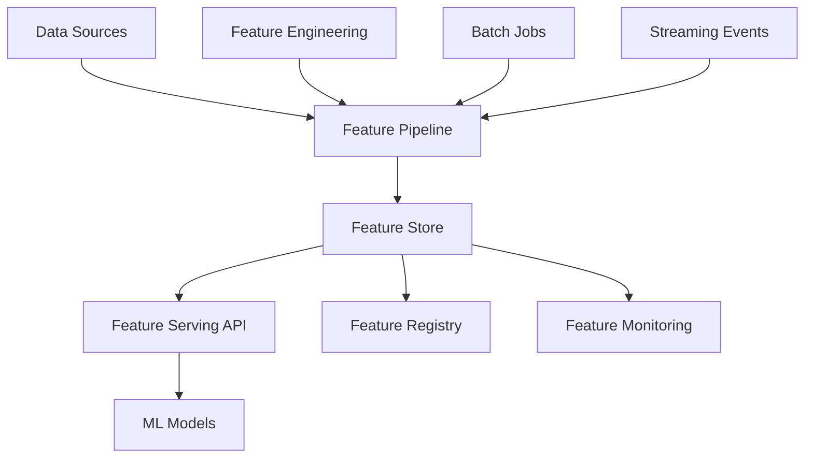

# EchoTune AI Feature Store Design

## Overview

The EchoTune AI Feature Store provides a centralized, scalable platform for managing, serving, and monitoring machine learning features across the recommendation system. It enables consistent feature engineering, real-time feature serving, and feature reusability across multiple models and teams.

## Architecture

### Core Components



### Technology Stack

- **Storage Layer**: Redis (real-time) + PostgreSQL (batch)
- **Processing**: Apache Spark for batch, Kafka Streams for real-time
- **API Layer**: FastAPI for feature serving
- **Registry**: PostgreSQL for metadata management
- **Monitoring**: Prometheus + Grafana for feature quality

## Feature Categories

### User Features
```yaml
user_profile_features:
  - user_age_group: categorical
  - subscription_type: categorical  
  - listening_hours_weekly: numerical
  - favorite_genres: array
  - country: categorical
  - device_preferences: array

user_behavior_features:
  - recent_listening_diversity: numerical
  - skip_rate_7d: numerical
  - replay_rate_7d: numerical
  - playlist_creation_rate: numerical
  - social_sharing_frequency: numerical
```

### Content Features
```yaml
track_features:
  - audio_features: # From Spotify API
    - danceability: numerical
    - energy: numerical
    - valence: numerical
    - tempo: numerical
    - acousticness: numerical
  
  - content_features:
    - genre_primary: categorical
    - genre_secondary: categorical
    - release_year: numerical
    - popularity_score: numerical
    - language: categorical

artist_features:
  - popularity_tier: categorical
  - genre_diversity: numerical
  - collaboration_frequency: numerical
  - career_stage: categorical
```

### Contextual Features
```yaml
session_features:
  - time_of_day: categorical
  - day_of_week: categorical
  - session_duration: numerical
  - device_type: categorical
  - location_context: categorical

interaction_features:
  - current_playlist_context: categorical
  - listening_source: categorical # discover, search, radio
  - previous_track_relationship: categorical
  - user_mood_detected: categorical
```

## Feature Store Implementation

### Feature Definition Schema
```python
from dataclasses import dataclass
from typing import List, Dict, Any, Optional
from enum import Enum

class FeatureType(Enum):
    NUMERICAL = "numerical"
    CATEGORICAL = "categorical"
    ARRAY = "array"
    EMBEDDING = "embedding"

class ComputationType(Enum):
    BATCH = "batch"
    STREAM = "stream"
    ON_DEMAND = "on_demand"

@dataclass
class FeatureDefinition:
    name: str
    feature_type: FeatureType
    computation_type: ComputationType
    source_query: str
    update_frequency: str  # "1h", "1d", "realtime"
    retention_days: int
    description: str
    owner: str
    tags: List[str]
    
    # Validation rules
    min_value: Optional[float] = None
    max_value: Optional[float] = None
    allowed_values: Optional[List[str]] = None
    null_policy: str = "allow"  # "allow", "reject", "default"
    default_value: Optional[Any] = None
```

### Feature Engineering Pipeline
```python
class FeaturePipeline:
    def __init__(self, feature_definitions: List[FeatureDefinition]):
        self.feature_definitions = feature_definitions
        self.processors = {}
    
    def register_processor(self, feature_name: str, processor_func):
        """Register custom feature processing function"""
        self.processors[feature_name] = processor_func
    
    def compute_batch_features(self, entity_ids: List[str]) -> Dict[str, Dict[str, Any]]:
        """Compute features for batch of entities"""
        # TODO: Implement batch feature computation
        pass
    
    def compute_realtime_features(self, entity_id: str, context: Dict[str, Any]) -> Dict[str, Any]:
        """Compute features for real-time serving"""
        # TODO: Implement real-time feature computation
        pass
```

### Feature Serving API
```python
from fastapi import FastAPI, HTTPException
from pydantic import BaseModel
from typing import List, Dict, Any

app = FastAPI(title="EchoTune Feature Store API")

class FeatureRequest(BaseModel):
    entity_id: str
    feature_names: List[str]
    context: Optional[Dict[str, Any]] = None

class FeatureResponse(BaseModel):
    entity_id: str
    features: Dict[str, Any]
    timestamp: int
    feature_store_version: str

@app.post("/features/get", response_model=FeatureResponse)
async def get_features(request: FeatureRequest):
    """Get features for a specific entity"""
    try:
        features = await feature_store.get_features(
            entity_id=request.entity_id,
            feature_names=request.feature_names,
            context=request.context
        )
        
        return FeatureResponse(
            entity_id=request.entity_id,
            features=features,
            timestamp=int(time.time()),
            feature_store_version="v1.0.0"
        )
    except Exception as e:
        raise HTTPException(status_code=500, detail=str(e))

@app.post("/features/batch", response_model=List[FeatureResponse])
async def get_batch_features(requests: List[FeatureRequest]):
    """Get features for multiple entities"""
    # TODO: Implement batch feature serving
    pass
```

## Data Storage Strategy

### Real-time Feature Store (Redis)
```python
class RedisFeatureStore:
    def __init__(self, redis_client):
        self.redis = redis_client
        self.key_pattern = "features:{entity_type}:{entity_id}"
    
    async def store_features(self, entity_type: str, entity_id: str, features: Dict[str, Any]):
        """Store features in Redis with TTL"""
        key = self.key_pattern.format(entity_type=entity_type, entity_id=entity_id)
        
        # Serialize features to JSON
        features_json = json.dumps(features, default=str)
        
        # Store with TTL (24 hours for user features)
        ttl = 86400 if entity_type == "user" else 3600
        await self.redis.setex(key, ttl, features_json)
    
    async def get_features(self, entity_type: str, entity_id: str, feature_names: List[str]) -> Dict[str, Any]:
        """Retrieve specific features from Redis"""
        key = self.key_pattern.format(entity_type=entity_type, entity_id=entity_id)
        features_json = await self.redis.get(key)
        
        if not features_json:
            return {}
        
        all_features = json.loads(features_json)
        return {name: all_features.get(name) for name in feature_names if name in all_features}
```

### Batch Feature Store (PostgreSQL)
```sql
-- Feature metadata table
CREATE TABLE feature_definitions (
    id SERIAL PRIMARY KEY,
    name VARCHAR(255) UNIQUE NOT NULL,
    feature_type VARCHAR(50) NOT NULL,
    computation_type VARCHAR(50) NOT NULL,
    update_frequency VARCHAR(50) NOT NULL,
    retention_days INTEGER NOT NULL,
    created_at TIMESTAMP DEFAULT CURRENT_TIMESTAMP,
    updated_at TIMESTAMP DEFAULT CURRENT_TIMESTAMP,
    owner VARCHAR(255) NOT NULL,
    description TEXT
);

-- Feature values table (time-series)
CREATE TABLE feature_values (
    id BIGSERIAL PRIMARY KEY,
    feature_name VARCHAR(255) NOT NULL,
    entity_type VARCHAR(100) NOT NULL,
    entity_id VARCHAR(255) NOT NULL,
    feature_value JSONB NOT NULL,
    timestamp TIMESTAMP NOT NULL,
    version INTEGER DEFAULT 1,
    
    CONSTRAINT fk_feature_name 
        FOREIGN KEY (feature_name) 
        REFERENCES feature_definitions(name)
);

-- Indexes for performance
CREATE INDEX idx_feature_values_lookup 
    ON feature_values(entity_type, entity_id, feature_name, timestamp DESC);
    
CREATE INDEX idx_feature_values_timestamp 
    ON feature_values(timestamp);
```

## Feature Quality Monitoring

### Data Quality Metrics
```python
class FeatureQualityMonitor:
    def __init__(self, metrics_client):
        self.metrics = metrics_client
    
    def validate_feature_value(self, feature_def: FeatureDefinition, value: Any) -> bool:
        """Validate feature value against definition"""
        try:
            # Type validation
            if feature_def.feature_type == FeatureType.NUMERICAL:
                float(value)
                if feature_def.min_value is not None and value < feature_def.min_value:
                    return False
                if feature_def.max_value is not None and value > feature_def.max_value:
                    return False
            
            elif feature_def.feature_type == FeatureType.CATEGORICAL:
                if feature_def.allowed_values and value not in feature_def.allowed_values:
                    return False
            
            return True
            
        except (ValueError, TypeError):
            return False
    
    def track_feature_freshness(self, feature_name: str, last_update: datetime):
        """Track how fresh feature data is"""
        staleness_seconds = (datetime.now() - last_update).total_seconds()
        
        self.metrics.gauge(
            'feature_staleness_seconds',
            staleness_seconds,
            labels={'feature_name': feature_name}
        )
    
    def track_feature_completeness(self, feature_name: str, completeness_ratio: float):
        """Track what percentage of entities have this feature"""
        self.metrics.gauge(
            'feature_completeness_ratio',
            completeness_ratio,
            labels={'feature_name': feature_name}
        )
```

### Monitoring Dashboard
```yaml
feature_quality_dashboard:
  panels:
    - title: "Feature Freshness"
      query: "feature_staleness_seconds"
      type: "time_series"
      
    - title: "Feature Completeness"
      query: "feature_completeness_ratio"
      type: "gauge"
      
    - title: "Feature Serving Latency"
      query: "histogram_quantile(0.95, rate(feature_serving_duration_seconds_bucket[5m]))"
      type: "stat"
      
    - title: "Feature Validation Errors"
      query: "rate(feature_validation_errors_total[5m])"
      type: "time_series"
```

## Performance Optimization

### Caching Strategy
```python
class FeatureCacheManager:
    def __init__(self, l1_cache, l2_cache):
        self.l1_cache = l1_cache  # Local in-memory cache
        self.l2_cache = l2_cache  # Redis cache
    
    async def get_cached_features(self, cache_key: str) -> Optional[Dict[str, Any]]:
        """Multi-level cache lookup"""
        # Try L1 cache first (in-memory)
        features = self.l1_cache.get(cache_key)
        if features:
            return features
        
        # Try L2 cache (Redis)
        features = await self.l2_cache.get(cache_key)
        if features:
            # Populate L1 cache
            self.l1_cache.set(cache_key, features, ttl=300)  # 5 minutes
            return features
        
        return None
    
    async def cache_features(self, cache_key: str, features: Dict[str, Any]):
        """Store in both cache levels"""
        self.l1_cache.set(cache_key, features, ttl=300)
        await self.l2_cache.setex(cache_key, 3600, json.dumps(features))
```

### Batch Optimization
```python
class BatchFeatureLoader:
    def __init__(self, feature_store, batch_size=100):
        self.feature_store = feature_store
        self.batch_size = batch_size
    
    async def load_features_batch(self, entity_ids: List[str], feature_names: List[str]) -> Dict[str, Dict[str, Any]]:
        """Load features for multiple entities in batches"""
        results = {}
        
        # Process in batches to avoid overwhelming the system
        for i in range(0, len(entity_ids), self.batch_size):
            batch = entity_ids[i:i + self.batch_size]
            batch_results = await self._load_batch(batch, feature_names)
            results.update(batch_results)
        
        return results
    
    async def _load_batch(self, entity_ids: List[str], feature_names: List[str]) -> Dict[str, Dict[str, Any]]:
        """Load single batch of features"""
        # TODO: Implement optimized batch loading
        pass
```

## Integration with ML Pipeline

### Model Training Integration
```python
class FeatureExtractor:
    def __init__(self, feature_store):
        self.feature_store = feature_store
    
    def get_training_dataset(self, entity_ids: List[str], feature_names: List[str], 
                           start_date: datetime, end_date: datetime) -> pd.DataFrame:
        """Extract features for model training"""
        # TODO: Implement training dataset extraction
        pass
    
    def get_inference_features(self, entity_id: str, feature_names: List[str]) -> Dict[str, Any]:
        """Get features for real-time model inference"""
        return self.feature_store.get_features(entity_id, feature_names)
```

### Feature Transformation Pipeline
```python
class FeatureTransformer:
    def __init__(self):
        self.transformers = {}
    
    def register_transformer(self, feature_name: str, transformer_func):
        """Register feature transformation function"""
        self.transformers[feature_name] = transformer_func
    
    def transform_features(self, raw_features: Dict[str, Any]) -> Dict[str, Any]:
        """Apply transformations to raw features"""
        transformed = {}
        
        for feature_name, value in raw_features.items():
            if feature_name in self.transformers:
                transformed[feature_name] = self.transformers[feature_name](value)
            else:
                transformed[feature_name] = value
        
        return transformed
```

## Implementation Roadmap

### Phase 1: Core Infrastructure (Weeks 1-2)
- [ ] Set up Redis and PostgreSQL for feature storage
- [ ] Implement basic feature serving API
- [ ] Create feature definition schema and registry
- [ ] Basic feature validation and monitoring

### Phase 2: Feature Engineering (Weeks 3-4)
- [ ] Implement batch feature computation pipeline
- [ ] Add real-time feature computation
- [ ] Create feature transformation framework
- [ ] Integrate with existing data sources

### Phase 3: Optimization & Monitoring (Weeks 5-6)
- [ ] Implement multi-level caching
- [ ] Add comprehensive monitoring and alerting
- [ ] Performance optimization and benchmarking
- [ ] Integration with ML training pipeline

### Phase 4: Advanced Features (Weeks 7-8)
- [ ] Feature drift detection
- [ ] Automated feature quality validation
- [ ] Feature lineage tracking
- [ ] Advanced feature discovery and recommendation

## Success Metrics

### Performance Targets
- Feature serving latency: <10ms p95
- Feature freshness: <1 hour for batch, <1 minute for streaming
- System availability: >99.9%
- Cache hit ratio: >90%

### Quality Targets
- Feature validation error rate: <0.1%
- Feature completeness: >95% for core features
- Data quality score: >95%
- Feature drift detection accuracy: >90%

---
**Next Review:** 2024-09-15  
**Related Documents:** ADR-002 (Recommendation Engine), ADR-005 (Observability)