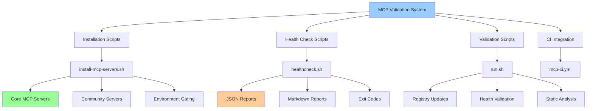

# MCP Validation Documentation

## 🤖 Overview

The EchoTune AI MCP (Model Context Protocol) validation system provides comprehensive health monitoring, installation validation, and operational testing for all MCP server integrations. This system ensures reliable MCP infrastructure operation across development, testing, and production environments.

## 🏗️ Architecture



## 📦 Core Components

### 1. Installation System (`scripts/install-mcp-servers.sh`)

**Purpose:** Robust, idempotent installation of MCP servers with OS detection and environment gating.

**Key Features:**
- ✅ Idempotent execution (safe to run multiple times)
- ✅ OS detection (Linux, macOS, Windows)
- ✅ Environment gating for optional services
- ✅ Graceful fallbacks when dependencies missing
- ✅ Comprehensive logging and reporting

**Usage:**
```bash
# Install core MCP servers
./scripts/install-mcp-servers.sh --core

# Install all MCP servers
./scripts/install-mcp-servers.sh --all

# Show help
./scripts/install-mcp-servers.sh --help
```

**Installation Categories:**
- **Core Servers:** Essential MCP infrastructure
- **Community Servers:** Third-party MCP integrations
- **Environment-Gated:** Optional services requiring API keys

### 2. Health Check System (`scripts/mcp/healthcheck.sh`)

**Purpose:** Comprehensive health monitoring with detailed reporting and CI-friendly exit codes.

**Key Features:**
- ✅ Multi-format output (JSON + Markdown)
- ✅ Component-level health checks
- ✅ Environment variable validation
- ✅ Live server connectivity testing
- ✅ CI-friendly exit codes

**Usage:**
```bash
# Run comprehensive health check
./scripts/mcp/healthcheck.sh

# Check specific component
curl http://localhost:3001/health
```

**Health Check Categories:**
```bash
✅ Node.js Environment
✅ MCP Server Files  
✅ npm Package Installation
✅ Environment Variables
✅ JSON Configuration Files
✅ npm Script Availability
✅ Filesystem Permissions
✅ Live Server Connectivity
```

### 3. Validation System (`scripts/mcp/run.sh`)

**Purpose:** Comprehensive MCP validation with registry updates and artifact generation.

**Key Features:**
- ✅ Fixed undefined function references
- ✅ Deduplicated server entries
- ✅ Standardized path handling
- ✅ Environment gate status reporting
- ✅ YAML and Markdown artifact generation

**Usage:**
```bash
# Run MCP validation
./scripts/mcp/run.sh

# View generated artifacts
cat mcp/registry.yaml
cat reports/mcp-health.md
```

## 🔧 Environment Gating

### Concept

Environment gating ensures optional MCP servers only start when required credentials are available, preventing failures in CI/testing environments.

### Gated Services

1. **Browserbase MCP Server**
   ```bash
   # Required environment variables
   BROWSERBASE_API_KEY=your-api-key
   BROWSERBASE_PROJECT_ID=your-project-id
   
   # Behavior:
   # ✅ Present: Server starts and functions normally
   # ⚠️ Missing: Server skipped gracefully (no error)
   ```

2. **Spotify MCP Server**
   ```bash
   # Required environment variables  
   SPOTIFY_CLIENT_ID=your-client-id
   SPOTIFY_CLIENT_SECRET=your-client-secret
   
   # Behavior:
   # ✅ Present: Spotify integration enabled
   # ⚠️ Missing: Spotify features disabled gracefully
   ```

3. **OpenAI Integration**
   ```bash
   # Optional environment variable
   OPENAI_API_KEY=your-api-key
   
   # Behavior:
   # ✅ Present: AI features fully enabled
   # ⚠️ Missing: Falls back to mock provider
   ```

### Implementation Pattern

```bash
validate_environment() {
    local required_env=$1
    local server_name=$2
    
    if [ -z "${!required_env:-}" ]; then
        log_warning "$server_name: $required_env not set - will skip gracefully"
        return 1
    else
        log_success "$server_name: $required_env is configured"
        return 0
    fi
}
```

## 📋 Package.json Integration

### MCP Scripts

```json
{
  "scripts": {
    "mcp:install": "./scripts/install-mcp-servers.sh --core",
    "mcp:health": "./scripts/mcp/healthcheck.sh", 
    "mcp:test": "node scripts/mcp-manager.js test",
    "mcp:report": "./scripts/mcp/run.sh",
    "mcp:validate": "npm run mcp:install && npm run mcp:health && npm run mcp:test && npm run mcp:report"
  }
}
```

### Usage Examples

```bash
# Full MCP validation pipeline
npm run mcp:validate

# Individual components
npm run mcp:install
npm run mcp:health
npm run mcp:report

# CI-friendly validation (with proper exit codes)
npm run mcp:health && echo "Health check passed"
```

## 🎯 CI Integration

### GitHub Actions Workflow (`.github/workflows/mcp-ci.yml`)

**Triggers:**
- Pull requests affecting MCP files
- Pushes to main branch with MCP changes
- Manual workflow dispatch

**Jobs:**

1. **Structure Validation**
   - JSON schema validation
   - Environment safety checks
   - Registry structure validation

2. **Script Testing**  
   - MCP script execution testing
   - Package script validation
   - Report generation verification

3. **Security Checks**
   - Hardcoded secret detection
   - Configuration security validation
   - Environment variable safety

### CI Workflow Features

```yaml
# Key workflow capabilities
✅ JSON validation with jq and Python fallback
✅ Script execution testing with error handling
✅ Artifact generation and upload
✅ Security scanning for hardcoded secrets
✅ Comprehensive result reporting
```

## 📊 Reporting & Artifacts

### JSON Health Report (`reports/mcp-health.json`)

```json
{
  "timestamp": "2025-01-17T00:00:00.000Z",
  "overall_status": "healthy",
  "total_checks": 25,
  "results": [
    {
      "component": "nodejs",
      "status": "healthy", 
      "message": "Node.js v20.19.4 available",
      "timestamp": "2025-01-17T00:00:00.000Z"
    }
  ],
  "summary": {
    "healthy": 18,
    "warning": 7,
    "unhealthy": 0
  },
  "environment": {
    "os": "Linux",
    "node_version": "v20.19.4",
    "npm_version": "10.8.2"
  }
}
```

### Markdown Health Report (`reports/mcp-health.md`)

```markdown
# MCP Health Check Report

**Generated:** 2025-01-17T00:00:00.000Z  
**Overall Status:** healthy  
**Total Checks:** 25

## Executive Summary

🟢 **All systems operational** - MCP infrastructure is healthy and ready for use.

## Health Check Results

| Component | Status | Message |
|-----------|--------|---------|
| nodejs | ✅ healthy | Node.js v20.19.4 available |
| Enhanced File MCP | ✅ healthy | File present at mcp-servers/enhanced-file-utilities.js |
| MCP SDK | ✅ healthy | Package installed (v1.17.2) |

## Recommendations

1. **Regular Monitoring:** Run this health check periodically with `npm run mcp:health`
2. **Full Validation:** Run `npm run mcp:validate` for comprehensive validation
```

### Registry YAML (`mcp/registry.yaml`)

```yaml
# MCP Server Registry - Generated 2025-01-17T00:00:00.000Z
metadata:
  generated: 2025-01-17T00:00:00.000Z
  validation_status: partially_validated
  
servers:
  - name: enhanced-file-utilities
    status: available
    type: file-operations
    capabilities: ["read", "validate", "security-scan"]
    path: "mcp-servers/enhanced-file-utilities.js"
    
  - name: browserbase
    status: available
    source: community
    package: "@browserbasehq/mcp-server-browserbase"

community_integrations:
  - name: filesystem
    status: available
    source: community
    package: "FileScopeMCP"
```

## 🔍 Local Testing & Development

### Development Setup

```bash
# Clone repository
git clone https://github.com/dzp5103/Spotify-echo.git
cd Spotify-echo

# Install dependencies
npm install

# Make scripts executable
chmod +x scripts/mcp/*.sh
chmod +x scripts/install-mcp-servers.sh
```

### Local Validation

```bash
# Test individual components
./scripts/mcp/healthcheck.sh
./scripts/mcp/run.sh
./scripts/install-mcp-servers.sh --help

# Test package scripts
npm run mcp:health
npm run mcp:report

# Full validation pipeline
npm run mcp:validate
```

### Development Workflow

1. **Make Changes**
   - Edit MCP configurations
   - Update scripts
   - Modify package.json MCP entries

2. **Local Testing**
   ```bash
   npm run mcp:health
   ./scripts/mcp/run.sh
   ```

3. **CI Testing**
   ```bash
   # Push changes triggers CI validation
   git add . && git commit -m "Update MCP config"
   git push origin feature-branch
   ```

4. **Review Results**
   - Check CI workflow results
   - Review generated artifacts
   - Validate health reports

## 🛠️ Troubleshooting

### Common Issues

#### 1. Script Execution Failures
```bash
# Make scripts executable
chmod +x scripts/mcp/*.sh

# Check bash syntax
bash -n scripts/mcp/healthcheck.sh

# Run with debug output
bash -x scripts/mcp/healthcheck.sh
```

#### 2. Environment Variable Issues
```bash
# Check current environment
env | grep -E "(BROWSERBASE|SPOTIFY|OPENAI)"

# Test environment validation
export BROWSERBASE_API_KEY=test
./scripts/mcp/healthcheck.sh
```

#### 3. JSON Validation Failures
```bash
# Test JSON files manually
jq . mcp-registry.json
python3 -c "import json; json.load(open('mcp-registry.json'))"

# Fix common JSON issues
- Remove trailing commas
- Escape special characters
- Check quote matching
```

#### 4. Package Script Issues
```bash
# Check script availability
npm run mcp:health --if-present

# Debug script execution
npm run mcp:health -- --debug

# Check package.json syntax
jq . package.json
```

### Health Check Debugging

```bash
# Debug health check components
./scripts/mcp/healthcheck.sh 2>&1 | grep -E "(❌|⚠️)"

# Check specific component health
curl -f http://localhost:3001/health || echo "MCP server not running"

# Validate environment manually
node -e "console.log('NODE_ENV:', process.env.NODE_ENV)"
```

### CI Debugging

```bash
# View workflow logs
gh run list --workflow=mcp-ci.yml
gh run view <run-id> --log

# Download artifacts locally
gh run download <run-id>

# Test workflow conditions locally
act -j validate  # Using act tool
```

## 📈 Metrics & Monitoring

### Health Metrics Tracked

1. **System Health**
   - Node.js version compatibility
   - npm package availability
   - File system permissions

2. **MCP Infrastructure**
   - Server file availability
   - Configuration validity
   - Environment gate status

3. **Integration Status**
   - Community MCP server health
   - API connectivity (when keys present)
   - Service responsiveness

### Performance Monitoring

```bash
# Script execution time
time ./scripts/mcp/healthcheck.sh

# Resource usage during validation
top -p $(pgrep -f healthcheck.sh)

# Network connectivity tests
timeout 5s curl -f http://localhost:3001/health
```

## 🚀 Advanced Configuration

### Custom Health Checks

```bash
# Add custom health check patterns
CUSTOM_CHECKS=(
    "custom-service:http://localhost:8080/health"
    "database:mongodb://localhost:27017/admin"
)

for check in "${CUSTOM_CHECKS[@]}"; do
    # Custom validation logic
done
```

### Environment-Specific Configuration

```bash
# Development environment
export MCP_ENVIRONMENT=development
export MCP_HEALTH_TIMEOUT=5

# Production environment  
export MCP_ENVIRONMENT=production
export MCP_HEALTH_TIMEOUT=30
export MCP_STRICT_VALIDATION=true
```

### Custom Validation Rules

```javascript
// Custom validation in continuous-improvement.js
const customValidationRules = {
  mcpServerCount: (count) => count >= 5,
  healthCheckSuccess: (status) => status === 'healthy',
  environmentGating: (config) => config.graceful_fallback === true
};
```

## 📚 Best Practices

### For Developers

1. **Regular Health Checks**
   ```bash
   # Before major changes
   npm run mcp:health
   
   # After configuration updates
   npm run mcp:validate
   
   # Before deployment
   npm run mcp:health && npm test
   ```

2. **Environment Management**
   - Use `.env.example` for documentation
   - Never commit actual API keys
   - Test with and without optional environment variables

3. **Error Handling**
   - Always check script exit codes
   - Use proper error messages
   - Implement graceful fallbacks

### For CI/CD

1. **Workflow Integration**
   ```yaml
   - name: Validate MCP Infrastructure
     run: npm run mcp:validate
   
   - name: Upload MCP Reports
     uses: actions/upload-artifact@v4
     with:
       name: mcp-health-reports
   ```

2. **Artifact Management**
   - Upload health reports for debugging
   - Archive validation results
   - Track metrics over time

3. **Security Considerations**
   - Scan for hardcoded secrets
   - Validate environment variable safety
   - Check configuration security

## 🔮 Future Enhancements

### Planned Features

1. **Enhanced Analytics**
   - Health trend analysis
   - Performance metrics tracking
   - Predictive failure detection

2. **Integration Improvements**
   - Real-time health monitoring
   - Automated recovery procedures
   - Advanced error diagnostics

3. **Ecosystem Expansion**
   - Additional community MCP servers
   - Custom MCP server templates
   - Integration testing frameworks

### Extension Points

```javascript
// Plugin architecture for custom validators
class CustomMCPValidator extends BaseMCPValidator {
  async validate() {
    // Custom validation logic
  }
}
```

---

**The MCP validation system ensures reliable, secure, and maintainable MCP infrastructure across all deployment environments.**