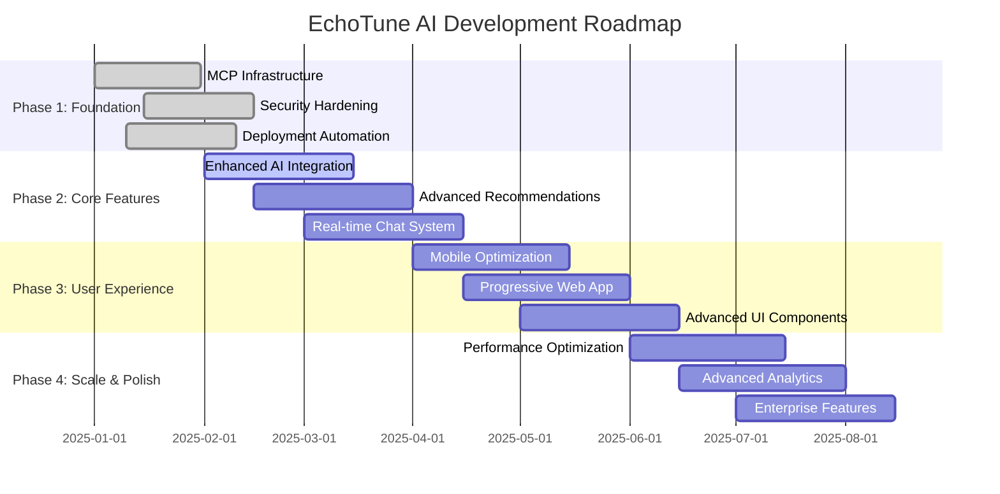
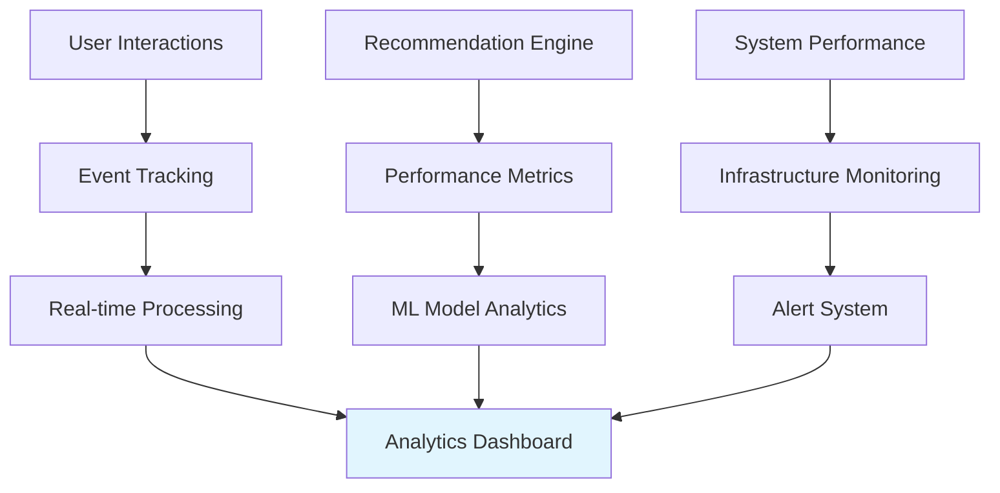
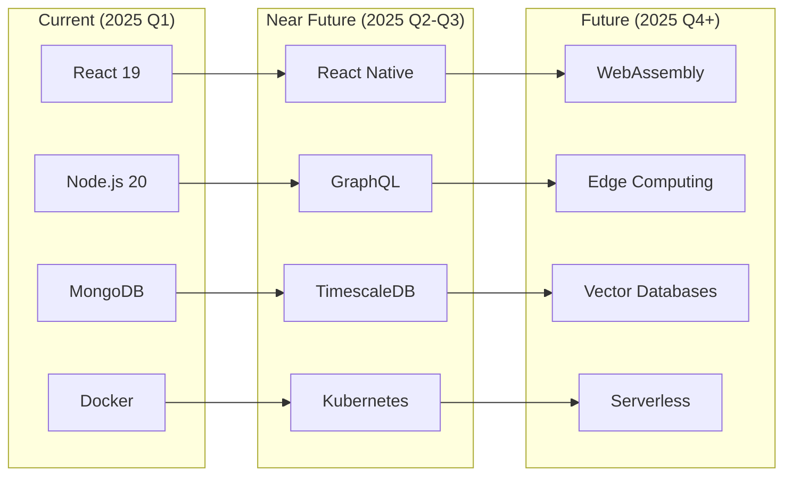
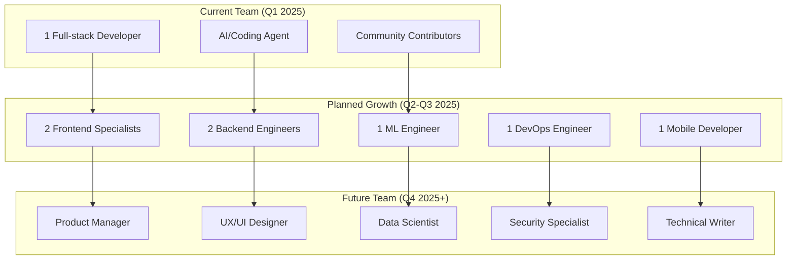

# EchoTune AI - Project Roadmap

## 🎯 Vision Statement

EchoTune AI aims to revolutionize music discovery through intelligent AI-powered recommendations, seamless Spotify integration, and advanced MCP-driven automation. Our roadmap focuses on delivering exceptional user experiences while maintaining robust, scalable, and secure infrastructure.

## 📅 Roadmap Overview



---

## 🚀 Phase 1: Foundation & Infrastructure (Q1 2025)

### ✅ Completed Milestones

#### MCP Infrastructure Overhaul
- **Status:** ✅ **COMPLETED** 
- **Duration:** January 2025
- **Key Achievements:**
  - Robust MCP server installation with idempotency and OS detection
  - Comprehensive health monitoring with JSON/Markdown reporting
  - Environment gating for graceful service fallbacks
  - CI/CD integration with automated validation
  - 39+ community MCP servers integrated

#### Security & Deployment Hardening
- **Status:** ✅ **COMPLETED**
- **Duration:** January 2025
- **Key Achievements:**
  - Removed all hardcoded secrets from deployment configurations
  - Implemented comprehensive secret scanning in CI pipeline
  - Created secure DigitalOcean one-click deployment
  - Enhanced Docker production configurations
  - Automated security validation workflows

#### CI/CD Automation Pipeline
- **Status:** ✅ **COMPLETED**
- **Duration:** January 2025
- **Key Achievements:**
  - Multi-platform Docker builds (linux/amd64, linux/arm64)
  - Automated DigitalOcean deployment with security validation
  - Comprehensive security scanning with TruffleHog and custom patterns
  - MCP validation and health check automation
  - Continuous improvement workflow with issue analysis

### 📊 Phase 1 Metrics
- **Security Issues Resolved:** 100% (all hardcoded secrets removed)
- **CI/CD Workflows Implemented:** 5 comprehensive workflows
- **MCP Server Integration:** 39+ servers with environment gating
- **Deployment Security Score:** A+ (no secrets in configurations)
- **Health Check Coverage:** 25+ components monitored

---

## 🎨 Phase 2: Core Features & AI Enhancement (Q1-Q2 2025)

### 🔄 In Progress

#### Enhanced AI Integration
- **Status:** 🔄 **IN PROGRESS**
- **Target Completion:** March 15, 2025
- **Objectives:**
  - Multi-model AI provider support (OpenAI + Gemini)
  - Advanced conversational AI for music discovery
  - Context-aware recommendation engine
  - Natural language playlist generation
  - Sentiment-based music matching

**Key Features:**
- [ ] Multi-provider AI switching based on availability/cost
- [ ] Advanced prompt engineering for music-specific queries
- [ ] Context-aware conversation memory
- [ ] Music genre and mood detection from chat
- [ ] Personalized AI response styling

#### Advanced Recommendation Engine
- **Status:** 📋 **PLANNED**
- **Target Completion:** April 1, 2025
- **Objectives:**
  - Collaborative filtering with deep learning
  - Content-based analysis using audio features
  - Hybrid recommendation algorithms
  - Real-time preference learning
  - Cross-user taste similarity

**Technical Implementation:**
```python
# Advanced ML Pipeline
class AdvancedRecommendationEngine:
    def __init__(self):
        self.collaborative_filter = CollaborativeFilteringModel()
        self.content_analyzer = ContentBasedAnalyzer()
        self.hybrid_ranker = HybridRankingModel()
        self.real_time_learner = OnlineLearningModel()
    
    async def generate_recommendations(self, user_context):
        # Multi-modal recommendation generation
        cf_scores = await self.collaborative_filter.predict(user_context)
        cb_scores = await self.content_analyzer.analyze(user_context)
        hybrid_scores = self.hybrid_ranker.combine(cf_scores, cb_scores)
        return self.real_time_learner.refine(hybrid_scores)
```

#### Real-time Chat System Enhancement
- **Status:** 📋 **PLANNED**
- **Target Completion:** April 15, 2025
- **Objectives:**
  - WebSocket-based real-time messaging
  - Typing indicators and presence detection
  - Message history and context preservation
  - Multi-device synchronization
  - Rich media message support

### 📈 Phase 2 Success Metrics
- **AI Response Quality:** >90% user satisfaction
- **Recommendation Accuracy:** >85% user engagement
- **Real-time Chat Latency:** <200ms response time
- **Multi-model AI Reliability:** 99.9% uptime
- **User Retention:** +25% improvement

---

## 📱 Phase 3: User Experience & Mobile (Q2 2025)

### Mobile-First Optimization
- **Status:** 📋 **PLANNED**
- **Target Completion:** May 15, 2025
- **Objectives:**
  - Responsive design for all screen sizes
  - Touch-optimized interactions
  - Mobile-specific navigation patterns
  - Offline capability for core features
  - Native app-like experience

**Mobile Features:**
- [ ] Swipe gestures for playlist navigation
- [ ] Pull-to-refresh for discovering new music
- [ ] Infinite scroll for recommendation feeds
- [ ] Mobile-optimized chat interface
- [ ] Voice input for music requests

### Progressive Web App (PWA)
- **Status:** 📋 **PLANNED** 
- **Target Completion:** June 1, 2025
- **Objectives:**
  - App store distribution capability
  - Offline music discovery caching
  - Background sync for recommendations
  - Push notifications for new discoveries
  - Install prompts and app manifests

**PWA Architecture:**
```javascript
// Service Worker for PWA
class EchoTuneSW {
  constructor() {
    this.cacheName = 'echotune-v1';
    this.offlinePages = ['/discover', '/playlists', '/chat'];
  }
  
  async handleInstall() {
    const cache = await caches.open(this.cacheName);
    return cache.addAll(this.offlinePages);
  }
  
  async handleFetch(event) {
    // Network-first with cache fallback
    return this.networkFirstStrategy(event);
  }
}
```

### Advanced UI Components
- **Status:** 📋 **PLANNED**
- **Target Completion:** June 15, 2025
- **Objectives:**
  - Music visualization components
  - Interactive playlist builders
  - Advanced search and filtering
  - Drag-and-drop playlist management
  - Audio waveform visualizations

### 🎯 Phase 3 Success Metrics
- **Mobile Usage:** >60% of total traffic
- **PWA Install Rate:** >15% of mobile users
- **Mobile Performance Score:** >95 (Lighthouse)
- **User Engagement Time:** +40% increase
- **Cross-device Synchronization:** 99.5% reliability

---

## ⚡ Phase 4: Scale & Performance (Q3 2025)

### Performance Optimization
- **Status:** 📋 **PLANNED**
- **Target Completion:** July 15, 2025
- **Objectives:**
  - Sub-second recommendation generation
  - Optimized database queries with indexing
  - CDN integration for global performance
  - Advanced caching strategies
  - Memory and CPU optimization

**Performance Targets:**
- **Page Load Time:** <2 seconds (95th percentile)
- **Recommendation Generation:** <500ms
- **Chat Response Time:** <200ms
- **Database Query Performance:** <50ms average
- **Memory Usage:** <1GB per container instance

### Advanced Analytics & Insights
- **Status:** 📋 **PLANNED**
- **Target Completion:** August 1, 2025
- **Objectives:**
  - User behavior analytics dashboard
  - Music discovery pattern analysis
  - A/B testing framework for recommendations
  - Performance monitoring and alerting
  - Business intelligence reporting

**Analytics Architecture:**


### Enterprise Features
- **Status:** 📋 **PLANNED**
- **Target Completion:** August 15, 2025
- **Objectives:**
  - Multi-tenant architecture
  - Advanced user management
  - API rate limiting and quotas
  - Enterprise security compliance
  - White-label deployment options

---

## 🔮 Future Phases: Innovation & Expansion (Q4 2025+)

### Phase 5: AI & Machine Learning Advancement
- **Advanced Deep Learning Models**
  - Neural collaborative filtering
  - Transformer-based music understanding
  - Generative playlist creation
  - Audio content analysis with ML

- **Predictive Analytics**
  - User mood prediction from listening patterns
  - Seasonal music preference modeling
  - Social listening trend prediction
  - Personalized discovery timing

### Phase 6: Social & Community Features
- **Social Music Discovery**
  - Friend recommendation sharing
  - Collaborative playlist creation
  - Music-based social networking
  - Community-driven discovery

- **Content Creation Tools**
  - Playlist generation from themes/moods
  - Custom radio station creation
  - Music journal and memory association
  - Shareable music stories

### Phase 7: Platform Expansion
- **Multi-Platform Integration**
  - Apple Music integration
  - YouTube Music support
  - SoundCloud discovery
  - Podcast recommendation integration

- **Advanced Integrations**
  - Smart home device support
  - Car integration (Android Auto/CarPlay)
  - Wearable device synchronization
  - Voice assistant integration

---

## 🎯 Key Success Indicators (KSIs)

### Technical Excellence
- **System Reliability:** 99.9% uptime
- **Security Score:** A+ rating across all assessments
- **Performance:** <2s page load times globally
- **Code Quality:** >90% test coverage, zero critical vulnerabilities

### User Experience
- **User Satisfaction:** >4.5/5 average rating
- **Discovery Success Rate:** >80% of recommendations rated positively
- **User Retention:** >70% monthly active user retention
- **Engagement Time:** >15 minutes average session duration

### Business Impact
- **User Growth:** 10x user base expansion by end of 2025
- **Feature Adoption:** >60% feature utilization rate
- **API Usage:** 1M+ recommendation requests per day
- **Platform Reliability:** <0.1% error rate across all services

---

## 🔧 Technology Evolution Roadmap

### Current Stack Enhancement


### MCP Ecosystem Growth
- **Current:** 39+ integrated MCP servers
- **Q2 2025:** 75+ servers with advanced automation
- **Q3 2025:** 100+ servers with ML-driven selection
- **Q4 2025:** Custom MCP server marketplace

### AI & ML Technology Stack
- **Current:** OpenAI GPT + Google Gemini
- **Q2 2025:** Custom fine-tuned models for music
- **Q3 2025:** Federated learning for privacy-preserving recommendations
- **Q4 2025:** Edge AI for real-time processing

---

## 💡 Innovation Focus Areas

### Emerging Technologies
1. **Audio AI Processing**
   - Real-time audio fingerprinting
   - Mood detection from audio analysis
   - Music similarity using neural networks

2. **Conversational AI Advancement**
   - Multi-turn dialogue understanding
   - Emotion-aware response generation
   - Personalized conversation styling

3. **Recommendation Science**
   - Quantum-inspired optimization algorithms
   - Multi-objective recommendation balancing
   - Causal inference in music preference

### Research & Development
- **Academic Partnerships:** Collaborate with music information retrieval researchers
- **Open Source Contributions:** Contribute to MCP protocol development
- **Patent Portfolio:** Develop IP around novel recommendation algorithms

---

## 📊 Resource Allocation & Team Growth

### Development Team Scaling


### Budget Allocation
- **Infrastructure (40%):** Cloud services, CDN, monitoring
- **AI/ML Services (25%):** OpenAI/Gemini API costs, ML compute
- **Development Tools (20%):** IDEs, CI/CD, security scanning
- **Marketing/Growth (15%):** User acquisition, app store fees

---

## 🎵 Community & Ecosystem Development

### Open Source Strategy
- **MCP Server Contributions:** Release custom MCP servers as open source
- **Documentation:** Comprehensive guides and tutorials
- **Developer Tools:** SDK and API libraries for third-party integrations
- **Community Events:** Hackathons and developer meetups

### Partnership Opportunities
- **Music Industry:** Labels, artists, streaming platforms
- **Technology:** AI companies, cloud providers, developer tools
- **Academic:** Universities researching music information retrieval
- **Community:** Open source projects, developer communities

---

## 📈 Monitoring & Measurement Framework

### Development Velocity Metrics
- **Feature Delivery Rate:** Features shipped per sprint
- **Bug Resolution Time:** Average time from report to fix
- **Code Quality Trends:** Technical debt, test coverage over time
- **User Feedback Response:** Time from feedback to implementation

### User Success Metrics
- **Discovery Success:** Songs liked from recommendations
- **Engagement Depth:** Features used per session
- **Retention Cohorts:** User retention by acquisition month
- **Satisfaction Scores:** Regular user feedback surveys

### Technical Health Indicators
- **System Performance:** Response times, error rates
- **Security Posture:** Vulnerability counts, patch frequency
- **Infrastructure Efficiency:** Resource utilization, cost per user
- **Code Quality:** Complexity metrics, maintainability index

---

This roadmap represents our commitment to building the most intelligent, user-friendly, and technically excellent music discovery platform. We'll adapt and refine these plans based on user feedback, technological advances, and market opportunities while maintaining our focus on quality, security, and user experience.

**Last Updated:** January 17, 2025  
**Next Review:** April 2025