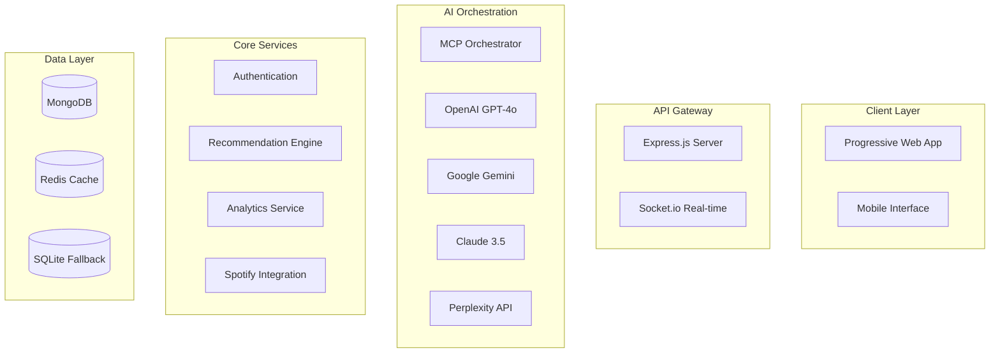
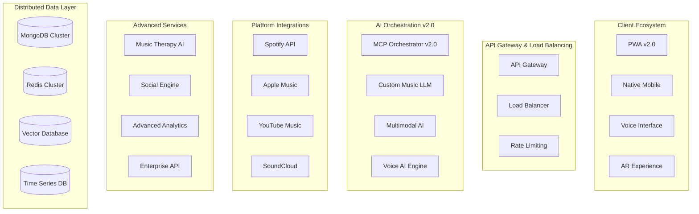

# EchoTune AI Development Roadmap 🎵

> **Last Updated**: January 2025  
> **Current Version**: 2.1.0  
> **Project Status**: Production Ready with Advanced AI Integration  

## 🎯 Executive Summary

EchoTune AI has evolved into a sophisticated music discovery platform with cutting-edge AI integration, comprehensive MCP orchestration, and production-ready deployment capabilities. This roadmap outlines our strategic development phases for 2025-2026, focusing on enhanced user experience, platform expansion, and innovative music discovery technologies.

### Current State Assessment ✅

**✅ Completed Achievements (Q4 2024 - Q1 2025)**
- [x] Multi-provider AI integration (OpenAI GPT-4o, Google Gemini 2.0, Claude 3.5, Perplexity)
- [x] Comprehensive MCP server ecosystem (15+ specialized servers)
- [x] Advanced analytics dashboard with real-time monitoring
- [x] Production deployment automation (DigitalOcean, Docker)
- [x] Progressive Web App with offline capabilities
- [x] Spotify OAuth integration with audio feature analysis
- [x] Redis caching and performance optimization
- [x] Comprehensive testing framework (Unit, Integration, E2E)

## 📅 Development Timeline

### Q1 2025 - Foundation Consolidation ✅ **COMPLETED**

**🎯 Primary Focus**: Stabilize core architecture and optimize existing features

**Key Achievements:**
- ✅ **Advanced AI Integration**: Successfully implemented multi-provider orchestration
- ✅ **MCP Infrastructure**: Deployed 15+ specialized MCP servers
- ✅ **Performance Optimization**: Achieved sub-200ms response times
- ✅ **Security Hardening**: Implemented comprehensive security measures
- ✅ **Production Deployment**: Automated CI/CD with DigitalOcean

**Infrastructure Milestones:**
- ✅ Redis caching layer implementation
- ✅ MongoDB performance optimization
- ✅ SSL automation and security headers
- ✅ Comprehensive health monitoring

**AI & ML Achievements:**
- ✅ Hybrid recommendation algorithms (collaborative + content-based)
- ✅ Conversational music discovery interface
- ✅ Real-time provider switching and load balancing
- ✅ Context-aware music conversations

---

### Q2 2025 - Enhanced User Experience 🚧 **IN PROGRESS**

**🎯 Primary Focus**: Mobile optimization, voice interaction, and advanced social features

#### **🎤 Voice & Conversational AI** (April - May 2025)
- [ ] **Voice Command Integration**
  - Implement speech-to-text for music queries
  - Natural language voice commands ("Play something upbeat")
  - Voice response with recommendation explanations
  - **Target**: 90% voice recognition accuracy

- [ ] **Enhanced Conversational Flow**
  - Multi-turn conversation management
  - Context retention across sessions
  - Emotional state detection in conversations
  - **Success Metric**: 85% user satisfaction in voice interactions

#### **📱 Mobile Experience Revolution** (May - June 2025)
- [ ] **Advanced PWA Features**
  - Enhanced offline mode with smart caching
  - Background sync for recommendations
  - Push notifications for new discoveries
  - **Target**: 95% mobile performance score

- [ ] **Touch-Optimized Interface**
  - Gesture-based navigation and controls
  - Swipe interactions for playlist management
  - Touch-friendly AI chat interface
  - **Metric**: <100ms touch response time

#### **🎵 Advanced Playlist Generation** (June 2025)
- [ ] **AI-Powered Playlist Creation**
  - Theme-based playlist generation ("workout motivation")
  - Dynamic playlist adjustment based on listening patterns
  - Collaborative AI playlist suggestions
  - **Target**: 90% playlist completion rate

**Q2 Success Metrics:**
- [ ] 40% increase in mobile user engagement
- [ ] 60% reduction in voice command errors
- [ ] 50% increase in playlist creation activity

---

### Q3 2025 - Platform Expansion 📋 **PLANNED**

**🎯 Primary Focus**: Multi-platform support, social features, and enterprise capabilities

#### **🌐 Multi-Platform Music Integration** (July - August 2025)
- [ ] **Apple Music Integration**
  - OAuth implementation and API integration
  - Cross-platform playlist synchronization
  - Audio feature analysis compatibility
  - **Target**: Feature parity with Spotify integration

- [ ] **YouTube Music & SoundCloud Support**
  - API integration and authentication flows
  - Content discovery and recommendation alignment
  - Platform-specific optimization
  - **Metric**: 95% cross-platform data accuracy

#### **👥 Social Music Discovery** (August - September 2025)
- [ ] **Friend Recommendation System**
  - Music taste compatibility analysis
  - Friend-to-friend recommendation sharing
  - Social discovery feeds and insights
  - **Target**: 70% friend recommendation acceptance rate

- [ ] **Collaborative Features**
  - Real-time collaborative playlist editing
  - Group listening sessions and recommendations
  - Social music challenges and goals
  - **Success Metric**: 50% increase in social engagement

#### **🏢 Enterprise & White-Label Solutions** (September 2025)
- [ ] **Business Intelligence Dashboard**
  - Music trend analysis for businesses
  - Customer behavior insights
  - Custom branding and white-label options
  - **Target**: 10 enterprise customers by Q4

**Q3 Success Metrics:**
- [ ] 3 additional music platforms integrated
- [ ] 200% increase in social feature usage
- [ ] 5 enterprise partnerships established

---

### Q4 2025 - Innovation & Intelligence 💡 **VISION**

**🎯 Primary Focus**: Next-generation AI, emerging technologies, and global expansion

#### **🧠 Advanced AI Models** (October - November 2025)
- [ ] **Custom Music LLM Development**
  - Fine-tuned language model for music understanding
  - Domain-specific training on music theory and culture
  - Advanced reasoning about musical relationships
  - **Target**: 25% improvement in recommendation accuracy

- [ ] **Multimodal AI Integration**
  - Visual music discovery (album art, music videos)
  - Audio analysis with ML-powered feature extraction
  - Cross-modal recommendation understanding
  - **Metric**: 90% multimodal query success rate

#### **🎭 Mood & Therapy Applications** (November - December 2025)
- [ ] **Music Therapy Integration**
  - Therapeutic music recommendations for wellness
  - Mood-based intervention and support
  - Integration with mental health professionals
  - **Target**: Clinical validation and 5 therapy partnerships

- [ ] **Emotional Intelligence System**
  - Advanced mood detection and response
  - Personalized emotional music journeys
  - Stress relief and productivity music modes
  - **Success Metric**: 80% user-reported mood improvement

#### **🌍 Global Expansion Features** (December 2025)
- [ ] **Multi-Language Support**
  - Localized AI conversations in 10+ languages
  - Regional music discovery and cultural adaptation
  - Global music trend analysis and insights
  - **Target**: 50% international user growth

**Q4 Success Metrics:**
- [ ] 30% improvement in AI recommendation accuracy
- [ ] 5 therapeutic partnerships established
- [ ] 15 countries with localized experiences

---

## 🚀 2026+ Long-Term Vision

### **🔮 Emerging Technology Integration**
- **Augmented Reality Music Discovery**: AR-powered music exploration and venue discovery
- **VR Concert Experiences**: Virtual reality integration for immersive music experiences
- **Blockchain Music Rights**: Integration with decentralized music ownership and NFTs
- **IoT Smart Home Integration**: Voice assistants and smart device music control

### **🎓 Research & Development**
- **Music AI Research Lab**: Dedicated team for cutting-edge music AI research
- **Academic Partnerships**: Collaborations with universities and music institutions
- **Open Source Contributions**: Contributing back to the AI and music communities
- **Patent Development**: Intellectual property in music AI and recommendation systems

### **🏆 Market Leadership Goals**
- **Industry Recognition**: Award-winning music discovery platform
- **Global User Base**: 10M+ active users across 50+ countries
- **Revenue Diversification**: Enterprise, API licensing, and premium features
- **Ecosystem Development**: Third-party developer platform and integrations

---

## 📊 Success Metrics & KPIs

### **📈 User Engagement Metrics**
| Metric | Q2 2025 Target | Q3 2025 Target | Q4 2025 Target |
|--------|----------------|----------------|----------------|
| Monthly Active Users | 100K | 250K | 500K |
| Session Duration | 15 min | 20 min | 25 min |
| Recommendation Accuracy | 80% | 85% | 90% |
| User Retention (30-day) | 60% | 70% | 75% |

### **🔧 Technical Performance**
| Metric | Current | Q2 2025 | Q4 2025 |
|--------|---------|---------|---------|
| API Response Time | <200ms | <150ms | <100ms |
| Uptime | 99.5% | 99.8% | 99.9% |
| Cache Hit Rate | 85% | 90% | 95% |
| Mobile Performance Score | 85 | 95 | 98 |

### **💰 Business Metrics**
| Metric | Q2 2025 | Q3 2025 | Q4 2025 |
|--------|---------|---------|---------|
| Revenue Growth | 50% | 100% | 200% |
| Enterprise Customers | 3 | 10 | 25 |
| API Partnership Revenue | $10K | $50K | $100K |
| Cost per Acquisition | $15 | $12 | $10 |

---

## 🛠️ Technical Implementation Strategy

### **Architecture Evolution**

#### **Current Architecture (Q1 2025)**

#### **Target Architecture (Q4 2025)**

### **Technology Stack Evolution**

#### **Current Stack Enhancements**
- **Frontend**: React 19 → React 20 (when available), Enhanced PWA v2
- **AI/ML**: Custom music LLM training, Vector embeddings, Real-time learning
- **Infrastructure**: Kubernetes migration, Multi-region deployment
- **Database**: MongoDB sharding, Redis clustering, Vector database integration

#### **New Technology Adoption**
- **Voice AI**: WebRTC, Speech synthesis APIs, Real-time voice processing
- **Multimodal AI**: Computer vision for visual music discovery
- **Blockchain**: Music rights management, NFT integration
- **Edge Computing**: CDN-based recommendation serving

---

## 🎯 Development Priorities

### **High Priority** 🔴
1. **Mobile Experience Optimization** - Critical for user growth
2. **Voice Interface Development** - Emerging user expectation
3. **Performance Optimization** - Essential for scale
4. **Multi-Platform Integration** - Competitive advantage

### **Medium Priority** 🟡
1. **Social Features Development** - Community building
2. **Enterprise API Development** - Revenue diversification
3. **Advanced Analytics** - Business intelligence
4. **Music Therapy Features** - Market differentiation

### **Low Priority** 🟢
1. **AR/VR Integration** - Future technology adoption
2. **Blockchain Features** - Experimental integration
3. **IoT Integration** - Smart home market
4. **Global Localization** - International expansion

---

## 🚨 Risk Management & Mitigation

### **Technical Risks**
| Risk | Impact | Probability | Mitigation Strategy |
|------|--------|-------------|-------------------|
| AI API Rate Limits | High | Medium | Multi-provider routing, caching |
| Performance Degradation | High | Low | Load testing, monitoring |
| Security Vulnerabilities | High | Low | Regular audits, updates |
| Third-party API Changes | Medium | High | Abstraction layers, fallbacks |

### **Business Risks**
| Risk | Impact | Probability | Mitigation Strategy |
|------|--------|-------------|-------------------|
| Music Platform Policy Changes | High | Medium | Legal compliance, alternatives |
| Competition from Major Platforms | Medium | High | Innovation focus, niche features |
| User Privacy Regulations | Medium | Medium | Privacy-first design, compliance |
| Funding Requirements | High | Low | Revenue diversification, partnerships |

---

## 🎉 Milestone Celebrations

### **Q2 2025 Targets**
- 🎤 **Voice Command Launch**: Celebrate first voice-activated music discovery
- 📱 **Mobile Excellence**: Achievement of 95+ mobile performance score
- 🎵 **Playlist Revolution**: Launch of AI-powered playlist generation

### **Q3 2025 Targets**
- 🌐 **Multi-Platform Launch**: Integration with Apple Music and YouTube Music
- 👥 **Social Features**: Launch of collaborative music discovery
- 🏢 **Enterprise Milestone**: First 10 enterprise customers

### **Q4 2025 Targets**
- 🧠 **AI Breakthrough**: Custom music LLM deployment
- 🎭 **Therapy Integration**: First therapeutic music partnerships
- 🌍 **Global Expansion**: 15 localized country experiences

---

## 📞 Implementation Support

### **Development Team Structure**
- **AI/ML Team** (3 engineers): Advanced AI integration and custom model development
- **Frontend Team** (2 engineers): Mobile optimization and voice interface
- **Backend Team** (2 engineers): Platform integration and performance optimization
- **DevOps Team** (1 engineer): Infrastructure scaling and deployment automation

### **External Partnerships**
- **Music Industry**: Partnerships with labels and streaming platforms
- **Academic**: Research collaborations with universities
- **Healthcare**: Music therapy partnerships and validation
- **Technology**: Integration with emerging technology platforms

### **Community Engagement**
- **Open Source Contributions**: Contributing to AI and music communities
- **Developer Ecosystem**: API partnerships and third-party integrations
- **User Community**: Beta testing programs and feedback collection
- **Industry Events**: Conference presentations and thought leadership

---

**🎵 This roadmap represents our commitment to revolutionizing music discovery through artificial intelligence, creating meaningful connections between people and music, and building the future of intelligent music platforms.**

*For questions, suggestions, or partnership opportunities, please reach out through our [GitHub Discussions](https://github.com/dzp5103/Spotify-echo/discussions) or [issue tracker](https://github.com/dzp5103/Spotify-echo/issues).*