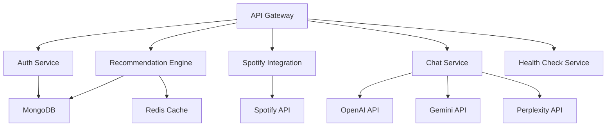

# Backend Initiatives Roadmap

## Service Architecture Evolution

### Current State Assessment
EchoTune AI currently operates on a modular monolithic architecture with well-defined service boundaries. The backend leverages Express.js with comprehensive middleware, MCP server orchestration, and multi-provider AI integration.

### Strategic Architecture Goals

#### Microservices Transition Strategy
- **Phase 1**: Extract MCP orchestration into standalone service
- **Phase 2**: Separate authentication and user management service
- **Phase 3**: Isolate recommendation engine as dedicated service
- **Phase 4**: Create dedicated Spotify integration service

#### Service Mesh Implementation
- **Technology Stack**: Istio or Linkerd for service communication
- **Traffic Management**: Intelligent load balancing and canary deployments
- **Security**: mTLS between services with certificate rotation
- **Observability**: Distributed tracing across service boundaries

## Resilience & Reliability

### Circuit Breaker Enhancement
**Current**: Basic circuit breaker pattern implemented  
**Target**: Advanced circuit breaker with:
- **Adaptive Thresholds**: Dynamic failure rate adjustments
- **Bulk-head Isolation**: Resource pool separation for external services
- **Retry Strategies**: Exponential backoff with jitter
- **Health Check Integration**: Proactive circuit state management

### Fault Tolerance Patterns

| Pattern | Implementation Status | Priority | Target Completion |
|---|---|---|---|
| **Timeout Management** | ✅ Implemented | - | Complete |
| **Retry with Backoff** | ✅ Implemented | - | Complete |
| **Circuit Breaker** | ✅ Basic Implementation | Medium | Week 4 |
| **Bulkhead Pattern** | ❌ Not Implemented | High | Week 2 |
| **Fallback Mechanisms** | 🔄 Partial | High | Week 3 |
| **Rate Limiting** | ✅ Implemented | - | Complete |

### Graceful Degradation Strategy

#### Service Dependency Mapping


#### Degradation Levels
1. **Level 0 (Full Functionality)**: All services operational
2. **Level 1 (Cached Recommendations)**: Use cached results when ML service unavailable
3. **Level 2 (Basic Functionality)**: Core features with simplified recommendation logic
4. **Level 3 (Emergency Mode)**: Essential services only, static content serving

## API Contract & Evolution

### OpenAPI 3.1 Specification Implementation

**Scope**: Complete API documentation covering:
- **Authentication Endpoints**: OAuth flows, token management, user profiles
- **Music Discovery**: Search, recommendations, playlist generation
- **Chat Interface**: Message handling, context management, AI provider routing
- **Analytics**: User behavior tracking, insight generation
- **Administration**: Health checks, metrics, system management

**Deliverables**:
- Interactive API documentation with Swagger UI
- SDK auto-generation for TypeScript/JavaScript clients
- Contract testing suite for API compliance validation
- Version management strategy for backward compatibility

### API Versioning Strategy

#### Semantic Versioning for APIs
- **v1.x**: Current stable API with backward compatibility
- **v2.x**: Next major version with breaking changes (planned Q2 2025)
- **Beta Endpoints**: New features available at `/api/beta/*` endpoints

#### Deprecation Policy
1. **Announcement**: 3 months advance notice for breaking changes
2. **Deprecation Period**: 6 months support for deprecated endpoints  
3. **Migration Guide**: Comprehensive documentation and migration tools
4. **Sunset Timeline**: Clear removal dates with monitoring alerts

## Data Layer Evolution

### Database Optimization Strategy

#### MongoDB Performance Enhancement
- **Indexing Strategy**: Compound indexes for common query patterns
- **Connection Pooling**: Optimized pool size based on load testing
- **Read Replicas**: Geographic distribution for read scalability
- **Aggregation Pipeline Optimization**: Performance-tuned analytics queries

#### Redis Cluster Implementation
```yaml
Redis Architecture:
  Cluster Mode: 6 nodes (3 masters, 3 replicas)
  Memory Optimization: 
    - LRU eviction policy
    - Compression for large values
    - TTL optimization based on access patterns
  Failover: 
    - Automatic failover with Sentinel
    - Health check integration
    - Backup and recovery automation
```

### Data Migration & Consistency

#### Schema Evolution Management
- **Migration Scripts**: Automated database schema updates
- **Rollback Capabilities**: Safe schema rollback mechanisms
- **Data Validation**: Integrity checks during migrations
- **Zero-Downtime Updates**: Blue-green deployment strategy

#### Event Sourcing Implementation
**Phase 1 (Weeks 8-12)**:
- User interaction event capture
- Recommendation effectiveness tracking
- System state reconstruction capabilities

## Performance Optimization

### Response Time Targets

| Endpoint Category | Current P95 | Target P95 | Optimization Strategy |
|---|---|---|---|
| **Authentication** | 200ms | 100ms | Token caching, session optimization |
| **Music Search** | 500ms | 200ms | Elasticsearch integration, result caching |
| **Recommendations** | 1.2s | 400ms | ML model optimization, precomputed results |
| **Chat Interface** | 2.5s | 800ms | AI provider pooling, response streaming |
| **Health Checks** | 50ms | 25ms | Local health state caching |

### Caching Strategy Enhancement

#### Multi-Layer Caching Architecture
1. **L1 - Application Cache**: In-memory LRU cache for hot data
2. **L2 - Redis Cluster**: Distributed caching for session and computed results  
3. **L3 - CDN Cache**: Static asset and API response caching
4. **L4 - Database Query Cache**: MongoDB query result caching

#### Cache Invalidation Strategies
- **TTL-based**: Time-based expiration for static content
- **Event-based**: Reactive invalidation on data updates
- **Dependency-based**: Hierarchical invalidation for related data
- **Manual**: Administrative cache clearing capabilities

## External API Integration

### Spotify Web API Optimization

#### Rate Limiting Management  
```javascript
const SpotifyRateLimiter = {
  requestsPerSecond: 10,
  burstCapacity: 100,
  backoffStrategy: 'exponential',
  retryAttempts: 3,
  circuitBreakerThreshold: 0.5
};
```

#### Batch Processing Implementation
- **Track Feature Extraction**: Batch audio feature requests
- **Playlist Operations**: Bulk playlist manipulation
- **User Data Sync**: Scheduled batch synchronization

### AI Provider Load Balancing

#### Multi-Provider Architecture
```yaml
AI Providers:
  OpenAI:
    Models: ['gpt-4o', 'gpt-4o-mini']
    Rate Limit: 10000 tokens/minute
    Fallback Priority: 1
  
  Google Gemini:
    Models: ['gemini-2.0-flash-exp', 'gemini-1.5-pro']
    Rate Limit: 15000 tokens/minute  
    Fallback Priority: 2
    
  Perplexity:
    Models: ['sonar-pro', 'sonar-reasoning']
    Budget: $3.00/week
    Fallback Priority: 3
```

#### Provider Selection Logic
1. **Request Complexity Analysis**: Route based on query complexity
2. **Load Balancing**: Distribute load across available providers
3. **Cost Optimization**: Budget-aware provider selection
4. **Failure Recovery**: Automatic fallback to alternative providers

## Monitoring & Observability

### Service Level Objectives (SLOs)

#### Availability Targets
- **Core API Endpoints**: 99.9% uptime (4.3 hours downtime/month)
- **Music Recommendations**: 99.5% uptime (3.6 hours downtime/month)
- **Chat Interface**: 99.0% uptime (7.2 hours downtime/month)
- **Admin Endpoints**: 99.99% uptime (4.3 minutes downtime/month)

#### Performance SLOs
- **API Response Time**: 95% of requests under target latency
- **Database Queries**: 99% under 100ms response time
- **Cache Hit Ratio**: Maintain >85% hit ratio for recommendation cache
- **Error Rate**: Keep error rate below 0.1% for core endpoints

### Distributed Tracing Implementation

#### OpenTelemetry Integration
```yaml
Tracing Configuration:
  Exporter: OTLP/HTTP to Jaeger
  Sampling: 
    - Production: 1% sampling rate
    - Development: 100% sampling rate
  Instrumentation:
    - HTTP requests/responses
    - Database queries  
    - External API calls
    - MCP server communications
```

## Security Hardening

### Authentication & Authorization

#### JWT Token Enhancement
- **Short-lived Access Tokens**: 15-minute expiration
- **Refresh Token Rotation**: Automatic rotation on use
- **Token Introspection**: Real-time token validation
- **Blacklist Management**: Revoked token tracking

#### RBAC Implementation
```yaml
Role Hierarchy:
  Admin:
    - Full system access
    - User management
    - System configuration
  
  Premium User:
    - Advanced recommendations
    - Export capabilities
    - Priority support
    
  Basic User:
    - Core music discovery
    - Basic recommendations
    - Limited API access
```

### Input Validation & Sanitization

#### Comprehensive Validation Framework
- **Schema Validation**: Zod-based request validation
- **SQL Injection Prevention**: Parameterized queries only
- **XSS Protection**: Input sanitization and CSP enforcement
- **Rate Limiting**: Per-user and per-endpoint limits
- **CORS Configuration**: Strict origin validation

## Implementation Timeline

### Week 1-2: Foundation
- [ ] Bulkhead pattern implementation
- [ ] Enhanced circuit breaker configuration
- [ ] Basic SLO metric collection setup
- [ ] OpenAPI specification creation

### Week 3-4: Performance & Resilience  
- [ ] Fallback mechanism implementation
- [ ] Database indexing optimization
- [ ] Redis cluster configuration
- [ ] Advanced circuit breaker deployment

### Week 5-6: Observability & Monitoring
- [ ] OpenTelemetry distributed tracing
- [ ] SLO monitoring dashboard
- [ ] Alerting rule configuration
- [ ] Performance baseline establishment

**Dependencies**: Phase 2 completion, stable tracing infrastructure  
**Success Criteria**: All SLO targets met, zero critical security vulnerabilities  
**Rollback Plan**: Feature flag rollback, database migration reversal procedures

---

## Related Resources

- [Master Roadmap](./ROADMAP.md)
- [Testing & Quality Roadmap](./testing_quality.md)
- [Frontend & UI Roadmap](./frontend_ui.md)
- [Architecture Documentation](../architecture/)
- [API Documentation](../api/)