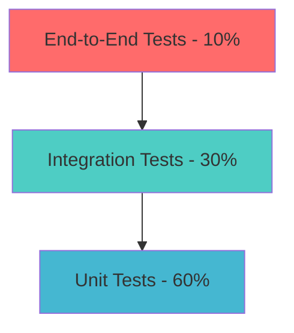

# Testing & Quality Assurance Roadmap

## Test Pyramid Strategy

### Testing Philosophy
EchoTune AI follows a comprehensive testing strategy based on the test pyramid principle, emphasizing fast and reliable automated testing at all levels while maintaining high code quality and user experience standards.

### Test Distribution Target


#### Testing Layer Responsibilities
- **Unit Tests (60%)**: Individual function and component testing
- **Integration Tests (30%)**: Service interaction and API contract validation  
- **End-to-End Tests (10%)**: Full user workflow validation

## Coverage Milestones & Targets

### Current Baseline Assessment
**Estimated Current Coverage**: ~40% (based on existing test structure)

### Incremental Coverage Targets

| Phase | Timeline | Lines Coverage | Statement Coverage | Branch Coverage | Function Coverage |
|---|---|---|---|---|---|
| **Phase 1** | Weeks 1-2 | 60% | 65% | 55% | 70% |
| **Phase 2** | Weeks 3-4 | 70% | 75% | 65% | 80% |
| **Phase 3** | Weeks 5-6 | 80% | 85% | 75% | 90% |
| **Target** | Week 6+ | 85% | 90% | 80% | 95% |

### Coverage Quality Metrics
```typescript
interface CoverageQualityMetrics {
  quantitative: {
    lines: number;
    statements: number;
    branches: number;
    functions: number;
  };
  
  qualitative: {
    criticalPathCoverage: number;    // 100% required
    errorHandlingCoverage: number;   // 90% target
    edgeCaseCoverage: number;        // 75% target  
    integrationCoverage: number;     // 80% target
  };
}
```

## Mutation Testing Implementation

### Mutation Testing Strategy

#### Tool Selection: Stryker.js
**Rationale**: TypeScript/JavaScript ecosystem integration, comprehensive mutation operators, CI/CD pipeline compatibility

#### Mutation Testing Phases

##### Phase 1: Baseline Establishment (Weeks 3-4)
```javascript
// Stryker Configuration
module.exports = {
  mutator: 'typescript',
  packageManager: 'npm',
  testRunner: 'jest',
  coverageAnalysis: 'perTest',
  
  mutate: [
    'src/**/*.ts',
    'src/**/*.js',
    '!src/**/*.test.{ts,js}',
    '!src/**/__tests__/**/*'
  ],
  
  thresholds: {
    high: 80,
    low: 60,
    break: 50  // Phase 1 target
  }
};
```

##### Phase 2: Quality Enhancement (Weeks 5-6)
**Target**: >= 65% mutation score  
**Focus Areas**:
- Critical business logic functions
- Error handling pathways
- Edge case validation
- API response processing

##### Phase 3: Excellence Achievement (Weeks 7-8)
**Target**: >= 75% mutation score  
**Advanced Strategies**:
- Custom mutation operators for music domain logic
- Semantic mutation testing for recommendation algorithms
- Performance regression mutation testing

#### Mutation Score Improvement Strategy

```typescript
interface MutationTestingMetrics {
  overallScore: number;
  byCategory: {
    authentication: number;
    musicDiscovery: number;
    recommendations: number;
    chatInterface: number;
    analytics: number;
  };
  
  survivedMutants: MutantAnalysis[];
  killedMutants: MutantAnalysis[];
  timeoutMutants: MutantAnalysis[];
}

const analyzeMutationGaps = (metrics: MutationTestingMetrics) => {
  return metrics.survivedMutants
    .filter(mutant => mutant.category === 'criticalPath')
    .map(mutant => ({
      file: mutant.fileName,
      line: mutant.location.line,
      suggestion: generateTestSuggestion(mutant)
    }));
};
```

## Contract Testing Strategy

### API Contract Testing Implementation

#### Tool Selection: Pact.js
**Consumer-Driven Contracts** for API reliability between frontend and backend services

#### Contract Testing Architecture
```typescript
// Consumer Contract (Frontend)
const musicDiscoveryContract = new Pact({
  consumer: 'echotune-frontend',
  provider: 'echotune-backend-api',
  port: 1234,
  log: path.resolve(process.cwd(), 'logs', 'pact.log'),
  dir: path.resolve(process.cwd(), 'pacts'),
  logLevel: 'INFO'
});

describe('Music Discovery API Contract', () => {
  beforeAll(() => musicDiscoveryContract.setup());
  afterAll(() => musicDiscoveryContract.finalize());

  describe('Get Recommendations', () => {
    beforeEach(() => {
      return musicDiscoveryContract
        .given('user has listening history')
        .uponReceiving('a request for recommendations')
        .withRequest({
          method: 'GET',
          path: '/api/music/recommendations',
          headers: {
            'Authorization': like('Bearer eyJhbGciOiJIUzI1NiIs...'),
            'Accept': 'application/json'
          },
          query: {
            limit: '20',
            seed_genres: 'rock,pop'
          }
        })
        .willRespondWith({
          status: 200,
          headers: {
            'Content-Type': 'application/json'
          },
          body: {
            tracks: eachLike({
              id: like('4uLU6hMCjMI75M1A2tKUQC'),
              name: like('Song Title'),
              artists: eachLike(like('Artist Name')),
              album: like({
                name: 'Album Name',
                image: like('https://example.com/image.jpg')
              }),
              audio_features: like({
                danceability: like(0.735),
                energy: like(0.578),
                valence: like(0.624)
              })
            }),
            total: like(20),
            generated_at: like('2025-01-20T10:30:00Z')
          }
        });
    });

    it('should return recommendations for authenticated user', () => {
      return musicDiscoveryContract.verify();
    });
  });
});
```

#### Contract Testing Pipeline
1. **Contract Generation**: Frontend tests generate consumer contracts
2. **Contract Sharing**: Contracts stored in Pact Broker
3. **Provider Verification**: Backend validates against contracts
4. **Breaking Change Detection**: Automated contract diff analysis

## Performance Regression Testing

### Performance Testing Framework

#### Automated Performance Gates
```typescript
interface PerformanceGates {
  api: {
    '/api/music/search': { p95: 200, p99: 500 };
    '/api/music/recommendations': { p95: 400, p99: 800 };
    '/api/chat/message': { p95: 800, p99: 1500 };
    '/internal/health': { p95: 25, p99: 50 };
  };
  
  frontend: {
    LCP: { target: 2500, max: 4000 };  // Largest Contentful Paint
    FID: { target: 100, max: 300 };    // First Input Delay
    CLS: { target: 0.1, max: 0.25 };   // Cumulative Layout Shift
  };
  
  database: {
    queryTime: { avg: 50, max: 200 };
    connectionPool: { utilization: 0.8 };
  };
}
```

#### Performance Regression Detection
```bash
#!/bin/bash
# Performance regression test script

set -euo pipefail

echo "🚀 Running performance regression tests..."

# Baseline establishment
npm run perf:baseline

# Load testing with autocannon
npx autocannon \
  --connections 10 \
  --duration 30 \
  --json \
  http://localhost:3000/api/music/search?q=test \
  > performance-results.json

# Performance comparison
node scripts/performance/compare-baselines.js \
  --current performance-results.json \
  --baseline performance-baseline.json \
  --threshold 10  # 10% regression threshold

echo "✅ Performance regression tests completed"
```

## Chaos Testing Schedule

### Chaos Engineering Implementation

#### Chaos Testing Categories

##### Infrastructure Chaos
- **Network Partitions**: Simulate network connectivity issues
- **Service Failures**: Random service termination and restart
- **Resource Exhaustion**: CPU, memory, and disk space limitations
- **Database Failures**: Connection pool exhaustion, query timeouts

##### Application Chaos
- **API Rate Limiting**: Simulate third-party API throttling
- **Authentication Failures**: Token expiration and validation errors
- **Cache Failures**: Redis unavailability and data inconsistency
- **External Service Timeouts**: Spotify API and AI provider failures

#### Chaos Testing Schedule

```yaml
Chaos Testing Schedule:
  Daily:
    - Random API endpoint latency injection (2-5 seconds)
    - Memory leak simulation (gradual memory consumption)
    
  Weekly:
    - Database connection pool exhaustion
    - Redis cache cluster node failure
    - Authentication service unavailability
    
  Monthly:
    - Full region failure simulation
    - Complete external API unavailability
    - Database primary node failure
    
  Quarterly:
    - Disaster recovery testing
    - Complete system restoration validation
```

#### Chaos Testing Implementation
```javascript
// Chaos testing with Chaos Monkey
const ChaosMonkey = {
  async networkChaos(config) {
    const { targetService, latencyMs, errorRate } = config;
    
    return {
      name: `network-chaos-${targetService}`,
      schedule: '*/15 * * * *', // Every 15 minutes
      action: async () => {
        await injectNetworkLatency(targetService, latencyMs);
        await injectNetworkErrors(targetService, errorRate);
      },
      recovery: async () => {
        await removeNetworkChaos(targetService);
      }
    };
  },

  async serviceChaos(config) {
    const { service, failureRate, recoveryTime } = config;
    
    return {
      name: `service-chaos-${service}`,
      schedule: '0 */2 * * *', // Every 2 hours
      action: async () => {
        if (Math.random() < failureRate) {
          await terminateService(service);
          setTimeout(() => restartService(service), recoveryTime);
        }
      }
    };
  }
};
```

## Quality Gates & Automation

### Continuous Integration Quality Gates

#### Pre-Commit Hooks
```json
{
  "husky": {
    "hooks": {
      "pre-commit": "lint-staged && npm run test:unit:changed",
      "pre-push": "npm run test:integration && npm run perf:smoke"
    }
  },
  
  "lint-staged": {
    "*.{js,ts,jsx,tsx}": [
      "eslint --fix",
      "prettier --write", 
      "jest --findRelatedTests --passWithNoTests"
    ],
    "*.{json,md,yml,yaml}": [
      "prettier --write"
    ]
  }
}
```

#### CI/CD Pipeline Quality Gates
```yaml
Quality Gates:
  Build Stage:
    - Code compilation successful
    - Linting passes (0 errors, <10 warnings)
    - Type checking passes (TypeScript)
    
  Test Stage:
    - Unit tests: 100% pass rate
    - Integration tests: 100% pass rate
    - Coverage: >= target threshold
    
  Quality Stage:
    - Mutation testing: >= 50% score
    - Contract tests: All contracts valid
    - Security scan: No high/critical vulnerabilities
    
  Performance Stage:
    - Load tests: Meet performance SLOs
    - Regression tests: <10% performance degradation
    - Smoke tests: All critical paths functional
```

### Automated Quality Reporting

#### Test Results Dashboard
```typescript
interface QualityDashboard {
  testMetrics: {
    totalTests: number;
    passRate: number;
    coverage: CoverageMetrics;
    mutationScore: number;
    trend: TrendAnalysis;
  };
  
  performanceMetrics: {
    apiResponseTimes: PerformanceMetrics;
    errorRates: ErrorRateMetrics;
    availability: AvailabilityMetrics;
  };
  
  qualityGates: {
    status: 'passing' | 'warning' | 'failing';
    gates: QualityGate[];
    recommendations: QualityRecommendation[];
  };
}
```

## Implementation Timeline

### Week 1-2: Foundation Setup
- [ ] Test infrastructure audit and baseline establishment
- [ ] Coverage target definition and measurement setup
- [ ] Unit test enhancement for critical components
- [ ] CI/CD pipeline quality gate implementation

### Week 3-4: Mutation Testing Introduction
- [ ] Stryker.js configuration and integration
- [ ] Initial mutation testing run and analysis
- [ ] Test quality improvement based on mutation results
- [ ] Contract testing framework setup (Pact.js)

### Week 5-6: Advanced Testing Implementation  
- [ ] Integration test suite expansion
- [ ] Performance regression testing automation
- [ ] Chaos testing pilot program launch
- [ ] Quality dashboard development

### Week 7-8: Excellence & Optimization
- [ ] Mutation score optimization (target: 75%)
- [ ] End-to-end test automation
- [ ] Performance gate fine-tuning
- [ ] Comprehensive quality reporting

**Success Criteria**: 
- Achieve 80% code coverage across all categories
- Maintain 65%+ mutation score
- Zero critical path regression failures
- Sub-30-second CI/CD pipeline feedback loop

**Dependencies**: 
- Stable CI/CD infrastructure
- Development team training on testing best practices
- Performance monitoring baseline establishment

---

## Related Resources

- [Master Roadmap](./ROADMAP.md)
- [Backend Initiatives](./backend_initiatives.md) 
- [Frontend & UI Roadmap](./frontend_ui.md)
- [Testing Documentation](../testing/)
- [Quality Assurance Guidelines](../quality/)